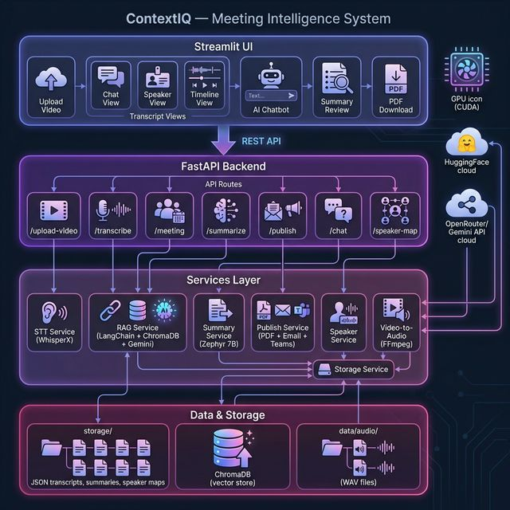
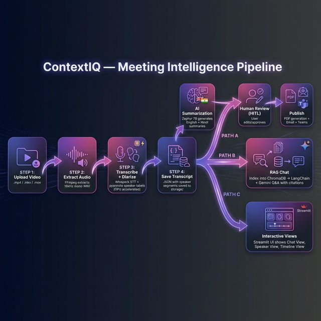
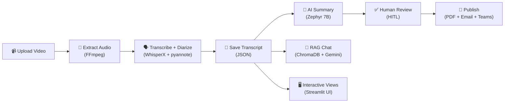

v# ContextIQ — Meeting Intelligence Platform

> Upload a meeting video → get **speaker-diarized transcription**, **AI summaries** (English + Hindi), **RAG-powered chatbot**, and **one-click PDF/Email/Teams publishing** — all from a single premium Streamlit UI.

---

## ✨ Features

| Category | Feature | Details |
|----------|---------|---------|
| 🎬 **Ingestion** | Video Upload | Accepts `.mp4`, `.mkv`, `.mov` — extracts 16 kHz mono WAV via FFmpeg |
| 🗣️ **Transcription** | WhisperX STT + Speaker Diarization | Fast CTranslate2 engine + pyannote.audio 3.1 speaker labels |
| ⚡ **Performance** | GPU Accelerated | Auto-detects NVIDIA CUDA GPUs (3–5× faster than CPU) |
| 🤖 **AI Summaries** | Bilingual Summarization | Speaker-wise + overall summaries in English & Hindi (Zephyr 7B via HuggingFace) |
| 💬 **AI Chat** | RAG-powered Q&A | Ask questions about meetings — LangChain + ChromaDB + Gemini with source citations |
| 👤 **HITL** | Speaker Name Mapping | Map `SPEAKER_00` → real names; persists across all views |
| ✅ **HITL** | Summary Approval | Review, edit, and approve AI summaries before publishing |
| 📄 **Publishing** | One-Click Publish | Professional PDF (Unicode Hindi support) + Email (SMTP) + Microsoft Teams webhook |
| 🖥️ **UI** | Premium Streamlit Frontend | Dark-themed, gradient-accented, multi-view dashboard |
| 💾 **Storage** | Persistent JSON | Transcripts, summaries, speaker maps saved to `storage/{meeting_id}/` |

---

## 🏗️ Architecture



```
ContextIQ/
├── app/
│   ├── main.py                        # FastAPI entry point, router registration
│   ├── api/
│   │   ├── upload.py                  # POST /upload-video
│   │   ├── transcribe.py             # POST /transcribe/{meeting_id}
│   │   ├── diarization.py            # GET  /meeting/{meeting_id}
│   │   ├── summarize.py              # POST /summarize/{meeting_id}
│   │   ├── publish.py                # POST /publish/{meeting_id}, GET /publish/{meeting_id}/pdf
│   │   ├── speaker_map.py            # POST/GET /meeting/{meeting_id}/speaker-map
│   │   └── chat.py                   # POST /chat/ask, POST /chat/index/{id}, GET /chat/meetings
│   ├── services/
│   │   ├── stt_service.py            # WhisperX transcription + pyannote diarization
│   │   ├── rag_service.py            # LangChain + ChromaDB + Gemini RAG chatbot
│   │   ├── summary_service.py        # HuggingFace Zephyr 7B summarization (EN + HI)
│   │   ├── publish_service.py        # PDF generation (fpdf2) + Email (SMTP) + Teams webhook
│   │   ├── speaker_service.py        # Speaker-wise segment grouping
│   │   ├── storage_service.py        # JSON persistence to disk
│   │   └── video_to_audio.py         # FFmpeg video → 16 kHz WAV extraction
│   ├── schemas/
│   │   └── schemas.py                # Pydantic v2 request/response models
│   └── fonts/                        # NotoSans + NotoSansDevanagari for Hindi PDF support
├── ui/
│   └── streamlit_app.py              # Premium Streamlit frontend (1100+ lines)
├── data/audio/                        # Extracted WAV files (auto-created)
├── storage/                           # Meeting data: transcripts, summaries, speaker maps, PDFs
│   └── chroma_db/                    # ChromaDB vector store for RAG
├── docs/                              # Architecture & workflow diagrams
├── requirements.txt
└── .env                               # Environment variables
```

---

## 🔄 Workflow





### Pipeline Steps

1. **Upload Video** → User uploads `.mp4`/`.mkv`/`.mov` via UI or API
2. **Extract Audio** → FFmpeg converts to 16 kHz mono WAV
3. **Transcribe + Diarize** → WhisperX performs STT; pyannote identifies speakers (GPU-accelerated)
4. **Save Transcript** → Speaker-labeled segments saved to `storage/{meeting_id}/transcript.json`
5. **Three parallel paths:**
   - **AI Summarization** → Zephyr 7B generates bilingual summaries → user reviews/edits (HITL) → publish as PDF/Email/Teams
   - **RAG Chatbot** → Transcript indexed into ChromaDB → ask questions with cited answers (Gemini)
   - **Interactive Views** → Chat View, Speaker View, Timeline Table via Streamlit

---

## 🚀 Quick Start

### 1. Prerequisites

| Tool | Why |
|------|-----|
| **Python 3.10+** | Runtime |
| **FFmpeg** | Video → audio extraction |
| **NVIDIA GPU + CUDA** *(optional)* | 3–5× faster transcription |
| **HuggingFace account** | Access pyannote diarization models + Zephyr 7B inference |

> **Diarization model access:** Accept the licenses at:
> - https://huggingface.co/pyannote/speaker-diarization-3.1
> - https://huggingface.co/pyannote/segmentation-3.0

### 2. Clone & Setup

```bash
git clone <repo-url>
cd ContextIQ
python -m venv .venv
.venv\Scripts\activate        # Windows
# source .venv/bin/activate   # Linux/macOS
```

### 3. Install Dependencies

**With NVIDIA GPU (recommended):**
```bash
pip install -r requirements.txt
pip install --force-reinstall torch torchaudio --index-url https://download.pytorch.org/whl/cu128
```

**CPU only:**
```bash
pip install -r requirements.txt
```

### 4. Configure Environment

Create a `.env` file in the project root:

```env
FFMPEG_PATH=C:/path/to/ffmpeg.exe
HF_TOKEN=hf_your_huggingface_token
OPENROUTER_API_KEY=sk-or-v1-your-key
OPENROUTER_MODEL=google/gemini-2.0-flash-001

# Optional — for email publishing
SMTP_HOST=smtp.gmail.com
SMTP_PORT=587
SMTP_USER=your@gmail.com
SMTP_PASSWORD=your-app-password

# Optional — for Teams publishing
TEAMS_WEBHOOK_URL=https://your-org.webhook.office.com/...
```

| Variable | Required | Description |
|----------|----------|-------------|
| `FFMPEG_PATH` | ✅ | Absolute path to `ffmpeg.exe` binary |
| `HF_TOKEN` | ✅ | HuggingFace access token ([create here](https://huggingface.co/settings/tokens)) |
| `OPENROUTER_API_KEY` | ✅ | OpenRouter API key for Gemini (RAG chatbot) |
| `OPENROUTER_MODEL` | ⬜ | LLM model ID (default: `google/gemini-2.0-flash-001`) |
| `SMTP_HOST/PORT/USER/PASSWORD` | ⬜ | SMTP settings for email publishing |
| `TEAMS_WEBHOOK_URL` | ⬜ | Microsoft Teams Incoming Webhook URL |

### 5. Run

**Start the backend:**
```bash
python -m uvicorn app.main:app --reload --port 8000
```

**Start the frontend (separate terminal):**
```bash
streamlit run ui/streamlit_app.py
```

| Service | URL |
|---------|-----|
| Backend API | http://localhost:8000 |
| Swagger Docs | http://localhost:8000/docs |
| Streamlit UI | http://localhost:8501 |

---

## 📡 API Reference

### Upload & Transcription

| Method | Endpoint | Description |
|--------|----------|-------------|
| `POST` | `/upload-video` | Upload video file, extract audio |
| `POST` | `/transcribe/{meeting_id}` | Run WhisperX transcription + diarization |
| `GET` | `/meeting/{meeting_id}` | Retrieve saved transcript |

### Summarization & Publishing

| Method | Endpoint | Description |
|--------|----------|-------------|
| `POST` | `/summarize/{meeting_id}` | Generate AI summaries (EN + HI) |
| `POST` | `/publish/{meeting_id}` | Generate PDF + send Email/Teams |
| `GET` | `/publish/{meeting_id}/pdf` | Download generated PDF |

### Chat (RAG)

| Method | Endpoint | Description |
|--------|----------|-------------|
| `POST` | `/chat/ask` | Ask a question about meetings |
| `POST` | `/chat/index/{meeting_id}` | Index transcript into knowledge base |
| `GET` | `/chat/meetings` | List all indexed meetings |
| `POST` | `/chat/clear/{session_id}` | Clear chat history |

### Speaker Mapping (HITL)

| Method | Endpoint | Description |
|--------|----------|-------------|
| `POST` | `/meeting/{meeting_id}/speaker-map` | Save speaker name mappings |
| `GET` | `/meeting/{meeting_id}/speaker-map` | Get saved speaker mappings |

### Example: Upload + Transcribe

```bash
# 1. Upload a video
curl -X POST http://localhost:8000/upload-video -F "file=@meeting.mp4"
# → {"meeting_id": "a1b2c3d4-...", "audio_path": "data/audio/a1b2c3d4-....wav"}

# 2. Transcribe with speaker diarization
curl -X POST http://localhost:8000/transcribe/a1b2c3d4-...
# → {"meeting_id": "...", "segments": [...], "speakers": {...}}

# 3. Generate summaries
curl -X POST "http://localhost:8000/summarize/a1b2c3d4-..."
# → {"meeting_id": "...", "overall_summary_en": "...", "overall_summary_hi": "..."}

# 4. Ask a question
curl -X POST http://localhost:8000/chat/ask \
  -H "Content-Type: application/json" \
  -d '{"question": "What decisions were made?", "meeting_ids": ["a1b2c3d4-..."]}'
# → {"answer": "...", "citations": [...]}
```

---

## 🖥️ Streamlit UI

The premium dark-themed frontend provides two main pages:

### 📋 Meeting Processing

| Tab | Description |
|-----|-------------|
| 💬 **Chat View** | Color-coded conversation with speaker labels and timestamps |
| 🗣️ **Speaker View** | Expandable per-speaker grouping of all segments |
| 🕒 **Timeline View** | Sortable table with Start, End, Speaker, and Text columns |
| 📝 **Summaries** | AI-generated English & Hindi summaries with edit/approve workflow |
| 📄 **Publish** | One-click PDF download, Email, and Teams integration |

### 💬 Meeting Chat

- RAG-powered conversational Q&A over all indexed meetings
- Source citations with speaker, timestamp, and excerpt
- Session-based conversation history
- Filter by specific meetings

---

## ⚡ GPU Acceleration

The system auto-detects your GPU. To verify:

```bash
python -c "import torch; print('CUDA:', torch.cuda.is_available(), '| Device:', torch.cuda.get_device_name(0) if torch.cuda.is_available() else 'CPU')"
```

| Mode | Compute Type | Speed |
|------|-------------|-------|
| **CUDA GPU** | `float16` | ⚡ 3–5× faster |
| **CPU** | `int8` | 🐢 Baseline |

If CUDA shows `False`, reinstall PyTorch with CUDA:
```bash
pip install --force-reinstall torch torchaudio --index-url https://download.pytorch.org/whl/cu128
```

---

## 📂 Output Format

### Transcript — `storage/{meeting_id}/transcript.json`

```json
{
  "created_at": "2026-02-21T16:00:00+00:00",
  "meeting_id": "a1b2c3d4-...",
  "audio_path": "data/audio/a1b2c3d4-....wav",
  "segments": [
    { "start": 0.0, "end": 4.2, "speaker": "SPEAKER_00", "text": "Hello everyone" }
  ],
  "speakers": {
    "SPEAKER_00": [
      { "start": 0.0, "end": 4.2, "text": "Hello everyone" }
    ]
  }
}
```

### Summary — `storage/{meeting_id}/summary.json`

```json
{
  "meeting_id": "a1b2c3d4-...",
  "speaker_summaries_en": { "SPEAKER_00": "..." },
  "overall_summary_en": "Full meeting summary in English...",
  "overall_summary_hi": "हिंदी में पूरी बैठक का सारांश..."
}
```

### Speaker Map — `storage/{meeting_id}/speaker_map.json`

```json
{
  "SPEAKER_00": "Pawan",
  "SPEAKER_01": "Ravi"
}
```

---

## 🛠️ Tech Stack

| Layer | Technology |
|-------|-----------|
| **Backend** | FastAPI + Uvicorn |
| **Frontend** | Streamlit (premium dark theme) |
| **Transcription** | WhisperX (CTranslate2) |
| **Diarization** | pyannote.audio 3.1 |
| **Summarization** | HuggingFace Zephyr 7B (free Inference API) |
| **RAG / Chat** | LangChain + ChromaDB + Gemini (via OpenRouter) |
| **Embeddings** | HuggingFace `all-MiniLM-L6-v2` |
| **PDF Generation** | fpdf2 (Unicode Hindi support) |
| **Email** | SMTP (smtplib) |
| **Teams** | Microsoft Incoming Webhook |
| **Audio Extraction** | FFmpeg |
| **Validation** | Pydantic v2 |
| **ML Framework** | PyTorch (CUDA 12.8) |

---

## 📝 License

MIT
