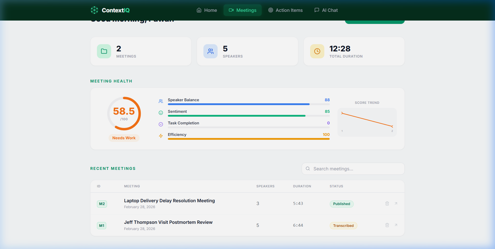
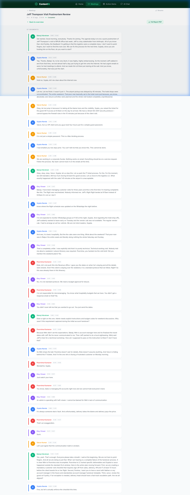
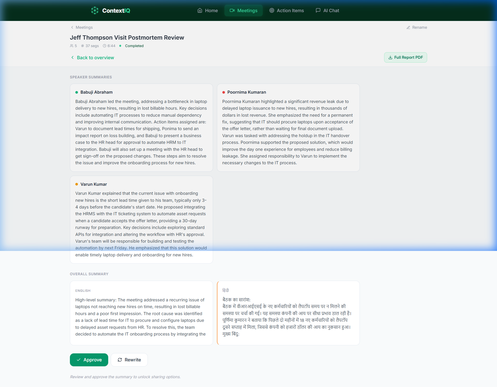
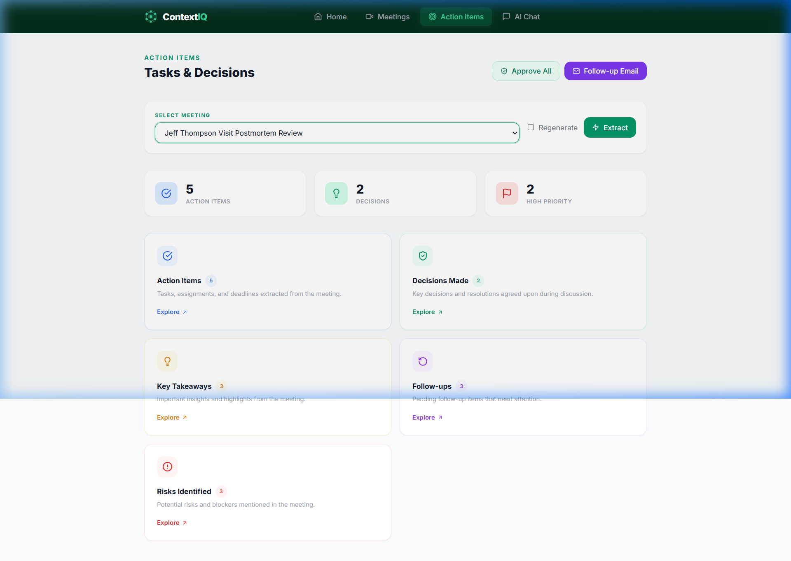
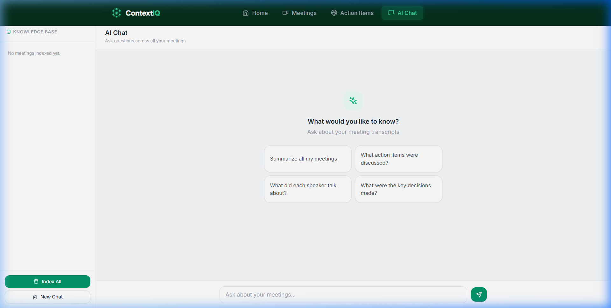
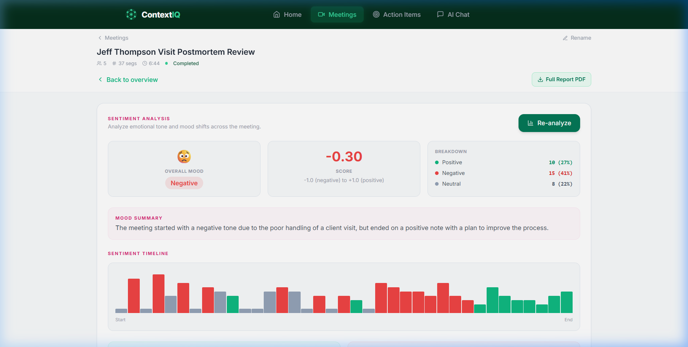
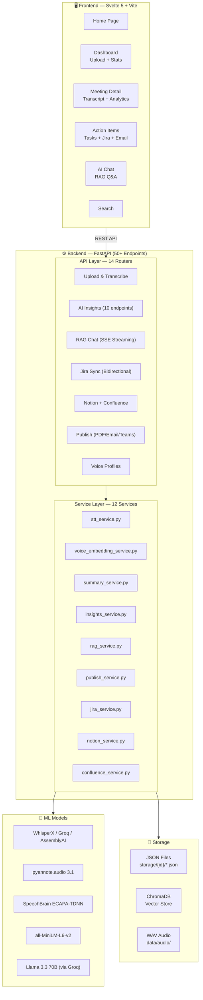
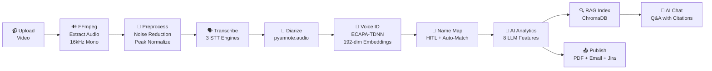

<p align="center">
  <h1 align="center">🧠 ContextIQ</h1>
  <p align="center"><strong>Meeting Intelligence Platform — End-to-End Data Pipeline</strong></p>
  <p align="center">
    Transforms raw meeting recordings into structured, queryable intelligence — speaker-identified transcripts, AI analytics, vector search, and enterprise integrations.
  </p>
  <p align="center">
    
    
    
    
    
    
  </p>
</p>

---

## 📸 Screenshots

<table>
  <tr>
    <td><br/><em>Dashboard — Aggregate stats & meeting list</em></td>
    <td><br/><em>Transcript — Speaker-labeled chat view</em></td>
  </tr>
  <tr>
    <td><br/><em>AI Summary — English & Hindi</em></td>
    <td><br/><em>Action Items — with Jira sync</em></td>
  </tr>
  <tr>
    <td><br/><em>RAG Chatbot — Cross-meeting Q&A</em></td>
    <td><br/><em>Sentiment Analysis — Per-segment mood</em></td>
  </tr>
</table>

---

## 🌟 What is ContextIQ?

ContextIQ is a **full-stack AI data pipeline** that processes unstructured meeting recordings into structured, actionable intelligence:

| Category | Features |
|----------|----------|
| **Transcription** | Multi-engine STT (AssemblyAI, Groq Whisper, WhisperX) with speaker diarization |
| **Voice Identification** | Neural voice embeddings (ECAPA-TDNN) for cross-meeting speaker recognition |
| **AI Analytics** | Bilingual summaries, action items, sentiment analysis, topic segmentation, requirements mining, meeting documentation |
| **RAG Chatbot** | Cross-meeting Q&A with diverse retrieval, SSE streaming, and video timestamp navigation |
| **Integrations** | Bidirectional Jira sync, Notion, Confluence, Teams webhooks, SMTP email |
| **Publishing** | PDF reports with Unicode Hindi support, one-click email/Teams distribution |

---

## 🏗️ System Architecture



---

## 📊 Data Pipeline — End-to-End Flow



---

## 🔬 Engineering Highlights

### 1. Voice Identification Pipeline

Cross-meeting speaker recognition using neural voice embeddings:

```
Audio Clip → Resample 16kHz → Peak Normalize → Bandpass (80-7600Hz) → Remove Silence → Re-Normalize
                                                                                          ↓
                                                                         SpeechBrain ECAPA-TDNN
                                                                                          ↓
                                                                         192-dim Embedding Vector
                                                                                          ↓
                                                                     Cosine Similarity (≥ 0.55)
                                                                                          ↓
                                                                         Speaker Match → Auto-Rename
```

- **5-stage audio preprocessing** optimized for embedding quality
- **SNR-ranked clip selection** — picks the clearest 10-second segment per speaker
- **Profile averaging** — multi-meeting enrollment improves accuracy over time
- **Exclusive assignment** — prevents duplicate name matches

### 2. Diverse RAG Retrieval

Standard RAG retrieves top-K chunks by similarity — but for multi-meeting queries, all K chunks may come from a single meeting (data skew). Our algorithm:

1. Fetch **40 candidate chunks** from ChromaDB
2. Group by `meeting_id`
3. **Round-robin** across meetings to select **18 final chunks**
4. Every indexed meeting gets representation in the LLM context

This prevents single-meeting bias in cross-meeting queries.

### 3. HITL Cascade Regeneration

When a user maps speaker names, the system triggers **asynchronous regeneration** of all 8 AI insights with `force=True`. The API responds instantly — the user doesn't wait. All analytics rebuild in background with real names.

### 4. Multi-Engine STT with Automatic Fallback

| Engine | Type | Speed | Diarization | Best For |
|--------|------|-------|-------------|----------|
| **AssemblyAI** | Cloud | ~3x real-time | Built-in | Best accuracy, noisy audio |
| **Groq Whisper** | Cloud (LPU) | ~7x real-time | Separate (pyannote) | Maximum speed |
| **WhisperX** | Local GPU | ~2x real-time | Separate (pyannote) | Privacy / offline |

Auto-fallback: Groq → Local when file exceeds 25MB limit. Configurable via `STT_MODE` env var.

### 5. Meeting Culture Score

Composite health metric (0–100) with 4 weighted signals:
- **Speaker Balance** (30%) — Gini-like coefficient measuring talk-time distribution
- **Sentiment Health** (25%) — ratio of positive to negative segments
- **Action Item Completion** (30%) — completion rate of assigned tasks
- **Meeting Efficiency** (15%) — decisions made per 10 minutes of meeting time

---

## 🚀 Quick Start

### Prerequisites

- **Python 3.10+**
- **Node.js 18+** and npm
- **FFmpeg** installed and in PATH
- **Groq API Key** (free at [console.groq.com](https://console.groq.com))

### 1. Clone & Setup Backend

```bash
git clone https://github.com/pawanuikey06/ContextIQ.git
cd ContextIQ

# Create virtual environment
python -m venv .venv
.venv\Scripts\activate        # Windows
# source .venv/bin/activate   # Linux/macOS

# Install dependencies
pip install -r requirements.txt
```

### 2. Configure Environment

Create a `.env` file in the project root:

```env
# Required
GROQ_API_KEY=gsk_your_groq_api_key
FFMPEG_PATH=ffmpeg

# STT Engine — "assemblyai" | "groq" | "local" | "auto"
STT_MODE=assemblyai

# Optional — AssemblyAI (recommended for best quality)
ASSEMBLYAI_API_KEY=your_assemblyai_key

# Optional — Local models (for WhisperX + pyannote)
HF_TOKEN=your_huggingface_token

# Optional — Jira Integration
JIRA_BASE_URL=https://yourorg.atlassian.net
JIRA_EMAIL=you@company.com
JIRA_API_TOKEN=your_jira_api_token
JIRA_PROJECT_KEY=PROJ

# Optional — Email
SMTP_HOST=smtp.gmail.com
SMTP_PORT=587
SMTP_USER=your@gmail.com
SMTP_PASSWORD=your_app_password

# Optional — Teams
TEAMS_WEBHOOK_URL=https://outlook.office.com/webhook/...

# Optional — Notion
NOTION_API_KEY=your_notion_key

# Optional — Confluence
CONFLUENCE_BASE_URL=https://yourorg.atlassian.net/wiki
CONFLUENCE_EMAIL=you@company.com
CONFLUENCE_API_TOKEN=your_confluence_token
CONFLUENCE_SPACE_KEY=MEET
```

### 3. Start Backend

```bash
python -m uvicorn app.main:app --reload --port 8000
```

### 4. Start Frontend

```bash
cd frontend
npm install
npm run dev
```

Open **http://localhost:5173** in your browser.

---

## 🗂️ Project Structure

```
ContextIQ/
├── app/                            # FastAPI Backend
│   ├── main.py                     # Entry point — 14 routers, CORS, health check
│   ├── api/                        # API Route Handlers (14 modules)
│   │   ├── upload.py               # Video upload with SHA-256 deduplication
│   │   ├── transcribe.py           # Multi-engine transcription trigger
│   │   ├── diarization.py          # Meeting data retrieval + video streaming
│   │   ├── summarize.py            # Bilingual summary generation
│   │   ├── insights.py             # Action items, requirements, docs, sentiment, topics
│   │   ├── chat.py                 # RAG chatbot with SSE streaming
│   │   ├── speaker_map.py          # HITL name mapping + cascade regeneration
│   │   ├── voice_profiles.py       # Speaker enrollment + voice matching
│   │   ├── jira.py                 # Bidirectional Jira sync
│   │   ├── notion.py               # Notion push
│   │   ├── confluence.py           # Confluence push
│   │   ├── publish.py              # PDF + Email + Teams
│   │   ├── search.py               # Weighted keyword search
│   │   └── stats.py                # Dashboard stats + culture score
│   ├── services/                   # Business Logic (12 services)
│   │   ├── stt_service.py          # Multi-engine STT (479 lines)
│   │   ├── voice_embedding_service.py  # Voice ID pipeline (477 lines)
│   │   ├── summary_service.py      # Bilingual summaries via Groq
│   │   ├── insights_service.py     # 8 AI features (870 lines)
│   │   ├── rag_service.py          # ChromaDB + LangChain RAG (557 lines)
│   │   ├── publish_service.py      # PDF + Email + Teams (639 lines)
│   │   ├── jira_service.py         # Jira REST API client
│   │   ├── notion_service.py       # Notion API client
│   │   ├── confluence_service.py   # Confluence API client
│   │   ├── speaker_service.py      # Speaker segment grouping
│   │   ├── storage_service.py      # File I/O utilities
│   │   └── video_to_audio.py       # FFmpeg audio extraction
│   ├── schemas/                    # Pydantic request/response models
│   └── fonts/                      # NotoSans + NotoSansDevanagari (Hindi PDF)
├── frontend/                       # Svelte 5 SPA
│   └── src/
│       ├── pages/                  # 6 page components
│       ├── components/             # 6 reusable UI components
│       └── lib/                    # API client, stores, utilities
├── docs/                           # Architecture docs + screenshots
├── storage/                        # Runtime: per-meeting JSON data
└── data/                           # Runtime: extracted audio files
```

---

## 🔌 API Reference (50+ Endpoints)

### Stage 1: Ingestion

| Method | Endpoint | Description |
|--------|----------|-------------|
| `POST` | `/upload-video` | Upload video → extract audio → SHA-256 dedup |
| `POST` | `/transcribe/{id}` | Transcribe + diarize (configurable engine) |

### Stage 2: Voice Identification

| Method | Endpoint | Description |
|--------|----------|-------------|
| `GET` | `/meeting/{id}/speaker-clips` | List extracted speaker audio clips |
| `GET` | `/meeting/{id}/speaker-clips/{speaker}` | Stream specific speaker clip |
| `GET` | `/speaker-profiles` | List all enrolled speaker profiles |
| `POST` | `/meeting/{id}/speaker-profiles` | Enroll speakers from meeting |
| `POST` | `/meeting/{id}/voice-match` | Auto-match speakers to profiles |
| `POST` | `/meeting/{id}/speaker-map` | HITL name mapping (triggers regen) |
| `GET` | `/meeting/{id}/speaker-map` | Get current name mappings |

### Stage 3: AI Analytics

| Method | Endpoint | Description |
|--------|----------|-------------|
| `POST` | `/summarize/{id}` | Bilingual summary (EN + HI) |
| `POST` | `/meeting/{id}/action-items` | Action items, decisions, risks, follow-ups |
| `PUT` | `/meeting/{id}/action-items` | HITL edit action items |
| `POST` | `/meeting/{id}/auto-title` | AI-generated meeting title |
| `POST` | `/meeting/{id}/sentiment` | Per-segment sentiment analysis |
| `POST` | `/meeting/{id}/topics` | Topic segmentation with time ranges |
| `POST` | `/meeting/{id}/requirements` | Functional/non-functional requirements |
| `POST` | `/meeting/{id}/documentation` | Meeting Minutes (MoM) generation |
| `POST` | `/meeting/{id}/followup-email` | AI-drafted follow-up email |
| `POST` | `/meeting/{id}/followup-email/send` | Send follow-up via SMTP |
| `GET` | `/meeting/{id}/speaker-analytics` | Talk time, WPM, interruptions |
| `GET` | `/meeting/{id}/speaker-report` | Speaker report cards with role classification |
| `GET` | `/meeting/{id}/keywords` | Keyword cloud extraction |

### Stage 4: RAG Chatbot

| Method | Endpoint | Description |
|--------|----------|-------------|
| `POST` | `/chat/ask` | Query meetings (batch response) |
| `POST` | `/chat/ask/stream` | Query meetings (SSE streaming) |
| `POST` | `/chat/index/{id}` | Index meeting into ChromaDB |
| `GET` | `/chat/meetings` | List indexed meetings |
| `POST` | `/chat/clear/{session}` | Clear conversation memory |

### Stage 5: Publishing & Integrations

| Method | Endpoint | Description |
|--------|----------|-------------|
| `POST` | `/publish/{id}` | One-click: PDF + Email + Teams |
| `GET` | `/publish/{id}/pdf` | Download summary PDF |
| `GET` | `/publish/{id}/full-report` | Download comprehensive PDF report |
| `POST` | `/publish/{id}/full-report/email` | Email full report to recipients |
| `POST` | `/meeting/{id}/jira/push` | Push action items to Jira |
| `POST` | `/meeting/{id}/jira/sync` | Sync statuses from Jira |
| `PUT` | `/meeting/{id}/jira/update` | Update Jira tickets |
| `GET` | `/jira/status` | Check Jira configuration |
| `POST` | `/meeting/{id}/notion/push` | Push notes to Notion |
| `POST` | `/meeting/{id}/confluence/push` | Push docs to Confluence |

### Dashboard & System

| Method | Endpoint | Description |
|--------|----------|-------------|
| `GET` | `/meetings` | List all meetings with metadata |
| `GET` | `/meeting/{id}` | Full meeting detail |
| `GET` | `/meeting/{id}/video` | Stream meeting video (Range support) |
| `GET` | `/stats` | Dashboard statistics |
| `GET` | `/stats/culture-score` | Meeting health metric |
| `GET` | `/search?q=keyword` | Weighted keyword search |
| `GET` | `/health` | System health (GPU, storage, ChromaDB) |

---

## 🛠️ Tech Stack — Why Each Choice

| Layer | Technology | Why |
|-------|-----------|-----|
| **Frontend** | Svelte 5 + Vite | Compiler approach = smallest bundle. No virtual DOM overhead. |
| **Styling** | TailwindCSS | Utility-first CSS for rapid, consistent UI development |
| **Backend** | FastAPI + Uvicorn | Async Python, auto OpenAPI docs, SSE streaming, Pydantic validation |
| **STT** | AssemblyAI / Groq Whisper / WhisperX | 3 engines for different speed/accuracy/privacy trade-offs |
| **Diarization** | pyannote.audio 3.1 | State-of-the-art neural speaker segmentation with GPU acceleration |
| **Voice ID** | SpeechBrain ECAPA-TDNN | 192-dim speaker embeddings, cosine matching at 0.55 threshold |
| **LLM** | Llama 3.3 70B via Groq | 500 tokens/sec inference, matches GPT-4 on structured extraction |
| **Embeddings** | all-MiniLM-L6-v2 | Best quality-to-speed ratio for semantic search (384-dim, CPU) |
| **Vector DB** | ChromaDB | Local, persistent, zero-infrastructure. SQLite-backed. |
| **RAG** | LangChain | Document loading, retrieval chains, memory management |
| **PDF** | fpdf2 + NotoSans | Unicode Hindi support with Devanagari font embedding |
| **Audio** | FFmpeg + noisereduce | Industry-standard media processing + spectral noise reduction |
| **Integrations** | Jira / Notion / Confluence / Teams | REST APIs for enterprise workflow automation |

---

## 🔧 Environment Variables

| Variable | Required | Description |
|----------|----------|-------------|
| `GROQ_API_KEY` | ✅ | Groq API key for Llama 3.3 70B |
| `FFMPEG_PATH` | ✅ | Path to FFmpeg binary |
| `STT_MODE` | ❌ | STT engine: `assemblyai` / `groq` / `local` / `auto` |
| `ASSEMBLYAI_API_KEY` | ❌ | AssemblyAI API key |
| `HF_TOKEN` | ❌ | HuggingFace token (for pyannote) |
| `JIRA_BASE_URL` | ❌ | Jira instance URL |
| `JIRA_EMAIL` | ❌ | Jira account email |
| `JIRA_API_TOKEN` | ❌ | Jira API token |
| `JIRA_PROJECT_KEY` | ❌ | Jira project key |
| `SMTP_HOST` | ❌ | SMTP server host |
| `SMTP_PORT` | ❌ | SMTP server port |
| `SMTP_USER` | ❌ | SMTP username |
| `SMTP_PASSWORD` | ❌ | SMTP password |
| `TEAMS_WEBHOOK_URL` | ❌ | MS Teams webhook URL |
| `NOTION_API_KEY` | ❌ | Notion API key |
| `CONFLUENCE_BASE_URL` | ❌ | Confluence instance URL |
| `CONFLUENCE_EMAIL` | ❌ | Confluence account email |
| `CONFLUENCE_API_TOKEN` | ❌ | Confluence API token |
| `CONFLUENCE_SPACE_KEY` | ❌ | Confluence space key |

---

## 📜 License

MIT License — see [LICENSE](LICENSE) for details.

---

<p align="center">
  <strong>ContextIQ</strong> — One recording in. Structured intelligence out.
</p>
