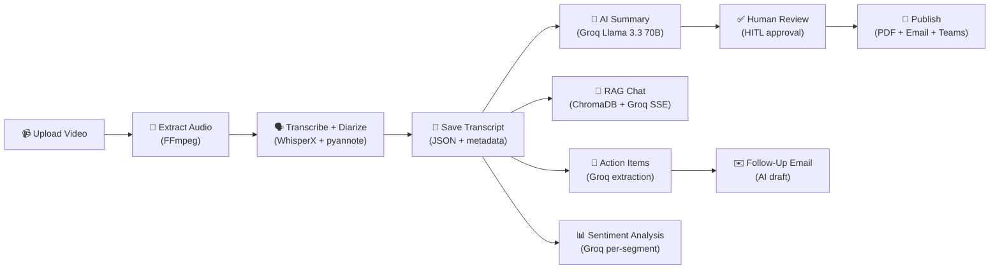

# ContextIQ — Meeting Intelligence Platform

> Upload a meeting video → get **speaker-diarized transcription**, **bilingual AI summaries**, **sentiment analysis**, **action items**, **RAG chatbot**, **subtitle export**, **full PDF reports**, and **one-click publishing** — all privacy-first, running locally on your GPU.

---

## ✨ Features (30+ Capabilities)

### 🎬 Ingestion & Processing
| # | Feature | Details |
|---|---------|---------|
| 1 | **Video Upload** | `.mp4`, `.mkv`, `.mov` — extracts 16 kHz mono WAV via FFmpeg |
| 2 | **Upload Deduplication** | SHA-256 hashing prevents reprocessing duplicate files |
| 3 | **Auto Audio Extraction** | FFmpeg-based, supports all major codecs |

### 🗣️ Transcription & Diarization
| # | Feature | Details |
|---|---------|---------|
| 4 | **WhisperX STT** | CTranslate2 engine with word-level timestamps |
| 5 | **Speaker Diarization** | pyannote.audio 3.1 identifies individual speakers |
| 6 | **GPU Acceleration** | Auto-detects NVIDIA CUDA GPUs (3–5× faster) |
| 7 | **Auto Metadata** | Processing timestamps, segment/speaker counts auto-saved |

### 🤖 AI Intelligence (Groq Llama 3.3 70B)
| # | Feature | Details |
|---|---------|---------|
| 8 | **Bilingual Summaries** | Speaker-wise + overall in English & Hindi |
| 9 | **Action Items** | Tasks with assignee, deadline, priority (🔴🟡🟢) |
| 10 | **Decisions Tracker** | Who decided what and why |
| 11 | **Key Takeaways** | Bullet-point highlights from every meeting |
| 12 | **Auto Meeting Title** | AI-generated descriptive title |
| 13 | **Follow-Up Email Draft** | Professional email combining summary + action items |
| 14 | **Sentiment Analysis** | Per-segment mood scoring, emotion labels, highlights |
| 15 | **Requirements Extraction** | Functional requirements with priority levels |
| 16 | **Documentation Generation** | Auto-generated meeting objective & next steps |

### 💬 RAG Chatbot
| # | Feature | Details |
|---|---------|---------|
| 17 | **Multi-Meeting Q&A** | Cross-meeting RAG via LangChain + ChromaDB |
| 18 | **SSE Streaming** | Real-time token-by-token with blinking cursor |
| 19 | **Source Citations** | Speaker, timestamp, and meeting ID per answer |
| 20 | **Session Memory** | Conversation history maintained per session |

### 👤 Human-in-the-Loop (HITL)
| # | Feature | Details |
|---|---------|---------|
| 21 | **Speaker Name Mapping** | Map `SPEAKER_00` → real names; persists across views |
| 22 | **Summary Approval** | Review, edit, and approve before publishing |
| 23 | **Custom Rewrite** | Provide instructions to regenerate summaries |

### 📄 Publishing & Export
| # | Feature | Details |
|---|---------|---------|
| 24 | **PDF Summary** | Professional layout with Unicode Hindi (NotoSansDevanagari) |
| 25 | **Full Report PDF** | Combines summary + action items + requirements + docs |
| 26 | **SRT Subtitle Export** | Standard `.srt` with speaker labels |
| 27 | **VTT Subtitle Export** | WebVTT format with `<v Speaker>` cues |
| 28 | **Email Publishing** | SMTP delivery with PDF attachment |
| 29 | **Teams Webhook** | Microsoft Teams Adaptive Card delivery |

### 🖥️ Modern Svelte Frontend
| # | Feature | Details |
|---|---------|---------|
| 30 | **Dashboard** | Real-time stats (meetings, speakers, duration) with search filter |
| 31 | **Meeting Detail** | 7-card feature grid (Chat, Speakers, Timeline, Summary, Action Items, Docs, Requirements, Sentiment) |
| 32 | **Meeting Search** | Live keyword search across transcripts, titles, speakers |
| 33 | **AI Chat Page** | Streaming chatbot with session management |
| 34 | **Action Items Tracker** | Jira-style task board with inline editing |
| 35 | **Toast Notifications** | System-wide feedback (success/error/info) |
| 36 | **Skeleton Loading** | Shimmer loading states for polished UX |

---

## 🏗️ Architecture

```
┌──────────────────────────────────────────────────────────────┐
│                   PRESENTATION LAYER                          │
│             Svelte + Vite (SPA, Hash Router)                  │
│  Home │ Dashboard │ MeetingDetail │ Search │ Chat │ Actions  │
│          Toast Notifications │ Skeleton Loading UI            │
└────────────────────────────┬─────────────────────────────────┘
                             │ REST API (HTTP + SSE)
┌────────────────────────────▼─────────────────────────────────┐
│                    API LAYER (FastAPI)                         │
│  upload │ transcribe │ diarization │ summarize │ publish      │
│  speaker_map │ insights │ chat │ stats │ subtitles │ search  │
└────────────────────────────┬─────────────────────────────────┘
                             │
┌────────────────────────────▼─────────────────────────────────┐
│                   SERVICES LAYER                              │
│  stt_service │ rag_service │ summary_service │ publish_service│
│  insights_service │ speaker_service │ storage_service         │
│                      video_to_audio                           │
└────────────────────────────┬─────────────────────────────────┘
                             │
┌────────────────────────────▼─────────────────────────────────┐
│                EXTERNAL AI SERVICES                           │
│  Groq API (Llama 3.3 70B) │ WhisperX (local) │ pyannote     │
└────────────────────────────┬─────────────────────────────────┘
                             │
┌────────────────────────────▼─────────────────────────────────┐
│                 DATA & STORAGE LAYER                          │
│  storage/ (JSON) │ ChromaDB (vectors) │ data/audio/ (WAV)    │
│               _file_hashes.json (dedup)                       │
└──────────────────────────────────────────────────────────────┘
```

### Directory Structure

```
ContextIQ/
├── app/
│   ├── main.py                       # FastAPI entry, CORS, router registration
│   ├── api/
│   │   ├── upload.py                 # POST /upload-video (SHA-256 dedup)
│   │   ├── transcribe.py            # POST /transcribe/{id}
│   │   ├── diarization.py           # GET /meeting/{id}, PUT segments
│   │   ├── summarize.py             # POST /summarize/{id}
│   │   ├── publish.py               # POST /publish, GET /pdf, GET /full-report
│   │   ├── speaker_map.py           # POST/GET speaker name mapping
│   │   ├── chat.py                  # POST /chat/ask/stream (SSE)
│   │   ├── insights.py              # Action items, auto-title, email, requirements, docs, sentiment
│   │   ├── stats.py                 # GET /stats (dashboard aggregates)
│   │   ├── subtitles.py             # GET /subtitles/srt and /vtt
│   │   └── search.py               # GET /search?q= (keyword search)
│   ├── services/
│   │   ├── stt_service.py           # WhisperX + pyannote (GPU offloading)
│   │   ├── rag_service.py           # LangChain + ChromaDB + Groq RAG
│   │   ├── summary_service.py       # Groq Llama 3.3 70B summarization
│   │   ├── insights_service.py      # Action items, sentiment, requirements, docs
│   │   ├── publish_service.py       # PDF (fpdf2) + SMTP + Teams + Full Report
│   │   ├── speaker_service.py       # Speaker segment grouping
│   │   ├── storage_service.py       # JSON persistence
│   │   └── video_to_audio.py        # FFmpeg extraction
│   ├── schemas/                      # Pydantic v2 models
│   └── fonts/                        # NotoSans + NotoSansDevanagari TTF
├── frontend/                          # Svelte + Vite SPA
│   └── src/
│       ├── App.svelte               # Router + global Toast
│       ├── pages/
│       │   ├── Home.svelte          # Landing page (6 feature cards)
│       │   ├── Dashboard.svelte     # Stats + meetings table + search
│       │   ├── MeetingDetail.svelte # 7-card feature grid + all tab views
│       │   ├── Chat.svelte          # RAG chatbot with SSE streaming
│       │   ├── ActionItems.svelte   # Jira-style task tracker
│       │   └── Search.svelte        # Live keyword search
│       ├── components/
│       │   ├── Header.svelte        # Top nav bar
│       │   ├── Toast.svelte         # Toast notification component
│       │   ├── Skeleton.svelte      # Shimmer loading component
│       │   └── Logo.svelte          # ContextIQ logo
│       └── lib/
│           ├── api.js               # API URL definitions + fetch helpers
│           ├── stores.js            # Svelte stores (meeting, summary, speaker map)
│           ├── toast.js             # Toast notification store
│           └── utils.js             # formatTime, colors, shortId
├── storage/                           # Runtime data (transcripts, summaries, etc.)
│   ├── {meeting_id}/                # Per-meeting JSON files
│   └── chroma_db/                   # ChromaDB vector store
├── data/audio/                        # Extracted WAV files
├── requirements.txt
└── .env                               # Configuration
```

---

## 📡 API Reference (27 Endpoints)

### Upload & Transcription
| Method | Endpoint | Description |
|--------|----------|-------------|
| `POST` | `/upload-video` | Upload video, extract audio (SHA-256 dedup) |
| `POST` | `/transcribe/{id}` | Transcribe + diarize + auto-metadata |
| `GET` | `/meeting/{id}` | Retrieve saved transcript |
| `PUT` | `/meeting/{id}/segments/{index}` | Edit a transcript segment |
| `GET` | `/meeting/{id}/metadata` | Get meeting metadata |
| `PATCH` | `/meeting/{id}/metadata` | Update meeting metadata |

### AI Intelligence
| Method | Endpoint | Description |
|--------|----------|-------------|
| `POST` | `/summarize/{id}` | Generate bilingual summaries |
| `POST` | `/meeting/{id}/action-items` | Extract action items & decisions |
| `POST` | `/meeting/{id}/auto-title` | Generate AI meeting title |
| `POST` | `/meeting/{id}/followup-email` | Draft follow-up email |
| `POST` | `/meeting/{id}/requirements` | Extract functional requirements |
| `POST` | `/meeting/{id}/documentation` | Generate meeting documentation |
| `POST` | `/meeting/{id}/sentiment` | Sentiment analysis per segment |

### RAG Chat
| Method | Endpoint | Description |
|--------|----------|-------------|
| `POST` | `/chat/ask/stream` | Ask question (SSE streaming) |
| `POST` | `/chat/index/{id}` | Index meeting for RAG |
| `GET` | `/chat/meetings` | List indexed meetings |
| `POST` | `/chat/clear/{session_id}` | Clear chat session |

### Search & Export
| Method | Endpoint | Description |
|--------|----------|-------------|
| `GET` | `/search?q=keyword` | Keyword search across all meetings |
| `GET` | `/meeting/{id}/subtitles/srt` | Download SRT subtitle file |
| `GET` | `/meeting/{id}/subtitles/vtt` | Download VTT subtitle file |

### Publishing
| Method | Endpoint | Description |
|--------|----------|-------------|
| `POST` | `/publish/{id}` | Generate PDF + send Email/Teams |
| `GET` | `/publish/{id}/pdf` | Download summary PDF |
| `GET` | `/publish/{id}/full-report` | Download comprehensive report PDF |
| `POST` | `/meeting/{id}/speaker-map` | Save speaker names |
| `GET` | `/meeting/{id}/speaker-map` | Get speaker names |

### System
| Method | Endpoint | Description |
|--------|----------|-------------|
| `GET` | `/` | Service info |
| `GET` | `/health` | GPU, storage, ChromaDB status |
| `GET` | `/stats` | Dashboard aggregate statistics |

---

## 🛠️ Tech Stack

| Layer | Technology |
|-------|-----------|
| **Frontend** | Svelte 5 + Vite (SPA) |
| **Backend** | FastAPI + Uvicorn |
| **Styling** | TailwindCSS |
| **Icons** | Lucide Svelte |
| **Routing** | svelte-spa-router (hash-based) |
| **Transcription** | WhisperX (CTranslate2) |
| **Diarization** | pyannote.audio 3.1 |
| **LLM** | Llama 3.3 70B via Groq (~500 tok/sec) |
| **RAG** | LangChain + ChromaDB |
| **Embeddings** | HuggingFace `all-MiniLM-L6-v2` (local) |
| **PDF** | fpdf2 (Unicode Hindi support) |
| **Email** | SMTP (smtplib) |
| **Teams** | Microsoft Incoming Webhook |
| **Audio** | FFmpeg |
| **ML** | PyTorch (CUDA 12.8) |
| **Streaming** | Server-Sent Events (SSE) |

---

## 🚀 Quick Start

### Prerequisites

| Tool | Why |
|------|-----|
| **Python 3.10+** | Backend runtime |
| **Node.js 18+** | Frontend build |
| **FFmpeg** | Video → audio extraction |
| **NVIDIA GPU + CUDA** *(optional)* | 3–5× faster transcription |
| **HuggingFace account** | pyannote diarization models |
| **Groq API key** | LLM inference ([get free key](https://console.groq.com/keys)) |

### Backend Setup

```bash
git clone https://github.com/pawanuikey06/ContextIQ.git
cd ContextIQ
python -m venv .venv
.venv\Scripts\activate        # Windows
pip install -r requirements.txt
pip install --force-reinstall torch torchaudio --index-url https://download.pytorch.org/whl/cu128
```

### Frontend Setup

```bash
cd frontend
npm install
```

### Configure `.env`

```env
FFMPEG_PATH=C:/path/to/ffmpeg.exe
HF_TOKEN=hf_your_huggingface_token
GROQ_API_KEY=gsk_your_groq_api_key
OPENROUTER_API_KEY=sk-or-your_openrouter_key   # For RAG chatbot

# Optional
SMTP_HOST=smtp.gmail.com
SMTP_PORT=587
SMTP_USER=your@gmail.com
SMTP_PASSWORD=your-app-password
TEAMS_WEBHOOK_URL=https://your-org.webhook.office.com/...
```

### Run

```bash
# Terminal 1 — Backend
python -m uvicorn app.main:app --reload --port 8000

# Terminal 2 — Frontend
cd frontend
npm run dev
```

| Service | URL |
|---------|-----|
| Frontend UI | http://localhost:5173 |
| Backend API | http://localhost:8000 |
| Swagger Docs | http://localhost:8000/docs |

---

## 🔄 Processing Pipeline



---

## 🏆 What Makes ContextIQ Unique

| Feature | Otter.ai | Fireflies | Gong | ContextIQ |
|---------|----------|-----------|------|-----------|
| **Hindi summaries** | ❌ | ❌ | ❌ | ✅ |
| **Fully local STT** | ❌ Cloud | ❌ Cloud | ❌ Cloud | ✅ On-device |
| **Sentiment analysis** | ❌ | ❌ | Basic | ✅ Per-segment |
| **RAG with citations** | ❌ | Basic | ❌ | ✅ Speaker+timestamp |
| **SSE streaming chat** | ❌ | ❌ | ❌ | ✅ |
| **HITL approval** | ❌ | ❌ | ❌ | ✅ |
| **Subtitle export (SRT/VTT)** | ❌ | Premium | ❌ | ✅ Free |
| **Full report PDF** | ❌ | ❌ | ❌ | ✅ |
| **Self-hosted / free** | $20/mo | $19/mo | $100+/mo | ✅ Free |

---

## 📝 License

MIT
