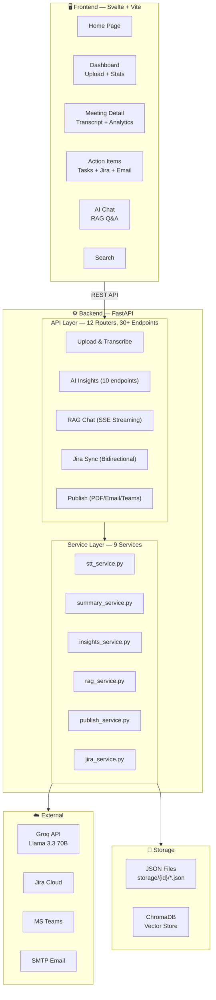
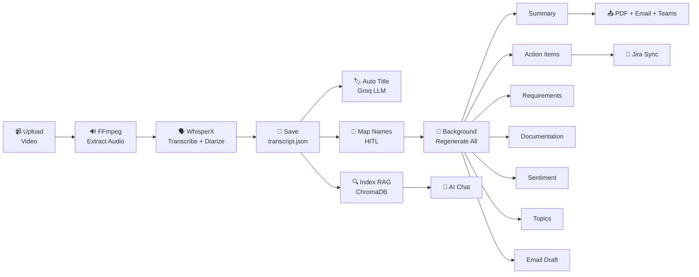
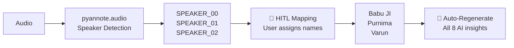
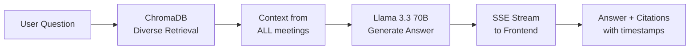
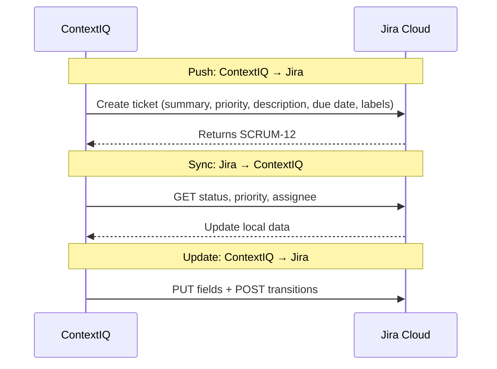
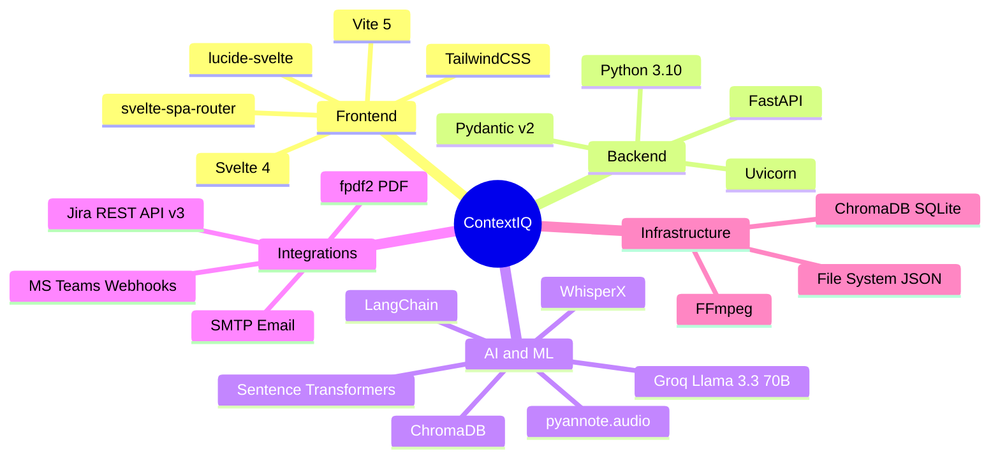

<p align="center">
  <h1 align="center">🧠 ContextIQ</h1>
  <p align="center"><strong>Intelligent Meeting Analytics Platform</strong></p>
  <p align="center">
    Transform meeting recordings into structured knowledge, actionable insights, and automated workflows — powered by AI.
  </p>
</p>

---

## 🌟 What is ContextIQ?

ContextIQ is a full-stack AI platform that takes raw meeting recordings and automatically produces:

- 📝 **Bilingual Summaries** (English + Hindi) with per-speaker breakdowns
- ✅ **Action Items** with assignee, priority, deadline, and Jira sync
- 📋 **Requirements Documents** extracted from discussions
- 📄 **Meeting Minutes (MoM)** with agenda, attendees, and next steps
- 😊 **Sentiment Analysis** per speaker segment
- 📌 **Topic Segmentation** with time ranges
- 💬 **AI Chatbot** (RAG) for cross-meeting Q&A with citations
- 🎫 **Jira Integration** — bidirectional ticket sync
- 📤 **Publishing** — PDF reports, email, Microsoft Teams notifications

All powered by **Llama 3.3 70B** (via Groq), **WhisperX** for transcription, and **ChromaDB** for retrieval.

---

## 🏗️ System Architecture



---

## 📊 Data Flow — End-to-End Pipeline



---

## 🚀 Quick Start

### Prerequisites

- **Python 3.10+**
- **Node.js 18+** and npm
- **FFmpeg** installed and in PATH
- **Groq API Key** (free at [console.groq.com](https://console.groq.com))

### 1. Clone & Setup Backend

```bash
git clone https://github.com/your-username/ContextIQ.git
cd ContextIQ

# Create virtual environment
python -m venv .venv
.venv\Scripts\activate        # Windows
# source .venv/bin/activate   # Linux/macOS

# Install dependencies
pip install -r requirements.txt
```

### 2. Configure Environment

Create a `.env` file in the project root:

```env
# Required
GROQ_API_KEY=gsk_your_groq_api_key
FFMPEG_PATH=ffmpeg

# Optional — Jira Integration
JIRA_BASE_URL=https://yourorg.atlassian.net
JIRA_EMAIL=you@company.com
JIRA_API_TOKEN=your_jira_api_token
JIRA_PROJECT_KEY=PROJ

# Optional — Email
SMTP_HOST=smtp.gmail.com
SMTP_PORT=587
SMTP_USER=your@gmail.com
SMTP_PASSWORD=your_app_password

# Optional — Teams
TEAMS_WEBHOOK_URL=https://outlook.office.com/webhook/...

# Optional — AssemblyAI (alternative STT)
ASSEMBLYAI_API_KEY=your_assemblyai_key
```

### 3. Start Backend

```bash
python -m uvicorn app.main:app --reload --port 8000
```

### 4. Start Frontend

```bash
cd frontend
npm install
npm run dev
```

Open **http://localhost:5173** in your browser.

---

## 🧩 Feature Breakdown

### 🎙️ Multi-Engine Transcription

ContextIQ supports three transcription engines:

| Engine | Type | Speed | Best For |
|---|---|---|---|
| **WhisperX** | Local (GPU) | ~2x real-time | Accuracy + word-level timestamps |
| **AssemblyAI** | Cloud API | ~3x real-time | Built-in diarization |
| **Groq Whisper** | Cloud (LPU) | ~5x real-time | Maximum speed |

All engines produce a standardized output with speaker labels, timestamps, and text.

### 👤 Speaker Diarization + HITL Mapping

Automatic speaker identification via **pyannote.audio 3.x**, with a Human-in-the-Loop layer:



When names are mapped, **all insights are automatically regenerated in the background** with real speaker names — summary, action items, requirements, sentiment, topics, documentation, follow-up email, and RAG index.

### 📝 Bilingual Summary Generation

LLM-generated summaries in **English + Hindi**:
- **Per-speaker summaries** — what each person contributed
- **Overall summary** — key points, decisions, action items
- **Hindi summary** — professional Hindi, not word-by-word translation

### ✅ Action Items & Decision Extraction

Structured extraction with rich fields:

```json
{
  "task": "Set up meeting with HR head for HRMS automation sign-off",
  "assigned_to": "Babu JI",
  "priority": "high",
  "category": "communication",
  "deadline": "Tomorrow",
  "context": "The HRMS integration requires HR head's approval...",
  "success_criteria": "Business case presented and approved",
  "dependencies": ["HR head availability"],
  "mentioned_by": "Babu JI"
}
```

### 💬 RAG AI Chatbot

Cross-meeting Q&A powered by **ChromaDB + LangChain + Llama 3.3 70B**:



**Key feature:** Diverse retrieval algorithm round-robins across meetings so every meeting is represented in the context.

### 🎫 Jira Bidirectional Sync



**Field mapping:** task → summary, priority → priority, category → issuetype (Story/Bug/Task), deadline → duedate, labels: `contextiq`, `category-{type}`

### 📤 Publishing Pipeline

| Channel | Format |
|---|---|
| **PDF Download** | Unicode PDF with EN + HI (NotoSans + NotoSansDevanagari) |
| **Email** | PDF attached, sent via SMTP/TLS |
| **MS Teams** | Rich Adaptive Card v1.4 with summary, action items, decisions, speakers |
| **Follow-up Email** | AI-generated draft with preview + edit before sending |

---

## 🗂️ Project Structure

```
ContextIQ/
├── app/
│   ├── main.py                     # FastAPI entry point
│   ├── api/                        # 12 API routers
│   │   ├── upload.py               # POST /upload-video
│   │   ├── transcribe.py           # POST /transcribe/{id}
│   │   ├── summarize.py            # POST /summarize/{id}
│   │   ├── insights.py             # Action items, requirements, docs, sentiment, topics
│   │   ├── chat.py                 # RAG chatbot (SSE streaming)
│   │   ├── jira.py                 # Jira push, sync, update
│   │   ├── publish.py              # PDF + email + Teams
│   │   ├── speaker_map.py          # HITL speaker name mapping
│   │   ├── search.py               # Keyword search
│   │   ├── stats.py                # Dashboard statistics
│   │   └── diarization.py          # Meeting detail data
│   └── services/                   # 9 service classes
│       ├── stt_service.py          # Multi-engine transcription
│       ├── video_to_audio.py       # FFmpeg audio extraction
│       ├── speaker_service.py      # Speaker grouping
│       ├── summary_service.py      # Bilingual summaries
│       ├── insights_service.py     # All AI insight extraction
│       ├── rag_service.py          # ChromaDB + LangChain RAG
│       ├── publish_service.py      # PDF + Email + Teams
│       ├── jira_service.py         # Jira REST API client
│       └── storage_service.py      # File I/O
├── frontend/
│   └── src/
│       ├── pages/                  # 6 page components
│       │   ├── Home.svelte         # Landing page
│       │   ├── Dashboard.svelte    # Upload + meeting list
│       │   ├── MeetingDetail.svelte # Transcript + analytics
│       │   ├── ActionItems.svelte  # Tasks + Jira + email
│       │   ├── Chat.svelte         # RAG chatbot
│       │   └── Search.svelte       # Keyword search
│       ├── components/             # Reusable UI components
│       └── lib/                    # API bindings + utilities
├── storage/                        # Per-meeting JSON data
│   └── {meeting_id}/
│       ├── transcript.json
│       ├── metadata.json
│       ├── speaker_map.json
│       ├── summary.json
│       ├── action_items.json
│       ├── requirements.json
│       ├── documentation.json
│       ├── sentiment.json
│       ├── topics.json
│       └── followup_email.json
├── docs/
│   ├── architecture.md             # 14 Mermaid diagrams
│   └── PROJECT_REPORT.md           # Full academic report
├── .env                            # Environment configuration
└── requirements.txt                # Python dependencies
```

---

## 🔌 API Reference

### Ingestion

| Method | Endpoint | Description |
|---|---|---|
| `POST` | `/upload-video` | Upload video file, returns `meeting_id` |
| `POST` | `/transcribe/{id}` | Transcribe + diarize meeting |

### AI Insights

| Method | Endpoint | Description |
|---|---|---|
| `POST` | `/summarize/{id}` | Generate bilingual summary |
| `POST` | `/meeting/{id}/action-items` | Extract action items + decisions |
| `POST` | `/meeting/{id}/requirements` | Extract requirements |
| `POST` | `/meeting/{id}/documentation` | Generate meeting MoM |
| `POST` | `/meeting/{id}/sentiment` | Analyze sentiment per segment |
| `POST` | `/meeting/{id}/topics` | Identify topic segments |
| `POST` | `/meeting/{id}/followup-email` | Generate follow-up email draft |
| `POST` | `/meeting/{id}/title` | Auto-generate meeting title |
| `POST` | `/meeting/{id}/speaker-report` | Generate speaker report cards |
| `POST` | `/meeting/{id}/culture-score` | Calculate meeting culture score |

### RAG Chat

| Method | Endpoint | Description |
|---|---|---|
| `POST` | `/chat/ask/stream` | Stream answer via SSE |
| `POST` | `/chat/index/{id}` | Index meeting into ChromaDB |
| `GET` | `/chat/meetings` | List indexed meetings with titles |
| `POST` | `/chat/clear/{session}` | Clear chat history |

### Jira Integration

| Method | Endpoint | Description |
|---|---|---|
| `POST` | `/meeting/{id}/jira/push` | Push action items to Jira |
| `POST` | `/meeting/{id}/jira/sync` | Sync statuses from Jira |
| `PUT` | `/meeting/{id}/jira/update` | Update Jira ticket from ContextIQ |
| `GET` | `/jira/status` | Check Jira configuration |

### Publishing

| Method | Endpoint | Description |
|---|---|---|
| `POST` | `/publish/{id}` | Generate PDF + send email + Teams |
| `POST` | `/meeting/{id}/followup-email/send` | Send follow-up email via SMTP |
| `GET` | `/meeting/{id}/report` | Download full PDF report |

### HITL & Data

| Method | Endpoint | Description |
|---|---|---|
| `POST` | `/meeting/{id}/speaker-map` | Save speaker names (triggers regen) |
| `GET` | `/meeting/{id}/speaker-map` | Get speaker name mappings |
| `GET` | `/meetings` | List all meetings |
| `GET` | `/meeting/{id}` | Get meeting detail |
| `GET` | `/stats` | Dashboard statistics |
| `GET` | `/search?q=keyword` | Search across meetings |

---

## 🔧 Environment Variables

| Variable | Required | Description |
|---|---|---|
| `GROQ_API_KEY` | ✅ Yes | Groq API key for Llama 3.3 70B |
| `FFMPEG_PATH` | ✅ Yes | Path to FFmpeg binary |
| `JIRA_BASE_URL` | ❌ No | Jira instance URL |
| `JIRA_EMAIL` | ❌ No | Jira account email |
| `JIRA_API_TOKEN` | ❌ No | Jira API token |
| `JIRA_PROJECT_KEY` | ❌ No | Jira project key (e.g., PROJ) |
| `SMTP_HOST` | ❌ No | SMTP server host |
| `SMTP_PORT` | ❌ No | SMTP server port |
| `SMTP_USER` | ❌ No | SMTP username |
| `SMTP_PASSWORD` | ❌ No | SMTP password / app password |
| `TEAMS_WEBHOOK_URL` | ❌ No | MS Teams incoming webhook URL |
| `ASSEMBLYAI_API_KEY` | ❌ No | AssemblyAI API key |

---

## 🛠️ Tech Stack



---

## 📜 License

This project is developed for academic and demonstration purposes.

---

<p align="center">
  Built with ❤️ using AI — <strong>ContextIQ Meeting Intelligence</strong>
</p>
