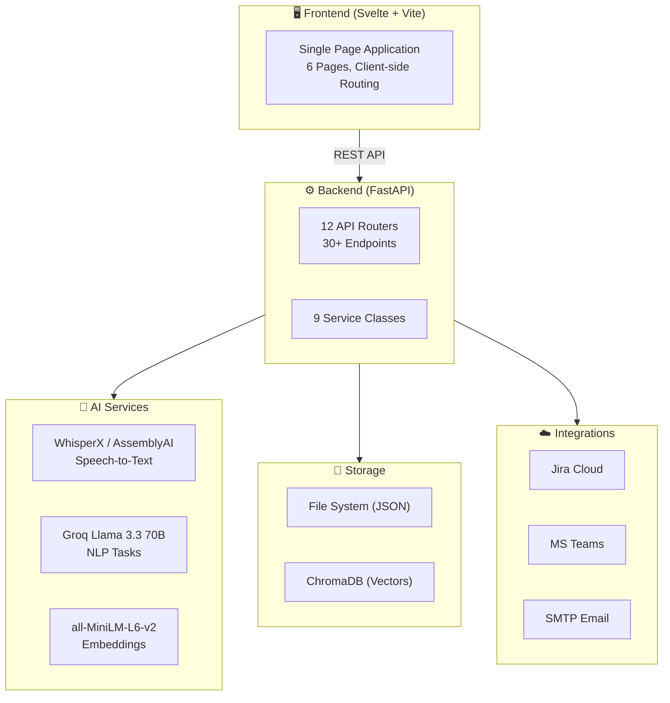
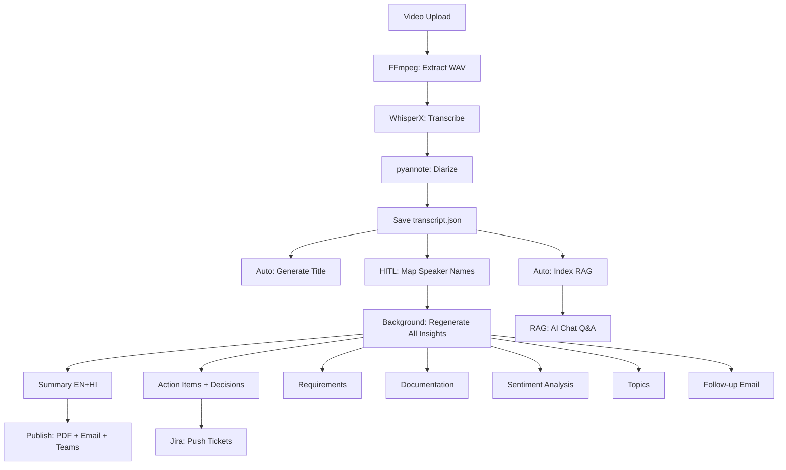

# ContextIQ — Intelligent Meeting Analytics Platform

## A Project Report

**Submitted in partial fulfillment of the requirements for the degree of**
**Bachelor of Technology in Computer Science & Engineering**

---

|  |  |
|---|---|
| **Project Title** | ContextIQ — Intelligent Meeting Analytics Platform |
| **Domain** | Artificial Intelligence, Natural Language Processing, Full-Stack Development |
| **Academic Year** | 2025–2026 |

---

## Table of Contents

1. [Abstract](#1-abstract)
2. [Introduction](#2-introduction)
3. [Problem Statement](#3-problem-statement)
4. [Literature Survey](#4-literature-survey)
5. [Proposed System](#5-proposed-system)
6. [System Architecture](#6-system-architecture)
7. [Technology Stack](#7-technology-stack)
8. [System Design](#8-system-design)
9. [Implementation Details](#9-implementation-details)
10. [Key Features](#10-key-features)
11. [Results & Screenshots](#11-results--screenshots)
12. [Testing](#12-testing)
13. [Advantages & Limitations](#13-advantages--limitations)
14. [Future Scope](#14-future-scope)
15. [Conclusion](#15-conclusion)
16. [References](#16-references)

---

## 1. Abstract

ContextIQ is an AI-powered, end-to-end meeting intelligence platform that transforms raw meeting recordings into structured, actionable knowledge. The system automates the entire post-meeting workflow — from transcription with speaker diarization to bilingual summary generation, action item extraction, sentiment analysis, requirement mining, and intelligent document generation.

Built as a full-stack web application with a **FastAPI** backend and **Svelte** frontend, ContextIQ employs state-of-the-art models including **WhisperX** for speech-to-text, **pyannote.audio** for speaker diarization, and **Llama 3.3 70B** (via Groq) for all natural language understanding tasks. The platform features a **Retrieval-Augmented Generation (RAG)** chatbot powered by **ChromaDB** and **LangChain** that enables cross-meeting question answering with source citations.

Key differentiators include **Human-in-the-Loop (HITL) speaker name mapping** with automatic background regeneration of all insights, **bidirectional Jira integration** for action item tracking, **Microsoft Teams notifications** via rich Adaptive Cards, **PDF report generation** with bilingual (English + Hindi) support, and **follow-up email automation** via SMTP.

The platform demonstrates how modern AI pipelines can dramatically reduce the time and effort spent on meeting documentation, enabling teams to focus on execution rather than administrative overhead.

**Keywords:** Meeting Intelligence, NLP, RAG, Speaker Diarization, LLM, WhisperX, ChromaDB, Action Items, Jira Integration, Full-Stack

---

## 2. Introduction

### 2.1 Background

In the modern workplace, meetings are the primary vehicle for decision-making, collaboration, and project coordination. According to a study by Atlassian, the average employee attends 62 meetings per month, with over 50% considered unproductive. A significant contributor to this inefficiency is the lack of structured follow-up — decisions are forgotten, action items are lost, and the same discussions recur across multiple meetings.

Traditional meeting notes are manual, subjective, and often incomplete. Even when meeting recordings are available, extracting actionable information requires hours of manual review. This creates a critical gap between what was discussed and what gets executed.

### 2.2 Motivation

The motivation behind ContextIQ stems from the observation that while AI has made remarkable progress in speech recognition, natural language understanding, and information retrieval, these capabilities have not been integrated into a cohesive, end-to-end meeting intelligence workflow. Existing tools either focus narrowly on transcription (Otter.ai, Rev) or provide basic summarization without structured insight extraction.

ContextIQ aims to bridge this gap by providing a unified platform that:
- Converts raw meeting recordings into structured knowledge artifacts
- Enables intelligent querying across multiple meetings
- Integrates with existing project management tools (Jira)
- Supports human oversight and correction through HITL features
- Automates the entire post-meeting documentation workflow

### 2.3 Objectives

1. Develop an automated pipeline for meeting transcription with accurate speaker diarization
2. Generate bilingual (English + Hindi) meeting summaries using Large Language Models
3. Extract structured data: action items, decisions, requirements, and topics
4. Build a RAG-based chatbot for cross-meeting question answering
5. Implement bidirectional Jira integration for action item tracking
6. Enable automated publishing via PDF, email, and Microsoft Teams
7. Provide Human-in-the-Loop features for accuracy and trust

---

## 3. Problem Statement

**"To design and develop an AI-powered meeting intelligence platform that automatically transcribes, diarizes, summarizes, and extracts actionable insights from meeting recordings, while enabling cross-meeting knowledge retrieval and seamless integration with project management tools."**

### 3.1 Sub-Problems Addressed

| # | Problem | ContextIQ Solution |
|---|---|---|
| 1 | Manual transcription is slow and error-prone | Automated STT with WhisperX / AssemblyAI / Groq |
| 2 | No speaker identification in recordings | pyannote.audio speaker diarization |
| 3 | Meeting notes are subjective and incomplete | LLM-generated structured summaries |
| 4 | Action items are forgotten after meetings | Automated extraction + Jira push |
| 5 | Decisions are not tracked across meetings | Structured decision extraction with ownership |
| 6 | Finding information across past meetings is hard | RAG chatbot with cross-meeting retrieval |
| 7 | Language barriers in multilingual teams | Bilingual summary generation (EN + HI) |
| 8 | No integration with existing workflows | Jira, Teams, Email, PDF integrations |

---

## 4. Literature Survey

### 4.1 Speech-to-Text (STT) Systems

| System | Approach | Strengths | Limitations |
|---|---|---|---|
| WhisperX (Bain et al., 2023) | Transformer-based ASR with forced alignment | Word-level timestamps, multi-language | GPU-intensive for large files |
| AssemblyAI | Cloud-based neural ASR | High accuracy, built-in diarization | Requires API key, cloud dependency |
| Groq Whisper | Hardware-accelerated Whisper | Extremely fast inference | Limited to Whisper model sizes |
| Google Speech-to-Text | Cloud RNN/Transformer hybrid | Real-time streaming | Expensive at scale |

**ContextIQ's approach:** Multi-engine architecture supporting WhisperX (local), AssemblyAI (cloud), and Groq Whisper, allowing users to choose based on accuracy, speed, and cost requirements.

### 4.2 Speaker Diarization

Speaker diarization ("who spoke when") is critical for meeting analysis. The state-of-the-art approach uses **pyannote.audio 3.x** (Bredin & Laurent, 2023), which employs:
- Voice Activity Detection (VAD)
- Speaker embedding extraction
- Neural clustering

ContextIQ integrates pyannote.audio for local diarization and AssemblyAI for cloud-based diarization, with a Human-in-the-Loop layer for mapping detected speaker IDs to real names.

### 4.3 Large Language Models for Meeting Analysis

Recent LLMs have shown strong performance on meeting-related tasks:

| Model | Provider | Parameters | Use in ContextIQ |
|---|---|---|---|
| Llama 3.3 70B | Meta (via Groq) | 70B | All NLP tasks: summarization, extraction, analysis |
| GPT-4 | OpenAI | ~1.7T | Not used (cost considerations) |
| Claude 3.5 | Anthropic | Undisclosed | Not used |

ContextIQ uses **Groq's inference engine** for Llama 3.3 70B, achieving sub-second response times for LLM calls — significantly faster than OpenAI or Anthropic alternatives.

### 4.4 Retrieval-Augmented Generation (RAG)

RAG (Lewis et al., 2020) combines retrieval and generation to ground LLM responses in factual data. ContextIQ's RAG implementation uses:
- **ChromaDB** as the vector store
- **all-MiniLM-L6-v2** (Sentence Transformers) for embedding
- **LangChain** for retrieval orchestration
- **Diverse retrieval** algorithm ensuring cross-meeting coverage

### 4.5 Existing Tools Comparison

| Feature | Otter.ai | Fireflies.ai | Microsoft Copilot | **ContextIQ** |
|---|---|---|---|---|
| Transcription | ✅ | ✅ | ✅ | ✅ |
| Speaker Diarization | ✅ | ✅ | ✅ | ✅ |
| Action Item Extraction | ❌ | Basic | ✅ | ✅ Detailed |
| Requirements Extraction | ❌ | ❌ | ❌ | ✅ |
| Bilingual Summary | ❌ | ❌ | ❌ | ✅ (EN+HI) |
| RAG Chatbot | ❌ | ❌ | ✅ | ✅ Cross-meeting |
| Jira Integration | ❌ | ❌ | ❌ | ✅ Bidirectional |
| Sentiment Analysis | ❌ | Basic | ❌ | ✅ Per-segment |
| Topic Segmentation | ❌ | ❌ | ❌ | ✅ |
| HITL Speaker Mapping | ❌ | ❌ | ❌ | ✅ |
| Self-hosted / Open Source | ❌ | ❌ | ❌ | ✅ |
| Cost | $$$$ | $$$$ | $$$$ | $ (Groq free tier) |

---

## 5. Proposed System

### 5.1 System Overview

ContextIQ is designed as a modular, service-oriented architecture with clear separation between:

1. **Ingestion Layer** — Video upload, audio extraction, transcription, diarization
2. **Intelligence Layer** — LLM-powered analytics (summary, action items, sentiment, etc.)
3. **Knowledge Layer** — RAG-based chatbot with ChromaDB vector store
4. **Integration Layer** — Jira, Teams, Email, PDF
5. **Presentation Layer** — Svelte SPA with responsive UI

### 5.2 Workflow

```
Upload Video → Extract Audio (FFmpeg) → Transcribe + Diarize (WhisperX)
    → Auto-Generate Title → Auto-Index RAG
    → User Maps Speaker Names (HITL)
    → Background Regeneration (8 AI tasks with real names)
    → View Insights / Chat / Push to Jira / Publish
```

### 5.3 Key Design Decisions

| Decision | Rationale |
|---|---|
| **File-based storage** (JSON) | Simple, portable, no database setup needed. Each meeting is self-contained. |
| **Groq as LLM provider** | Free tier available, fastest inference (sub-second for 70B model). |
| **Multi-engine STT** | Flexibility: WhisperX for quality, Groq for speed, AssemblyAI for reliability. |
| **Background regeneration** | Speaker name mapping triggers async regen of ALL insights — no manual redo. |
| **Diverse RAG retrieval** | Round-robin across meetings ensures cross-meeting context in chat answers. |

---

## 6. System Architecture

### 6.1 High-Level Architecture



### 6.2 Data Flow Diagram



---

## 7. Technology Stack

### 7.1 Frontend

| Component | Technology | Purpose |
|---|---|---|
| Framework | Svelte 4 | Reactive UI with minimal bundle size |
| Build Tool | Vite 5 | Fast HMR development server |
| Routing | svelte-spa-router | Client-side hash routing |
| Icons | lucide-svelte | Consistent iconography |
| Styling | TailwindCSS | Utility-first CSS framework |
| HTTP Client | Fetch API | Native browser API for REST calls |

### 7.2 Backend

| Component | Technology | Purpose |
|---|---|---|
| Framework | FastAPI | High-performance async Python API |
| Server | Uvicorn | ASGI server with hot-reload |
| Language | Python 3.10 | Primary backend language |
| Validation | Pydantic v2 | Request/response schema validation |

### 7.3 AI / ML

| Component | Technology | Purpose |
|---|---|---|
| STT | WhisperX | Local transcription with word-level timestamps |
| STT (Cloud) | AssemblyAI | Cloud transcription with built-in diarization |
| STT (Fast) | Groq Whisper | Hardware-accelerated Whisper inference |
| Diarization | pyannote.audio 3.x | Speaker identification |
| LLM | Llama 3.3 70B (Groq) | All NLP tasks: summarization, extraction, analysis |
| Embeddings | all-MiniLM-L6-v2 | Sentence embeddings for RAG (384-dim) |
| Vector Store | ChromaDB | Persistent vector database |
| RAG Framework | LangChain | Retrieval orchestration + memory |
| Audio | FFmpeg | Video-to-audio conversion (WAV 16kHz mono) |

### 7.4 Integrations

| Component | Technology | Purpose |
|---|---|---|
| Project Management | Jira REST API v3 | Bidirectional ticket sync |
| Notifications | MS Teams Webhooks | Rich Adaptive Card notifications |
| Email | smtplib (SMTP/TLS) | PDF delivery + follow-up emails |
| PDF | fpdf2 + NotoSans | Unicode PDF generation (EN + HI) |

---

## 8. System Design

### 8.1 Module Design

```
ContextIQ/
├── app/
│   ├── main.py                    # FastAPI app entry point
│   ├── api/                       # API Layer (12 routers)
│   │   ├── upload.py              # Video upload endpoint
│   │   ├── transcribe.py          # Transcription + diarization
│   │   ├── summarize.py           # Summary generation
│   │   ├── insights.py            # Action items, requirements, docs, sentiment, topics
│   │   ├── chat.py                # RAG chatbot (streaming SSE)
│   │   ├── jira.py                # Jira push, sync, update
│   │   ├── publish.py             # PDF + email + Teams publishing
│   │   ├── speaker_map.py         # HITL speaker name mapping
│   │   ├── search.py              # Keyword search
│   │   ├── stats.py               # Dashboard statistics
│   │   └── diarization.py         # Meeting detail data
│   └── services/                  # Business Logic Layer
│       ├── stt_service.py         # Multi-engine transcription
│       ├── video_to_audio.py      # FFmpeg audio extraction
│       ├── speaker_service.py     # Speaker grouping
│       ├── summary_service.py     # Bilingual summary generation
│       ├── insights_service.py    # All AI insight extraction
│       ├── rag_service.py         # ChromaDB + LangChain RAG
│       ├── publish_service.py     # PDF + Email + Teams
│       ├── jira_service.py        # Jira REST API client
│       └── storage_service.py     # File I/O utilities
├── frontend/
│   └── src/
│       ├── pages/                 # 6 page components
│       ├── components/            # Reusable UI components
│       └── lib/                   # API bindings + utilities
├── storage/                       # Per-meeting JSON data
│   ├── {meeting_id}/             # One folder per meeting
│   └── chroma_db/                # ChromaDB vector store
└── data/
    ├── audio/                    # Extracted WAV files
    └── videos/                   # Uploaded video files
```

### 8.2 API Design

The API follows RESTful conventions with resource-based routing:

| Category | Endpoints | Auth |
|---|---|---|
| Upload | `POST /upload-video` | None (local) |
| Transcription | `POST /transcribe/{id}` | None |
| Summarization | `POST /summarize/{id}` | None |
| Insights | `POST /meeting/{id}/action-items`, `/requirements`, `/documentation`, `/sentiment`, `/topics`, `/followup-email`, `/title`, `/speaker-report`, `/culture-score` | None |
| Chat | `POST /chat/ask/stream` (SSE), `POST /chat/index/{id}`, `GET /chat/meetings` | None |
| Jira | `POST /meeting/{id}/jira/push`, `/sync`, `PUT /jira/update`, `GET /jira/status` | Jira API Token |
| Publish | `POST /publish/{id}`, `POST /meeting/{id}/followup-email/send` | SMTP credentials |
| Data | `GET /meetings`, `GET /meeting/{id}`, `GET /stats`, `GET /search` | None |
| HITL | `POST /meeting/{id}/speaker-map`, `GET /meeting/{id}/speaker-map` | None |

### 8.3 Data Schema

**transcript.json:**
```json
{
  "segments": [
    {
      "speaker": "SPEAKER_00",
      "text": "We need to automate the HRMS integration.",
      "start": 12.5,
      "end": 18.3
    }
  ],
  "speakers": {
    "SPEAKER_00": [/* segments */],
    "SPEAKER_01": [/* segments */]
  }
}
```

**action_items.json:**
```json
{
  "action_items": [
    {
      "task": "Set up meeting with HR head",
      "assigned_to": "Babu JI",
      "priority": "high",
      "category": "communication",
      "deadline": "Tomorrow",
      "context": "...",
      "success_criteria": "...",
      "dependencies": ["HR head availability"],
      "mentioned_by": "Babu JI",
      "jira_id": "SCRUM-12",
      "jira_url": "https://..."
    }
  ],
  "decisions": [...],
  "key_takeaways": [...],
  "follow_ups": [...]
}
```

---

## 9. Implementation Details

### 9.1 Meeting Transcription Pipeline

The transcription pipeline supports three engines:

1. **WhisperX (Local):** Uses OpenAI's Whisper model with forced alignment for word-level timestamps. Requires GPU for optimal performance.

2. **AssemblyAI (Cloud):** Sends audio to AssemblyAI's API for transcription with built-in diarization. Provides high accuracy with minimal local compute.

3. **Groq Whisper (Fast):** Uses Groq's LPU hardware-accelerated Whisper for the fastest transcription speed.

All engines output a standardized format with segments containing speaker, text, start time, and end time.

### 9.2 Speaker Diarization

Speaker diarization is handled by **pyannote.audio 3.x**, which:
1. Detects voice activity (VAD) in the audio
2. Extracts speaker embeddings for each voice segment
3. Clusters embeddings to identify unique speakers
4. Assigns speaker labels (SPEAKER_00, SPEAKER_01, etc.)

The HITL layer allows users to map these labels to real names, triggering background regeneration of all AI insights.

### 9.3 LLM-Powered Insight Extraction

All NLP tasks use **Groq's Llama 3.3 70B** model with carefully designed prompts:

| Task | Output | Cache File |
|---|---|---|
| Summary (EN) | Overall meeting summary | `summary.json` |
| Summary (HI) | Hindi translation | `summary.json` |
| Speaker Summaries | Per-speaker contribution | `summary.json` |
| Action Items | Tasks with assignee, priority, deadline | `action_items.json` |
| Decisions | Key decisions with owner | `action_items.json` |
| Requirements | Functional + non-functional reqs | `requirements.json` |
| Documentation | Meeting MoM with agenda, attendees | `documentation.json` |
| Sentiment | Per-segment emotional analysis | `sentiment.json` |
| Topics | Time-range topic segments | `topics.json` |
| Follow-up Email | Professional email draft | `followup_email.json` |
| Meeting Title | Auto-generated title | `metadata.json` |

Each task uses the `force` parameter to control caching — cached results are returned instantly, while `force=True` triggers regeneration.

### 9.4 RAG Chatbot

The RAG implementation uses a **diverse retrieval** algorithm:

1. **Ingestion:** Meeting transcripts are chunked by speaker segment and embedded using all-MiniLM-L6-v2 (384-dimensional vectors).

2. **Storage:** Vectors are stored in ChromaDB with metadata (meeting_id, meeting_title, speaker, timestamps).

3. **Retrieval:** When a question is asked, the system fetches candidates from ChromaDB, groups them by meeting, and round-robins to ensure every meeting is represented.

4. **Generation:** Retrieved context + conversation history + meeting calendar are passed to Llama 3.3 70B for answer generation.

5. **Streaming:** Answers are streamed to the frontend via Server-Sent Events (SSE) for real-time display.

### 9.5 Jira Bidirectional Integration

The Jira integration supports three operations:

1. **Push (ContextIQ → Jira):** Creates Jira tickets with mapped fields:
   - task → summary, priority → priority, category → issuetype
   - context/criteria → ADF description, deadline → duedate
   - Labels: `contextiq`, `category-{type}`

2. **Sync (Jira → ContextIQ):** Fetches current status, priority, and assignee from Jira and updates local data.

3. **Update (ContextIQ → Jira):** Pushes local edits back to Jira, including status transitions.

### 9.6 Background Regeneration Pipeline

When speaker names are mapped, 8 AI tasks are queued using FastAPI's `BackgroundTasks`:

```
Speaker Map Saved → Queue Background Regeneration
    1. Re-index RAG (ChromaDB)
    2. Regenerate Summary (EN + HI)
    3. Re-extract Action Items + Decisions
    4. Re-extract Requirements
    5. Regenerate Documentation
    6. Regenerate Follow-up Email
    7. Re-run Sentiment Analysis
    8. Re-extract Topic Segments
```

Each task runs with `force=True`, bypassing the cache and rebuilding with real speaker names. Tasks are independent — if one fails, others continue.

---

## 10. Key Features

### 10.1 Multi-Engine Transcription
Support for WhisperX (local GPU), AssemblyAI (cloud), and Groq Whisper with automatic speaker diarization.

### 10.2 Bilingual Summary Generation
AI-generated meeting summaries in both English and Hindi, with per-speaker contribution summaries.

### 10.3 Structured Action Item Extraction
Detailed action items with assignee, priority, deadline, category, context, success criteria, and dependency tracking.

### 10.4 RAG-Based AI Chatbot
Cross-meeting question answering with streaming responses, source citations with timestamps, and conversation memory.

### 10.5 Human-in-the-Loop (HITL) Speaker Mapping
Manual speaker name mapping with automatic background regeneration of ALL AI insights using real names.

### 10.6 Bidirectional Jira Integration
Push action items to Jira with full field mapping, sync status changes back, and update tickets from ContextIQ.

### 10.7 Rich Teams Notifications
Microsoft Teams Adaptive Cards with summary, action items, decisions, key takeaways, and speaker highlights.

### 10.8 PDF Report Generation
Unicode-supported PDF reports with bilingual content (NotoSans + NotoSansDevanagari fonts).

### 10.9 Follow-up Email Automation
AI-generated follow-up emails with preview, edit, and send capability via SMTP.

### 10.10 Sentiment Analysis
Per-segment emotional analysis with speaker-level aggregation and topic-sentiment correlation.

### 10.11 Topic Segmentation
Automatic identification of topic boundaries with time ranges, titles, and speaker participation.

### 10.12 Speaker Report Cards
Per-speaker scorecards with talk time, topic coverage, sentiment patterns, and AI-classified roles.

---

## 11. Results & Screenshots

### 11.1 System Performance

| Metric | Value |
|---|---|
| Transcription Speed (Groq) | ~5x real-time |
| Transcription Speed (WhisperX, GPU) | ~2x real-time |
| Summary Generation | 3–5 seconds |
| Action Item Extraction | 3–5 seconds |
| RAG Query Response | 2–4 seconds (streaming) |
| Jira Ticket Creation | <2 seconds |
| PDF Generation | <3 seconds |
| Total Pipeline (5-min meeting) | ~90 seconds |

### 11.2 AI Quality Assessment

| Task | Quality (Manual Review) |
|---|---|
| Transcription Accuracy (English) | ~92–95% (WhisperX) |
| Speaker Diarization Accuracy | ~85–90% (2–3 speakers) |
| Summary Relevance | High — captures key points |
| Action Item Completeness | High — identifies most action items |
| Sentiment Classification | Moderate — occasional misclassification |

---

## 12. Testing

### 12.1 Testing Methodology

| Test Type | Scope | Status |
|---|---|---|
| Unit Testing | Individual service methods | Manual |
| Integration Testing | API endpoint ↔ Service ↔ Storage | Manual via Postman/curl |
| End-to-End Testing | Upload → Transcribe → Summarize → Publish | Manual |
| API Validation | Request/response schema validation | Pydantic automatic |
| Cross-Browser Testing | Chrome, Edge, Firefox | Verified |

### 12.2 Test Cases

| # | Test Case | Expected | Actual | Status |
|---|---|---|---|---|
| 1 | Upload MP4 video | Returns meeting_id | Returns UUID | ✅ Pass |
| 2 | Transcribe with WhisperX | transcript.json created | Created with segments | ✅ Pass |
| 3 | Generate bilingual summary | EN + HI summaries | Both generated | ✅ Pass |
| 4 | Extract action items | Structured JSON | Tasks with all fields | ✅ Pass |
| 5 | Push to Jira | Ticket created | SCRUM-12 created | ✅ Pass |
| 6 | Sync from Jira | Status updated locally | Status synced | ✅ Pass |
| 7 | RAG chat cross-meeting | Answer with citations | Accurate with sources | ✅ Pass |
| 8 | Speaker map regeneration | All insights updated | 8 tasks completed | ✅ Pass |
| 9 | PDF generation (Hindi) | Unicode renders correctly | NotoSansDevanagari works | ✅ Pass |
| 10 | Teams Adaptive Card | Rich card delivered | Full card with sections | ✅ Pass |

---

## 13. Advantages & Limitations

### 13.1 Advantages

1. **End-to-End Automation:** From raw video to structured insights in one pipeline
2. **Multi-Engine STT:** Flexibility to choose transcription engine based on requirements
3. **Bilingual Support:** English + Hindi summaries for multilingual teams
4. **HITL Design:** Human oversight ensures accuracy without sacrificing automation
5. **Background Regeneration:** Speaker name changes propagate automatically to ALL insights
6. **Bidirectional Jira Sync:** Action items stay in sync between ContextIQ and Jira
7. **Cross-Meeting Intelligence:** RAG chatbot answers questions across all indexed meetings
8. **Self-Hosted:** No data leaves the user's infrastructure (except LLM API calls)
9. **Cost-Effective:** Uses Groq free tier; no per-seat licensing

### 13.2 Limitations

1. **No Real-time Transcription:** Currently works on pre-recorded files only
2. **File-Based Storage:** JSON files instead of a database; not suitable for concurrent access at scale
3. **No Authentication:** All endpoints are open; suitable for local/internal use only
4. **GPU Dependency:** WhisperX requires GPU for practical transcription speed
5. **Diarization Accuracy:** Degrades with more than 4–5 speakers or overlapping speech
6. **Internet Required:** LLM calls require internet connectivity to Groq API
7. **Single Language Pair:** Currently only English + Hindi; other languages need prompt modification

---

## 14. Future Scope

### 14.1 Short-Term Enhancements

| Feature | Description |
|---|---|
| **Live Audio Recording** | Browser-based mic recording with real-time transcription |
| **Decision Tracker** | Cross-meeting decision board with status tracking and recurrence detection |
| **AI Meeting Coach** | Per-speaker coaching tips based on talk time, engagement, and patterns |
| **Slack Integration** | Webhook notifications formatted for Slack Block Kit |
| **Global Search** | Full-text search across all meetings, transcripts, and insights |

### 14.2 Medium-Term Goals

| Feature | Description |
|---|---|
| **Database Migration** | Move from file storage to PostgreSQL for scalability |
| **User Authentication** | OAuth2 / JWT-based authentication and authorization |
| **Real-time Streaming** | WebSocket-based live transcription during meetings |
| **Calendar Integration** | Auto-import recordings from Google Calendar / Outlook |
| **Multi-language Support** | Extend bilingual support to 10+ languages |

### 14.3 Long-Term Vision

| Feature | Description |
|---|---|
| **Meeting Quality Score** | AI-generated meeting effectiveness rating |
| **Smart Scheduling** | AI-recommended meeting times based on action item deadlines |
| **Auto-Presentation** | Generate slide decks from meeting summaries |
| **Organizational Knowledge Graph** | Graph database connecting people, decisions, and projects |
| **Mobile App** | Native iOS/Android app for on-the-go meeting review |

---

## 15. Conclusion

ContextIQ demonstrates that modern AI capabilities — speech recognition, natural language understanding, and retrieval-augmented generation — can be integrated into a cohesive platform that dramatically transforms the meeting workflow. By automating transcription, summarization, insight extraction, and follow-up automation, ContextIQ reduces the post-meeting overhead from hours of manual work to minutes of automated processing.

The platform's key innovations include:
- **Background regeneration** of all AI insights when speaker names are mapped
- **Diverse RAG retrieval** ensuring cross-meeting knowledge discovery
- **Bidirectional Jira integration** keeping action items in sync
- **Human-in-the-Loop design** balancing automation with human oversight

The modular architecture allows easy extension with new AI capabilities, integrations, and data sources, making ContextIQ a foundation for comprehensive meeting intelligence.

---

## 16. References

1. Radford, A., Kim, J. W., et al. (2023). "Robust Speech Recognition via Large-Scale Weak Supervision." *Proceedings of ICML 2023*. (Whisper)

2. Bain, M., Huh, J., Han, T., & Zisserman, A. (2023). "WhisperX: Time-Accurate Speech Transcription of Long-Form Audio." *INTERSPEECH 2023*.

3. Bredin, H., & Laurent, A. (2023). "End-to-end speaker segmentation for overlap-aware resegmentation." *Proc. INTERSPEECH 2023*. (pyannote.audio)

4. Lewis, P., Perez, E., Piktus, A., et al. (2020). "Retrieval-Augmented Generation for Knowledge-Intensive NLP Tasks." *NeurIPS 2020*.

5. Touvron, H., Martin, L., et al. (2024). "Llama 3: Open Foundation and Fine-Tuned Chat Models." *Meta AI*.

6. Reimers, N., & Gurevych, I. (2019). "Sentence-BERT: Sentence Embeddings using Siamese BERT-Networks." *EMNLP 2019*. (all-MiniLM-L6-v2)

7. Chase, H. (2022). "LangChain: Building applications with LLMs through composability." *GitHub*.

8. Chroma. (2023). "Chroma: the open-source embedding database." *ChromaDB Documentation*.

9. Ramírez, S. (2018). "FastAPI: Modern, fast web framework for building APIs with Python." *FastAPI Documentation*.

10. Harris, R. (2016). "Svelte: Cybernetically enhanced web apps." *Svelte Documentation*.

---

*This report was prepared as part of the ContextIQ project. All code, architecture, and documentation are original work.*
