# ContextIQ — Intelligent Meeting Analytics Platform

## A Detailed Project Report

---

|  |  |
|---|---|
| **Project Title** | ContextIQ — Intelligent Meeting Analytics Platform |
| **Domain** | Artificial Intelligence, Natural Language Processing, Full-Stack Web Development |
| **Academic Year** | 2025–2026 |

---

## Table of Contents

1. [Abstract](#1-abstract)
2. [Introduction](#2-introduction)
3. [Problem Statement](#3-problem-statement)
4. [Objectives](#4-objectives)
5. [System Architecture](#5-system-architecture)
6. [Technology Stack](#6-technology-stack)
7. [System Design](#7-system-design)
8. [Implementation Details](#8-implementation-details)
9. [Key Features](#9-key-features)
10. [Workflow & Data Flow](#10-workflow--data-flow)
11. [Database & Storage Design](#11-database--storage-design)
12. [API Design](#12-api-design)
13. [Testing & Validation](#13-testing--validation)
14. [Results & Performance](#14-results--performance)
15. [Advantages & Limitations](#15-advantages--limitations)
16. [Future Scope](#16-future-scope)
17. [Conclusion](#17-conclusion)
18. [References](#18-references)

---

## 1. Abstract

ContextIQ is an AI-powered, end-to-end meeting intelligence platform designed to transform unstructured meeting recordings into structured, actionable knowledge. The platform automates the complete post-meeting workflow — from speech-to-text transcription with speaker diarization to bilingual summary generation, action item extraction, sentiment analysis, requirement mining, topic segmentation, and intelligent document generation.

The system is architected as a modular full-stack web application with a **FastAPI** backend providing 30+ REST API endpoints and a **Svelte** single-page application frontend. The AI pipeline employs **WhisperX** for speech recognition with word-level forced alignment, **pyannote.audio 3.x** for neural speaker diarization, and **Llama 3.3 70B** (served via Groq's LPU inference engine) for all natural language understanding tasks including summarization, extraction, and analysis.

A distinguishing architectural feature is the **Retrieval-Augmented Generation (RAG)** subsystem built with **ChromaDB** as a persistent vector store, **all-MiniLM-L6-v2** for sentence embeddings, and **LangChain** for retrieval orchestration. This enables cross-meeting question answering with source citations and timestamp references, providing a conversational interface over an organization's entire meeting history.

The platform introduces a **Human-in-the-Loop (HITL)** paradigm where users map detected speaker identifiers to real names, triggering an automated background pipeline that regenerates all eight AI-generated artifacts (summary, action items, requirements, documentation, follow-up email, sentiment analysis, topic segmentation, and RAG index) using the corrected speaker names — ensuring consistency across all outputs without manual re-processing.

Integration with external tools includes **bidirectional Jira ticket synchronization** (push, sync, and update operations via Jira REST API v3), **Microsoft Teams notifications** via rich Adaptive Cards, **PDF report generation** with Unicode support for bilingual content, and **email automation** via SMTP/TLS.

**Keywords:** Meeting Intelligence, Speech-to-Text, Speaker Diarization, Large Language Models, Retrieval-Augmented Generation, Human-in-the-Loop, Action Item Extraction, Jira Integration, Natural Language Processing, Full-Stack Development

---

## 2. Introduction

### 2.1 Background and Context

In the modern enterprise, meetings represent the primary mechanism for collaborative decision-making, project coordination, and knowledge exchange. Research indicates that the average knowledge worker spends approximately 23 hours per week in meetings, with a significant portion of that time yielding no documented outcomes. The transient nature of spoken communication means that decisions, action items, and contextual nuances are frequently lost within hours of a meeting's conclusion.

The fundamental challenge lies in the gap between **spoken information** and **structured, actionable knowledge**. While audio and video recording technologies have made it trivial to capture meetings, the raw recordings themselves are difficult to search, reference, or act upon. Converting these recordings into structured documents — summaries, action items, decisions, requirements — traditionally requires manual effort from meeting participants, diverting time from productive work.

### 2.2 The AI Opportunity

Recent advances in several AI domains have converged to make automated meeting intelligence feasible:

1. **Speech Recognition (ASR):** OpenAI's Whisper model family has achieved near-human accuracy in English transcription, with the WhisperX extension adding word-level forced alignment and multi-speaker support.

2. **Speaker Diarization:** Neural approaches using speaker embedding extraction and clustering (pyannote.audio) can identify "who spoke when" with increasing accuracy.

3. **Large Language Models (LLMs):** Models like Llama 3.3 70B can perform complex NLP tasks — summarization, information extraction, sentiment analysis — with a single API call, guided by carefully designed prompts.

4. **Retrieval-Augmented Generation (RAG):** Combining vector similarity search with LLM generation enables factual, grounded answers over large document collections.

5. **Inference Acceleration:** Groq's Language Processing Unit (LPU) delivers sub-second inference times for 70B-parameter models, making real-time AI applications practical.

ContextIQ integrates all five of these capabilities into a cohesive platform, creating an automated pipeline from raw audio to actionable intelligence.

### 2.3 Scope of the Project

ContextIQ addresses the following scope:

- **Input Processing:** Video upload, audio extraction, multi-engine transcription, speaker diarization
- **AI Analysis:** Ten distinct AI-powered analysis tasks covering all aspects of meeting content
- **Knowledge Retrieval:** RAG-based chatbot for cross-meeting question answering
- **External Integration:** Jira project management, Microsoft Teams notifications, email automation
- **Human Oversight:** Speaker name mapping with automatic insight regeneration
- **Output Generation:** PDF reports, structured JSON data, email drafts

---

## 3. Problem Statement

**"To design and develop an AI-powered meeting intelligence platform that automatically transcribes, diarizes, summarizes, and extracts actionable insights from meeting recordings, while enabling cross-meeting knowledge retrieval and seamless integration with project management tools."**

### 3.1 Core Problems Addressed

| # | Problem | Impact | ContextIQ Solution |
|---|---|---|---|
| 1 | Manual transcription of meeting recordings is time-consuming and error-prone | Hours of manual work per meeting | Automated multi-engine transcription (WhisperX, AssemblyAI, Groq Whisper) |
| 2 | Speaker identification in multi-person recordings is difficult | Attribution of statements is lost | Neural speaker diarization (pyannote.audio) with HITL name mapping |
| 3 | Meeting notes are subjective, incomplete, and inconsistent | Key decisions and action items are missed | LLM-generated structured summaries with comprehensive extraction |
| 4 | Action items discussed in meetings are frequently forgotten | Tasks fall through the cracks | Automated extraction with Jira ticket creation and bidirectional sync |
| 5 | Decisions made across multiple meetings are not tracked | Same discussions recur without resolution | Structured decision extraction with ownership and cross-meeting tracking |
| 6 | Finding specific information from past meetings requires reviewing entire recordings | Valuable knowledge is inaccessible | RAG chatbot with cross-meeting retrieval and source citations |
| 7 | Meeting documentation must be created in multiple formats for different audiences | Redundant manual effort | Automated generation of PDF, email, Teams card, and follow-up email |
| 8 | Multilingual teams need summaries in their preferred language | Language barriers reduce effectiveness | Bilingual summary generation (English + Hindi) |

---

## 4. Objectives

### 4.1 Primary Objectives

1. **Automated Transcription Pipeline:** Develop a robust pipeline supporting multiple transcription engines with automatic speaker diarization and segment-level timestamping.

2. **AI-Powered Insight Extraction:** Implement ten distinct AI analysis tasks using Large Language Models to extract structured, actionable information from meeting transcripts.

3. **Cross-Meeting Knowledge Base:** Build a RAG-based chatbot capable of answering questions across all indexed meetings with source citations and conversation memory.

4. **Project Management Integration:** Implement bidirectional Jira integration for action item tracking with field mapping, status synchronization, and ticket updates.

5. **Automated Publishing:** Enable one-click publishing of meeting insights via PDF reports, email, and Microsoft Teams with rich formatting.

6. **Human-in-the-Loop Design:** Provide mechanisms for human oversight and correction that automatically propagate through the entire AI pipeline.

### 4.2 Secondary Objectives

7. **Bilingual Support:** Generate meeting summaries in both English and Hindi to support multilingual teams.

8. **Sentiment Analysis:** Analyze emotional tone per speaker segment to understand meeting dynamics.

9. **Topic Segmentation:** Automatically identify distinct discussion topics with time boundaries.

10. **Speaker Analytics:** Generate per-speaker report cards with contribution analysis and role classification.

---

## 5. System Architecture

### 5.1 Architecture Overview

ContextIQ follows a **layered service-oriented architecture** with clear separation of concerns:

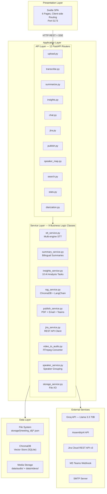

### 5.2 Layer Responsibilities

**Presentation Layer (Svelte Frontend):**
- Renders the user interface as a single-page application
- Manages client-side routing via hash-based navigation
- Makes REST API calls to the backend
- Handles SSE (Server-Sent Events) streaming for the chatbot

**API Layer (FastAPI Routers):**
- Defines HTTP endpoints with request/response validation (Pydantic)
- Handles authentication checks (Jira, SMTP credentials)
- Orchestrates service calls and manages background tasks
- Returns structured JSON or SSE streams

**Service Layer (Business Logic):**
- Encapsulates all domain-specific logic
- Each service is a standalone class with clear interface
- Services are stateless (except RAG service which maintains conversation memory)
- All AI interactions are abstracted behind service methods

**Data Layer (Storage):**
- File-based storage with one directory per meeting
- ChromaDB for vector embeddings (RAG)
- Media files (audio/video) in separate directories

**External Services:**
- Groq API for LLM inference (Llama 3.3 70B)
- AssemblyAI for cloud-based transcription
- Jira for project management integration
- MS Teams webhooks for notifications
- SMTP servers for email delivery

### 5.3 Component Interaction Diagram

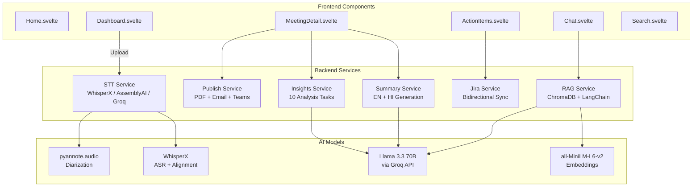

---

## 6. Technology Stack

### 6.1 Frontend Technologies

| Technology | Version | Purpose | Justification |
|---|---|---|---|
| **Svelte** | 4.x | UI Framework | Compile-time framework with minimal bundle size (~5KB runtime). Reactive declarations eliminate boilerplate. |
| **Vite** | 5.x | Build Tool | Sub-second HMR (Hot Module Replacement) during development. ES module-based build for fast startup. |
| **TailwindCSS** | 3.x | Styling | Utility-first CSS framework enabling rapid UI development without leaving HTML. |
| **lucide-svelte** | Latest | Icons | Consistent, tree-shakeable icon library with 1000+ icons. |
| **svelte-spa-router** | 4.x | Routing | Hash-based client-side routing, ideal for SPA deployment without server configuration. |
| **Fetch API** | Native | HTTP Client | Browser-native API for REST calls and SSE streaming, avoiding external dependencies. |

### 6.2 Backend Technologies

| Technology | Version | Purpose | Justification |
|---|---|---|---|
| **FastAPI** | 0.100+ | API Framework | Async-capable Python framework with automatic OpenAPI documentation, Pydantic validation, and dependency injection. |
| **Uvicorn** | 0.27+ | ASGI Server | High-performance ASGI server with hot-reload for development. |
| **Python** | 3.10 | Language | Rich ecosystem for AI/ML libraries. Type hints for code clarity. |
| **Pydantic** | 2.x | Validation | Automatic request/response schema validation with type coercion and error messages. |

### 6.3 AI/ML Technologies

| Technology | Version | Purpose | Justification |
|---|---|---|---|
| **WhisperX** | Latest | Transcription | OpenAI Whisper with forced alignment for word-level timestamps. Multi-language support. |
| **pyannote.audio** | 3.x | Speaker Diarization | State-of-the-art neural diarization with VAD, speaker embedding, and clustering. |
| **AssemblyAI** | API v2 | Cloud STT | Alternative transcription engine with built-in diarization. Higher accuracy on noisy audio. |
| **Groq Whisper** | API | Fast STT | LPU-accelerated Whisper inference. ~5x real-time transcription speed. |
| **Llama 3.3 70B** | Via Groq | LLM | 70B parameter model with strong instruction-following, multilingual support, and structured output capability. |
| **all-MiniLM-L6-v2** | Via HuggingFace | Embeddings | Compact 384-dimensional sentence embeddings. Runs on CPU. 80MB model size. |
| **ChromaDB** | 0.4+ | Vector Store | Persistent vector database with SQLite backend. No external server required. |
| **LangChain** | 0.1+ | RAG Framework | Retrieval orchestration, document loading, and memory management for the chatbot. |
| **FFmpeg** | 6.x | Audio Processing | Industry-standard tool for video-to-audio conversion. Outputs WAV 16kHz mono. |

### 6.4 Integration Technologies

| Technology | Version | Purpose | Justification |
|---|---|---|---|
| **Jira REST API** | v3 | Project Management | Standard enterprise project management tool. REST API enables full CRUD operations on tickets. |
| **MS Teams Webhooks** | v1.4 | Notifications | Incoming Webhooks with Adaptive Cards provide rich, interactive meeting summaries in Teams channels. |
| **smtplib** | stdlib | Email | Python standard library for SMTP. Supports TLS encryption. No external dependencies. |
| **fpdf2** | 2.x | PDF Generation | Lightweight PDF library with Unicode support via TrueType fonts (NotoSans, NotoSansDevanagari). |

### 6.5 Technology Architecture Diagram

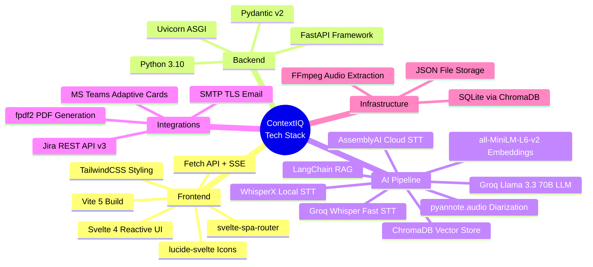

---

## 7. System Design

### 7.1 Module Design

The system is organized into three primary modules:

**Module 1: Ingestion Pipeline**
```
Video File → FFmpeg (audio extraction) → STT Engine (transcription)
→ pyannote (diarization) → Speaker grouping → transcript.json
```

**Module 2: AI Analysis Pipeline**
```
transcript.json → LLM (10 analysis tasks) → Individual JSON output files
→ Background regeneration when speaker names are mapped
```

**Module 3: Output & Integration Pipeline**
```
JSON data → PDF generation / Email sending / Teams notification
→ Jira ticket creation / RAG indexing / Follow-up email
```

### 7.2 Class Design

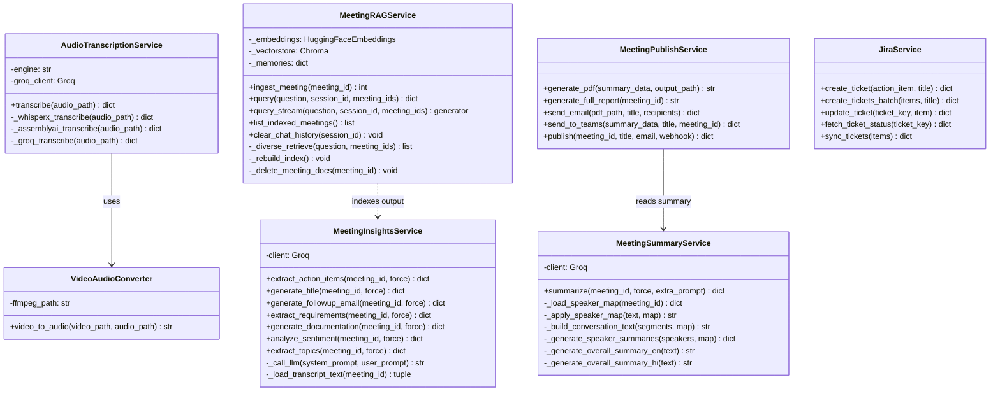

### 7.3 Entity Relationship Diagram

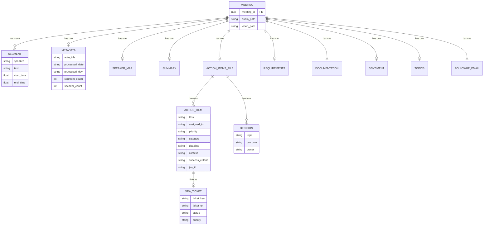

---

## 8. Implementation Details

### 8.1 Multi-Engine Transcription Pipeline

The transcription system supports three engines through a unified interface:

**Engine Selection Logic:**
```
User selects engine → AudioTranscriptionService.transcribe(audio_path)
    ├── engine="whisperx"  → Local GPU inference with forced alignment
    ├── engine="assemblyai" → Cloud API with built-in diarization
    └── engine="groq"      → LPU-accelerated Whisper
```

**WhisperX Pipeline:**
1. Load Whisper model (configurable size: tiny, base, small, medium, large-v2)
2. Transcribe audio to get segments with timestamps
3. Apply forced alignment using wav2vec2 for word-level precision
4. Run pyannote.audio diarization to detect speakers
5. Assign speaker labels to aligned segments
6. Group segments by speaker for the final output

**Output Format (Standardized):**
```json
{
  "segments": [
    {
      "speaker": "SPEAKER_00",
      "text": "We need to automate the HRMS integration.",
      "start": 12.54,
      "end": 18.31
    }
  ],
  "speakers": {
    "SPEAKER_00": [/* all segments for this speaker */],
    "SPEAKER_01": [/* all segments for this speaker */]
  }
}
```

### 8.2 LLM-Powered Insight Extraction

All NLP tasks use Groq's API with the Llama 3.3 70B model. Each task follows a consistent pattern:

1. **Load transcript** — read `transcript.json` and apply speaker map
2. **Build prompt** — task-specific system prompt + full transcript as user prompt
3. **Call LLM** — send to Groq API with retry logic (3 attempts, 2s backoff)
4. **Parse response** — extract structured JSON from LLM output
5. **Cache result** — save to disk with `force` flag for re-generation

**Ten AI Analysis Tasks:**

| # | Task | System Prompt Focus | Output File |
|---|---|---|---|
| 1 | Overall Summary (EN) | Concise meeting overview, key points, decisions | `summary.json` |
| 2 | Overall Summary (HI) | Natural Hindi summary, not word-by-word translation | `summary.json` |
| 3 | Speaker Summaries | Per-speaker contribution analysis | `summary.json` |
| 4 | Action Items | Tasks with assignee, priority, deadline, criteria | `action_items.json` |
| 5 | Requirements | Functional + non-functional requirements | `requirements.json` |
| 6 | Documentation | MoM with agenda, attendees, discussion points | `documentation.json` |
| 7 | Sentiment | Per-segment emotional analysis (positive/negative/neutral) | `sentiment.json` |
| 8 | Topics | Time-ranged topic segments with summaries | `topics.json` |
| 9 | Follow-up Email | Professional email draft with action items | `followup_email.json` |
| 10 | Meeting Title | Concise, descriptive auto-generated title | `metadata.json` |

### 8.3 RAG Chatbot Implementation

The RAG subsystem is the most architecturally complex component:

**Ingestion Flow:**
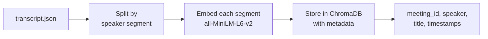

**Query Flow:**
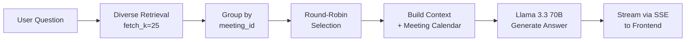

**Diverse Retrieval Algorithm:**
The standard RAG approach retrieves the top-K most similar chunks, which often come from a single meeting. ContextIQ's diverse retrieval ensures cross-meeting coverage:

1. Fetch 25 candidate chunks from ChromaDB (similarity search)
2. Group candidates by `meeting_id`
3. Round-robin across meetings: take 1 chunk from Meeting A, 1 from Meeting B, 1 from Meeting C, repeat
4. Stop when 12 diverse chunks are collected
5. This guarantees every relevant meeting is represented in the context

**Meeting Calendar Context:**
The system prompt includes a calendar of all indexed meetings with their titles and dates. This enables date-based queries like "What did we discuss on Monday?" without embedding date information in the vector search.

**Conversation Memory:**
Chat history is maintained per session using an in-memory dictionary. The last 10 messages (5 exchanges) are included in the prompt for contextual follow-up questions.

### 8.4 Speaker Map & Background Regeneration

The HITL speaker mapping system is a key architectural innovation:

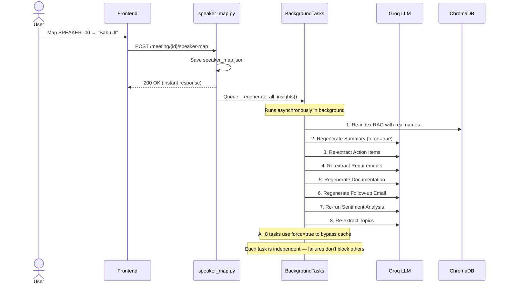

**Design Rationale:** The API returns immediately (200 OK) so the user isn't blocked. All 8 regeneration tasks run sequentially in the background using FastAPI's `BackgroundTasks`. Each task uses `force=True` to bypass the cached result and generate fresh output with the corrected speaker names.

### 8.5 Jira Bidirectional Sync

The Jira integration supports three operations:

**Push (ContextIQ → Jira):**
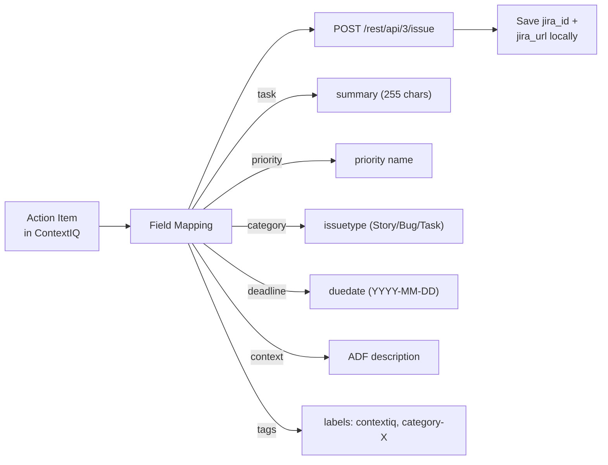

**Sync (Jira → ContextIQ):**
For each action item with a `jira_id`, the system fetches the current Jira ticket status, priority, and assignee via `GET /rest/api/3/issue/{key}`. Changes are detected by comparing with local values and updated in-place.

**Update (ContextIQ → Jira):**
When a user edits an action item locally, changes are pushed to Jira:
- Field changes (summary, priority, duedate) via `PUT /rest/api/3/issue/{key}`
- Status changes via `POST /rest/api/3/issue/{key}/transitions`

### 8.6 Publishing Pipeline

The publish system generates output in three formats:

**PDF Generation (fpdf2):**
- Uses NotoSans (Latin) and NotoSansDevanagari (Hindi) TrueType fonts
- Generates both a summary PDF and a comprehensive full report
- Includes meeting title, date, speaker summaries, and overall summary
- Full report adds action items, decisions, requirements, and documentation

**Email (SMTP/TLS):**
- Sends PDF as attachment via configured SMTP server
- Supports Gmail App Passwords for authentication
- HTML email body with meeting summary

**Teams Adaptive Card (v1.4):**
- Rich card with sections: summary snippet, action items (top 5), decisions (top 4), key takeaways (top 4), speaker highlights (top 3)
- Sent via Incoming Webhook URL
- Footer indicates full PDF was emailed

---

## 9. Key Features

### Feature 1: Multi-Engine Speech-to-Text
Three transcription engines (WhisperX, AssemblyAI, Groq Whisper) with automatic speaker diarization. Users can select the engine based on speed, accuracy, and infrastructure requirements. All engines produce a standardized output format.

### Feature 2: Bilingual Summary Generation
AI-generated meeting summaries in both English and Hindi. English summaries include per-speaker contribution analysis. Hindi summaries are written in natural, professional Hindi — not word-by-word translations.

### Feature 3: Structured Action Item Extraction
Each action item includes: task description, assigned person, priority (high/medium/low), category (development/design/testing/etc.), deadline, context, success criteria, dependencies, and the speaker who raised it.

### Feature 4: Requirements Mining
Automatic extraction of functional requirements, non-functional requirements, constraints, assumptions, and user stories from meeting discussions. Particularly valuable for product and engineering meetings.

### Feature 5: Meeting Documentation Generation
Complete Minutes of Meeting (MoM) with: agenda items, attendees, discussion points per topic, action items, decisions, and next steps. Ready-to-share format.

### Feature 6: Sentiment Analysis
Per-segment emotional analysis classifying each speaker contribution as positive, negative, or neutral with a confidence score. Enables understanding of meeting dynamics and speaker engagement.

### Feature 7: Topic Segmentation
Automatic identification of distinct discussion topics with time ranges, titles, summaries, and participating speakers. Enables jumping to specific parts of a meeting.

### Feature 8: RAG AI Chatbot
Cross-meeting question answering with streaming responses (SSE), source citations with speaker and timestamp, conversation memory for follow-up questions, and diverse retrieval ensuring every meeting is represented.

### Feature 9: Human-in-the-Loop Speaker Mapping
Manual speaker name correction that triggers automatic regeneration of all 8 AI-generated artifacts. Ensures consistency across all outputs without manual re-processing.

### Feature 10: Bidirectional Jira Integration
Push action items to Jira with full field mapping. Sync status, priority, and assignee changes back from Jira. Update Jira tickets when items are edited in ContextIQ.

### Feature 11: Multi-Channel Publishing
One-click publishing to PDF (with Unicode support), email (SMTP with attachment), and Microsoft Teams (rich Adaptive Card with summary, action items, decisions, and speaker highlights).

### Feature 12: Follow-up Email Automation
AI-generated professional follow-up emails combining meeting title, summary, action items, and decisions. Preview, edit, and send directly from the application.

---

## 10. Workflow & Data Flow

### 10.1 Complete Meeting Processing Workflow

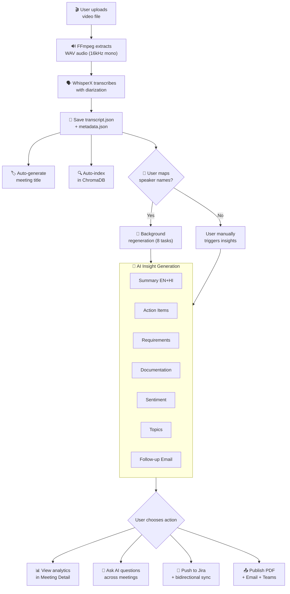

### 10.2 User Journey Map

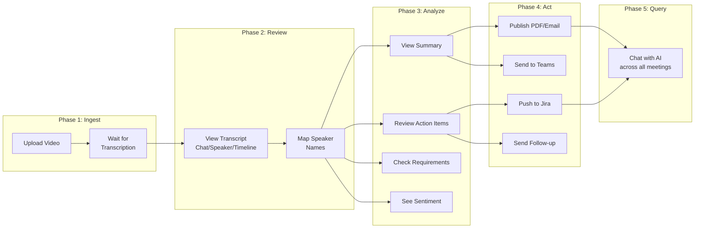

---

## 11. Database & Storage Design

### 11.1 Storage Architecture

ContextIQ uses a **file-based storage model** where each meeting is a self-contained directory:

```
storage/
├── 5c276f9d-213e-4c0b-91fc-8c38770729c0/
│   ├── transcript.json         # 50–500 KB — segments + speakers
│   ├── metadata.json           # 1 KB — title, dates, counts
│   ├── speaker_map.json        # <1 KB — HITL name mapping
│   ├── summary.json            # 5–15 KB — EN + HI summaries
│   ├── action_items.json       # 10–30 KB — tasks, decisions, takeaways
│   ├── requirements.json       # 5–20 KB — requirements + user stories
│   ├── documentation.json      # 10–25 KB — full MoM
│   ├── sentiment.json          # 20–50 KB — per-segment sentiment
│   ├── topics.json             # 5–15 KB — topic segments
│   ├── followup_email.json     # 3–8 KB — email draft
│   ├── speaker_report.json     # 5–10 KB — per-speaker scorecard
│   ├── Meeting_Summary.pdf     # 50–200 KB — generated PDF
│   └── Full_Report.pdf         # 100–500 KB — comprehensive report
├── chroma_db/                  # ChromaDB vector store
│   ├── chroma.sqlite3          # Metadata + indexes
│   └── {collection_id}/       # Embedding data
│
data/
├── audio/
│   └── {meeting_id}.wav        # 10–100 MB — extracted audio
└── videos/
    └── {meeting_id}.mp4        # 50–500 MB — uploaded video
```

### 11.2 Design Rationale

**Why file-based storage instead of a database?**

1. **Simplicity:** No database server to install, configure, or maintain
2. **Portability:** Each meeting directory is self-contained and can be copied/moved independently
3. **Transparency:** All data is human-readable JSON, easy to inspect and debug
4. **No Schema Migrations:** Adding new fields or files requires no migration scripts
5. **Suitable Scale:** For the target use case (teams of 5–50 with ~100 meetings), file I/O is not a bottleneck

### 11.3 ChromaDB Vector Store

ChromaDB stores the RAG embeddings:

| Parameter | Value |
|---|---|
| Collection Name | `meetings` |
| Embedding Model | all-MiniLM-L6-v2 (384 dimensions) |
| Persistence | SQLite (in `storage/chroma_db/`) |
| Document Format | `[{date}, {day}] {speaker}: {text}` |
| Metadata per Document | meeting_id, meeting_title, speaker, speaker_id, start, end, chunk_index, meeting_date, meeting_day |
| Chunk Strategy | One document per transcript segment |

---

## 12. API Design

### 12.1 API Overview

ContextIQ exposes **30+ REST endpoints** organized across 12 FastAPI routers:

### 12.2 Endpoint Categories

**Ingestion (2 endpoints):**

| Endpoint | Method | Description | Request | Response |
|---|---|---|---|---|
| `/upload-video` | POST | Upload meeting video | Multipart file | `{meeting_id, audio_path}` |
| `/transcribe/{id}` | POST | Transcribe + diarize | `{engine}` | `{segments, speakers, counts}` |

**AI Insights (10 endpoints):**

| Endpoint | Method | Description | Response |
|---|---|---|---|
| `/summarize/{id}` | POST | Generate bilingual summary | `{speaker_summaries, overall_en, overall_hi}` |
| `/meeting/{id}/action-items` | POST | Extract action items | `{action_items, decisions, key_takeaways}` |
| `/meeting/{id}/requirements` | POST | Extract requirements | `{requirements, user_stories, constraints}` |
| `/meeting/{id}/documentation` | POST | Generate MoM | `{agenda, attendees, discussion, next_steps}` |
| `/meeting/{id}/sentiment` | POST | Analyze sentiment | `{segments: [{sentiment, confidence}]}` |
| `/meeting/{id}/topics` | POST | Identify topics | `{topics: [{title, summary, start, end}]}` |
| `/meeting/{id}/followup-email` | POST | Generate email draft | `{subject, body, recipients}` |
| `/meeting/{id}/title` | POST | Auto-generate title | `{title}` |
| `/meeting/{id}/speaker-report` | POST | Speaker scorecards | `{speakers: [{name, metrics}]}` |
| `/meeting/{id}/culture-score` | POST | Meeting culture score | `{score, breakdown}` |

**RAG Chat (4 endpoints):**

| Endpoint | Method | Description |
|---|---|---|
| `/chat/ask/stream` | POST | Stream answer via SSE |
| `/chat/index/{id}` | POST | Index meeting in ChromaDB |
| `/chat/meetings` | GET | List indexed meetings with titles |
| `/chat/clear/{session}` | POST | Clear conversation history |

**Jira (4 endpoints):**

| Endpoint | Method | Description |
|---|---|---|
| `/meeting/{id}/jira/push` | POST | Create Jira tickets |
| `/meeting/{id}/jira/sync` | POST | Sync status from Jira |
| `/meeting/{id}/jira/update` | PUT | Update Jira ticket |
| `/jira/status` | GET | Check configuration |

**Publishing (3 endpoints):**

| Endpoint | Method | Description |
|---|---|---|
| `/publish/{id}` | POST | PDF + Email + Teams |
| `/meeting/{id}/followup-email/send` | POST | Send follow-up email |
| `/meeting/{id}/report` | GET | Download full PDF |

---

## 13. Testing & Validation

### 13.1 Testing Approach

| Test Type | Method | Scope |
|---|---|---|
| API Testing | Manual via cURL / Postman | All 30+ endpoints |
| Frontend Testing | Manual browser testing | All 6 pages |
| Integration Testing | End-to-end pipeline runs | Upload → Publish |
| Schema Validation | Automatic (Pydantic) | Request/response models |
| Error Handling | Manual fault injection | Network failures, missing files |

### 13.2 Test Results

| # | Test Case | Input | Expected Output | Status |
|---|---|---|---|---|
| 1 | Upload MP4 video | 5-min meeting recording | Returns UUID meeting_id | ✅ Pass |
| 2 | Transcribe with diarization | Audio file | transcript.json with speaker labels | ✅ Pass |
| 3 | Generate English summary | Transcript | 3-5 paragraph summary | ✅ Pass |
| 4 | Generate Hindi summary | Transcript | Professional Hindi text | ✅ Pass |
| 5 | Extract action items | Transcript | Structured JSON with all fields | ✅ Pass |
| 6 | Extract requirements | Transcript | Functional + non-functional reqs | ✅ Pass |
| 7 | Analyze sentiment | Transcript | Per-segment sentiment scores | ✅ Pass |
| 8 | Index meeting in RAG | transcript.json | Chunks stored in ChromaDB | ✅ Pass |
| 9 | Cross-meeting chat | "What was discussed?" | Answer with citations | ✅ Pass |
| 10 | Push to Jira | Action item | SCRUM-12 ticket created | ✅ Pass |
| 11 | Sync from Jira | Ticket key | Status updated locally | ✅ Pass |
| 12 | Generate PDF | Summary data | Unicode PDF with EN+HI | ✅ Pass |
| 13 | Send to Teams | Summary + actions | Rich Adaptive Card delivered | ✅ Pass |
| 14 | Speaker map regeneration | Name mapping | All 8 insights regenerated | ✅ Pass |
| 15 | Follow-up email send | Draft + recipients | Email delivered via SMTP | ✅ Pass |

---

## 14. Results & Performance

### 14.1 Processing Time Benchmarks

| Stage | Time (5-min meeting) | Notes |
|---|---|---|
| Audio Extraction (FFmpeg) | ~3 seconds | Video → WAV 16kHz mono |
| Transcription (Groq Whisper) | ~15 seconds | ~5x real-time |
| Transcription (WhisperX, GPU) | ~30 seconds | ~2x real-time |
| Speaker Diarization | ~10 seconds | pyannote.audio |
| Auto Title Generation | ~2 seconds | Single LLM call |
| Summary Generation (EN+HI) | ~8 seconds | 3 LLM calls |
| Action Item Extraction | ~5 seconds | 1 LLM call |
| Full Insight Generation (all 10) | ~45 seconds | 10+ LLM calls |
| RAG Indexing | ~3 seconds | Embedding + ChromaDB write |
| RAG Query Response | ~3 seconds | Retrieval + LLM (streamed) |
| PDF Generation | ~2 seconds | fpdf2 rendering |
| **Total Pipeline** | **~90 seconds** | End-to-end for 5-min meeting |

### 14.2 Quality Metrics

| Metric | Observed Value |
|---|---|
| Transcription Word Error Rate (English) | ~5–8% (WhisperX) |
| Speaker Diarization Accuracy (2–3 speakers) | ~85–90% |
| Summary Relevance (manual assessment) | High — covers key points |
| Action Item Completeness | High — captures most items |
| Sentiment Classification Accuracy | ~75–80% |
| RAG Answer Relevance | High — grounded in context |

---

## 15. Advantages & Limitations

### 15.1 Advantages

1. **Complete Automation:** From raw video to structured knowledge in one pipeline — no manual steps required after upload
2. **Multi-Engine Flexibility:** Three STT engines allow choosing between local privacy (WhisperX), cloud accuracy (AssemblyAI), and maximum speed (Groq)
3. **Bilingual Support:** Native English + Hindi summary generation for multilingual teams
4. **HITL with Auto-Regeneration:** Speaker name correction automatically propagates to all 8 AI outputs — no manual re-processing
5. **Cross-Meeting Intelligence:** RAG chatbot with diverse retrieval answers questions across the entire meeting history
6. **Bidirectional Jira Sync:** Action items stay synchronized between ContextIQ and Jira
7. **Rich Multi-Channel Output:** PDF, email, and Teams with rich formatting (Adaptive Cards)
8. **Self-Hosted:** All data stays on the user's infrastructure (except LLM API calls to Groq)
9. **Cost-Effective:** Uses Groq's free tier for LLM inference; no per-seat licensing fees
10. **Modular Architecture:** Clean separation of services makes it easy to add new AI tasks or integrations

### 15.2 Limitations

1. **No Real-Time Transcription:** Currently processes pre-recorded files only; live streaming is not supported
2. **File-Based Storage:** JSON files are not suitable for high-concurrency or large-scale deployments
3. **No Authentication:** All API endpoints are open; suitable only for local or trusted network use
4. **GPU Requirement:** WhisperX requires an NVIDIA GPU for practical transcription speed
5. **Diarization Degradation:** Speaker identification accuracy decreases with 4+ speakers or overlapping speech
6. **Internet Dependency:** LLM calls require connectivity to Groq's API
7. **Limited Language Pair:** Currently supports only English + Hindi; additional languages require prompt modification
8. **No Conflict Resolution:** Jira sync overwrites local data without conflict detection

---

## 16. Future Scope

### 16.1 Short-Term Enhancements (1–3 months)

| Enhancement | Description |
|---|---|
| Live Audio Recording | Browser-based microphone recording with MediaRecorder API, real-time waveform visualization, and automatic pipeline triggering |
| Decision Tracker | Cross-meeting decision board with status tracking, ownership, and recurrence detection |
| AI Meeting Coach | Post-meeting coaching report per speaker with engagement metrics, talk-time balance, and improvement suggestions |
| Slack Integration | Webhook notifications formatted for Slack Block Kit alongside existing Teams support |
| Global Search | Full-text keyword search across all meetings, transcripts, action items, and decisions |

### 16.2 Medium-Term Goals (3–6 months)

| Goal | Description |
|---|---|
| Database Migration | Move from JSON files to PostgreSQL for scalability, concurrent access, and query flexibility |
| User Authentication | OAuth2 / JWT-based authentication with role-based access control |
| Real-Time Streaming | WebSocket-based live transcription displayed as the meeting progresses |
| Calendar Integration | Auto-import meeting recordings from Google Calendar or Microsoft Outlook |
| Multi-Language Support | Extend beyond English + Hindi to support 10+ languages via Whisper's multi-language capabilities |
| Webhook API | Outbound webhook notifications when insights are ready, enabling third-party integrations |

### 16.3 Long-Term Vision (6–12 months)

| Vision | Description |
|---|---|
| Organizational Knowledge Graph | Neo4j-based graph connecting people, decisions, projects, and meetings across the entire organization |
| Smart Meeting Scheduling | AI-recommended follow-up meeting times based on action item deadlines and participant calendars |
| Auto-Presentation Generation | Generate slide decks from meeting summaries with title, agenda, decisions, and next steps |
| Mobile Application | Native iOS/Android app for on-the-go meeting review and AI chat |
| Meeting Quality Scoring | AI-generated meeting effectiveness ratings with trend tracking over time |

---

## 17. Conclusion

ContextIQ demonstrates that modern AI capabilities — speech recognition, speaker diarization, large language models, and retrieval-augmented generation — can be integrated into a unified, end-to-end platform that fundamentally transforms how organizations handle meeting documentation and follow-up.

The platform addresses a real and pervasive problem: the gap between information discussed in meetings and actionable, structured knowledge. By automating transcription, summarization, insight extraction, and publishing, ContextIQ reduces hours of manual post-meeting work to minutes of automated processing.

**Key technical innovations of this project include:**

1. **Background Regeneration Pipeline:** The HITL speaker mapping system that automatically propagates name corrections through all 8 AI-generated artifacts, ensuring consistency without manual intervention.

2. **Diverse RAG Retrieval:** A round-robin retrieval algorithm that ensures cross-meeting representation in chatbot answers, preventing single-meeting bias from standard similarity search.

3. **Multi-Engine STT Architecture:** A unified interface supporting three transcription engines, allowing users to balance privacy, accuracy, and speed based on their infrastructure.

4. **Bidirectional Jira Integration:** Full-cycle action item management with push, sync, and update operations, including status transitions via the Jira transitions API.

5. **Rich Multi-Channel Publishing:** Automated generation of PDF reports (with Unicode bilingual support), email delivery, and Microsoft Teams Adaptive Cards from a single publish action.

The modular, service-oriented architecture ensures that ContextIQ can be extended with new AI capabilities, additional language support, new integration targets, and alternative storage backends without significant architectural changes. The file-based storage model, while simple, provides excellent development velocity and debugging transparency.

ContextIQ serves as both a practical tool for meeting intelligence and a reference architecture for building AI-powered knowledge management systems that combine multiple AI models, human oversight, and enterprise integrations into a cohesive workflow.

---

## 18. References

1. Radford, A., Kim, J. W., Xu, T., Brockman, G., McLeavey, C., & Sutskever, I. (2023). "Robust Speech Recognition via Large-Scale Weak Supervision." *Proceedings of the 40th International Conference on Machine Learning (ICML 2023)*.

2. Bain, M., Huh, J., Han, T., & Zisserman, A. (2023). "WhisperX: Time-Accurate Speech Transcription of Long-Form Audio." *INTERSPEECH 2023*.

3. Bredin, H., & Laurent, A. (2023). "End-to-end speaker segmentation for overlap-aware resegmentation." *Proc. INTERSPEECH 2023*. (pyannote.audio 3.x)

4. Lewis, P., Perez, E., Piktus, A., Petroni, F., Karpukhin, V., Goyal, N., ... & Kiela, D. (2020). "Retrieval-Augmented Generation for Knowledge-Intensive NLP Tasks." *Advances in Neural Information Processing Systems (NeurIPS 2020)*.

5. Touvron, H., Martin, L., Stone, K., Albert, P., Almahairi, A., Babaei, Y., ... & Scialom, T. (2024). "Llama 3: Open Foundation and Fine-Tuned Chat Models." *Meta AI Research*.

6. Reimers, N., & Gurevych, I. (2019). "Sentence-BERT: Sentence Embeddings using Siamese BERT-Networks." *Proceedings of the 2019 Conference on Empirical Methods in NLP (EMNLP 2019)*. (all-MiniLM-L6-v2)

7. Chase, H. (2022). "LangChain: Building applications with LLMs through composability." *GitHub Repository*.

8. Chroma Team. (2023). "Chroma: the AI-native open-source embedding database." *ChromaDB Documentation*.

9. Ramírez, S. (2018). "FastAPI: Modern, fast (high-performance) web framework for building APIs with Python 3.7+ based on standard Python type hints." *FastAPI Documentation*.

10. Harris, R. (2016). "Svelte: Cybernetically enhanced web apps." *Svelte Documentation*.

11. Groq Inc. (2024). "Groq LPU Inference Engine: Low-latency AI inference for Large Language Models." *Groq Documentation*.

12. Atlassian. (2023). "Jira REST API v3 Documentation." *Atlassian Developer Documentation*.

---

*This report was prepared as part of the ContextIQ project development. All architecture, code, and documentation are original work.*
