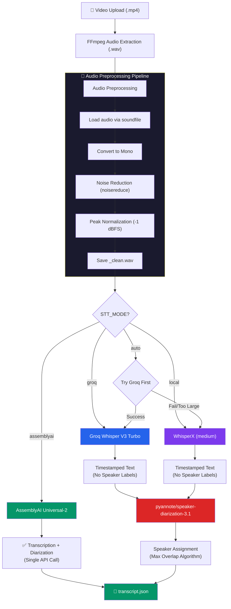
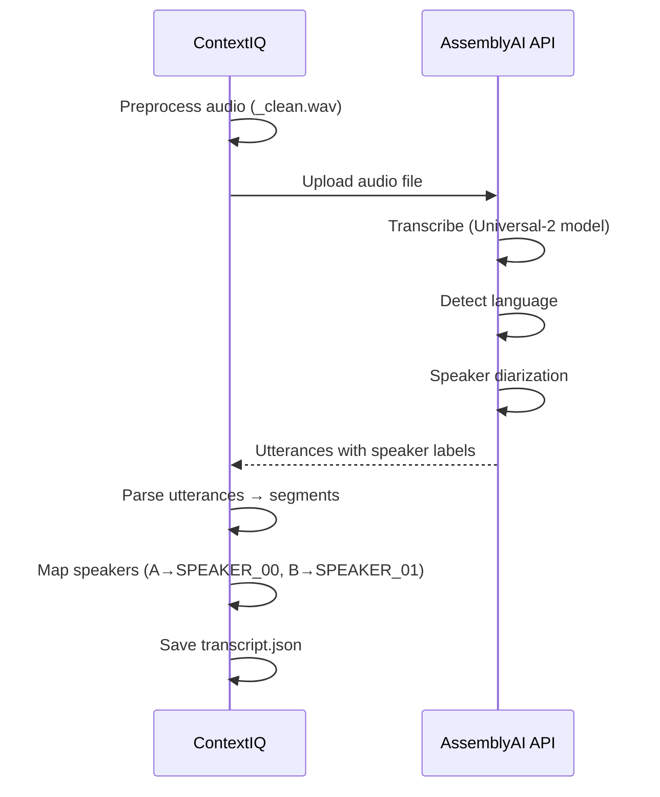
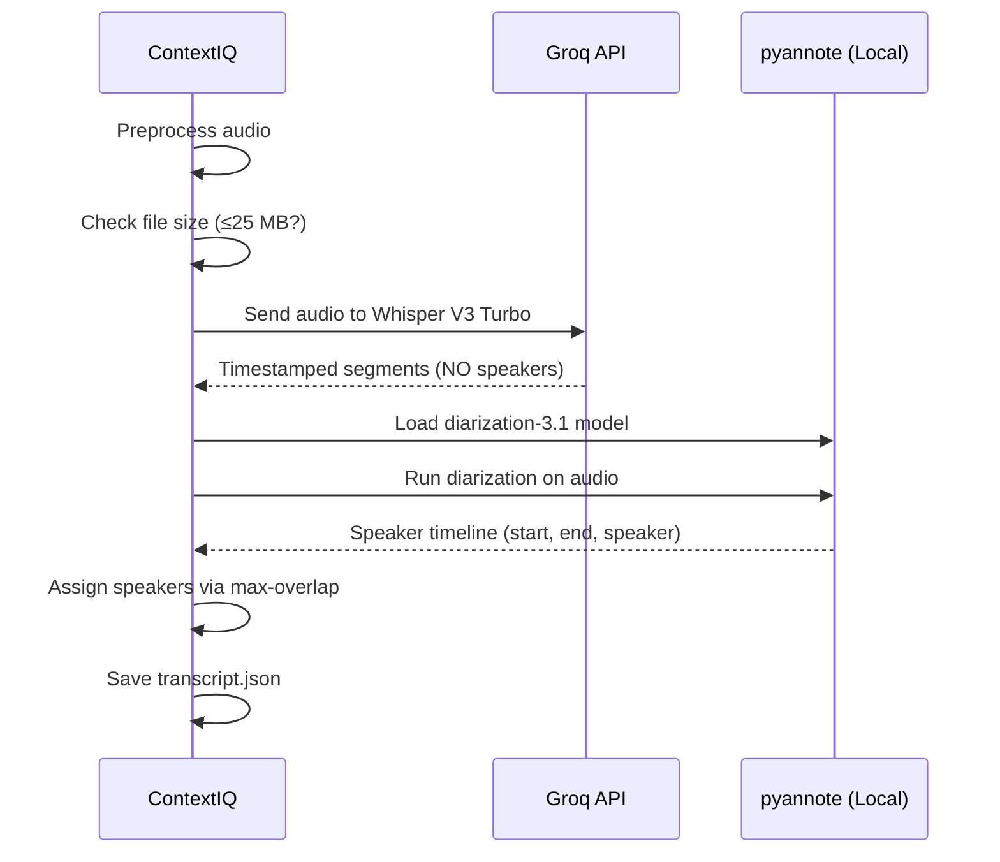
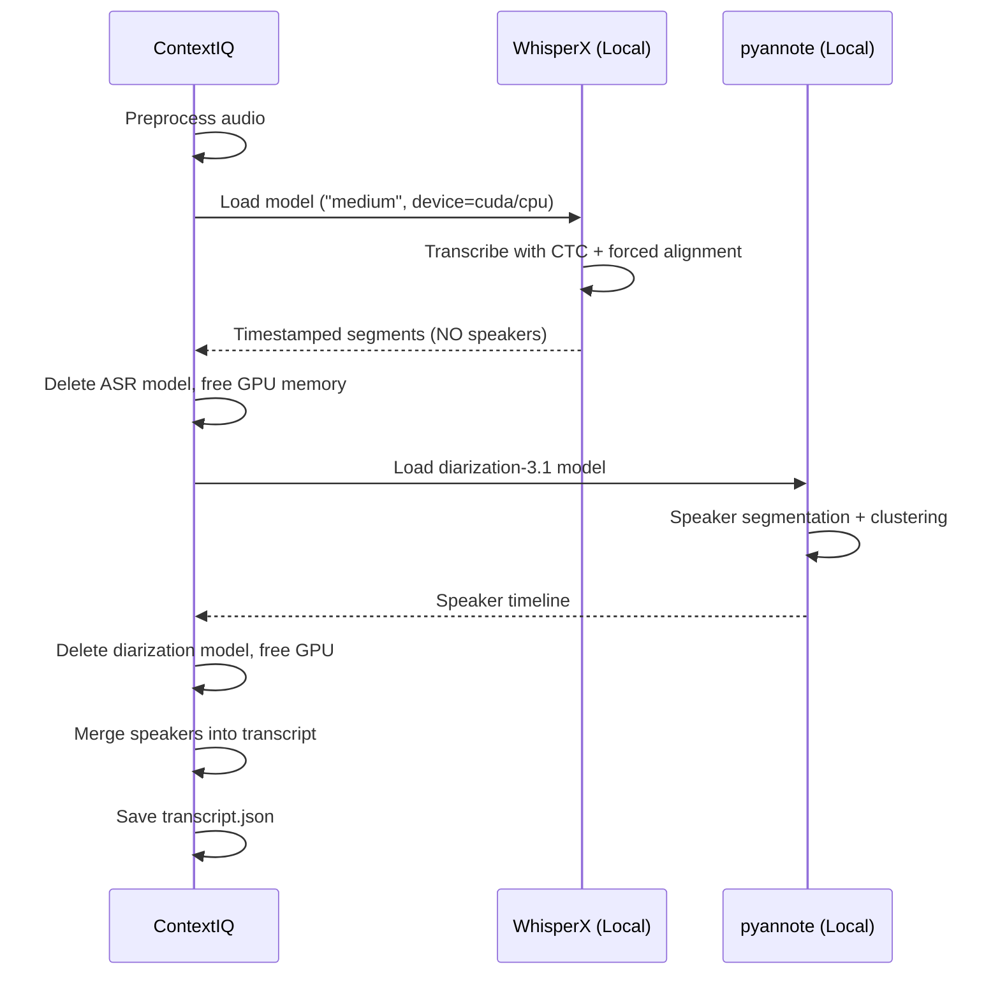
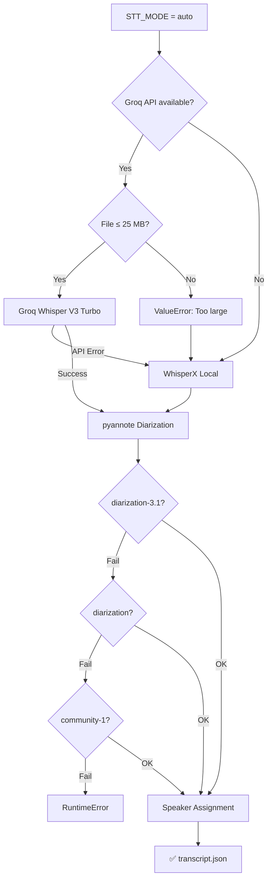

# Speech-to-Text (STT) Service — Internal Working

> **File**: `app/services/stt_service.py`  
> **Class**: `AudioTranscriptionService`  
> **Purpose**: Multi-engine transcription with speaker diarization

---

## Architecture Overview



---

## STT Modes (set via `STT_MODE` env var)

| Mode | Engine | Diarization | Speed | Quality | Cost |
|------|--------|-------------|-------|---------|------|
| `assemblyai` ⭐ | AssemblyAI Universal-2 | Built-in | ~3× realtime | Best | Paid API |
| `groq` | Groq Whisper V3 Turbo | pyannote (local) | ~10× realtime | Very Good | Free tier |
| `local` | WhisperX medium | pyannote (local) | ~5× realtime (GPU) | Good | Free (local) |
| `auto` | Groq → WhisperX fallback | pyannote (local) | Varies | Good | Free tier |

---

## Step-by-Step Internal Working

### Step 1: Audio Preprocessing

Every audio file goes through preprocessing before any STT engine:

```python
def _preprocess_audio(self, audio_path: str) -> str:
```

```
Raw WAV Input
    │
    ▼
┌─────────────────────────────────────┐
│  1. Load audio via soundfile        │
│     audio_data, sample_rate = sf.read()
│                                     │
│  2. Convert to Mono                 │
│     if stereo → average channels    │
│     np.mean(audio_data, axis=1)     │
│                                     │
│  3. Noise Reduction                 │
│     noisereduce.reduce_noise(       │
│       prop_decrease=0.7,            │  ← 70% noise reduction
│       n_std_thresh_stationary=1.5   │  ← stationary noise threshold
│     )                               │
│                                     │
│  4. Peak Normalization              │
│     target = -1 dBFS               │
│     audio *= (target_peak / peak)   │
│                                     │
│  5. Save cleaned audio              │
│     → audio_clean.wav               │
└─────────────────────────────────────┘
    │
    ▼
Cleaned WAV → STT Engine
```

**Why Preprocessing?**
- **Noise reduction**: Removes background hum, AC noise, keyboard clicks
- **Normalization**: Ensures consistent volume levels across different recordings
- **Mono conversion**: STT models expect single-channel audio

---

### Step 2A: AssemblyAI Mode (Default)



**Key Configuration:**
```python
config = aai.TranscriptionConfig(
    speech_models=["universal-2"],     # Latest model
    language_detection=True,           # Auto-detect language
    speaker_labels=True,               # Enable diarization
    speakers_expected=int(env)         # Optional hint from .env
)
```

**Output Format:**
```json
{
  "language": "en",
  "segments": [
    {
      "start": 0.52,
      "end": 12.34,
      "text": "Get started. Good morning, everybody...",
      "speaker": "SPEAKER_00"
    }
  ]
}
```

**Speaker Label Mapping**: AssemblyAI returns `"A"`, `"B"`, `"C"` → converted to `"SPEAKER_00"`, `"SPEAKER_01"`, `"SPEAKER_02"` via:
```python
speaker = f"SPEAKER_{ord(utt.speaker) - ord('A'):02d}"
# 'A' → SPEAKER_00, 'B' → SPEAKER_01
```

---

### Step 2B: Groq Whisper Mode



**Groq Whisper Call:**
```python
response = client.audio.transcriptions.create(
    file=(filename, audio_file),
    model="whisper-large-v3-turbo",
    response_format="verbose_json",
    timestamp_granularities=["segment"],
    language="en",
)
# Returns segments with timestamps but speaker="UNKNOWN"
```

**Limitation**: Groq Whisper has a **25 MB file size limit**. If exceeded in `auto` mode, falls back to local WhisperX.

---

### Step 2C: Local WhisperX Mode



**Memory Management Pattern** — Models are loaded, used, and immediately deleted to conserve GPU VRAM:
```python
# Load → Use → Delete pattern
asr_model = whisperx.load_model("medium", device="cuda")
result = asr_model.transcribe(audio)
del asr_model              # ← Immediately delete
torch.cuda.empty_cache()   # ← Force free VRAM

# Then separately:
diarize_model = load_diarization_pipeline()
diarization = diarize_model(audio_path)
del diarize_model           # ← Delete after use
torch.cuda.empty_cache()    
```

---

### Step 3: Speaker Diarization (pyannote)

Used by Groq and Local modes (AssemblyAI has built-in diarization).

**Model Loading Strategy** — tries models in order of quality:
```python
models_to_try = [
    "pyannote/speaker-diarization-3.1",         # Best
    "pyannote/speaker-diarization",             # Good
    "pyannote/speaker-diarization-community-1"  # Last resort
]
```

**Requires HuggingFace token** (`HF_TOKEN`) — these models require accepting licenses on HuggingFace.

---

### Step 4: Speaker Assignment Algorithm

When using Groq or WhisperX (which don't provide speaker labels), the diarization output is merged with the transcript using a **maximum temporal overlap** algorithm:

```
TRANSCRIPT SEGMENTS:          DIARIZATION OUTPUT:
├─ seg[0]: 0.5s - 12.3s      ├─ SPEAKER_A: 0.0s - 11.0s
├─ seg[1]: 12.5s - 25.1s     ├─ SPEAKER_B: 11.5s - 28.0s
├─ seg[2]: 25.3s - 38.7s     ├─ SPEAKER_A: 28.5s - 40.0s
└─ ...                        └─ ...

ALGORITHM:
For each transcript_segment:
    For each diarization_interval:
        overlap = max(0, min(seg.end, diar.end) - max(seg.start, diar.start))
        if overlap > best_overlap:
            assign this speaker

RESULT:
seg[0] → overlaps most with SPEAKER_A (0-11s) → assigned SPEAKER_A
seg[1] → overlaps most with SPEAKER_B (11.5-28s) → assigned SPEAKER_B
seg[2] → overlaps most with SPEAKER_A (28.5-40s) → assigned SPEAKER_A
```

```python
for seg in segments:
    best_speaker = "UNKNOWN"
    best_overlap = 0.0
    for d_start, d_end, d_speaker in diar_segments:
        overlap_start = max(seg["start"], d_start)
        overlap_end = min(seg["end"], d_end)
        overlap = max(0.0, overlap_end - overlap_start)
        if overlap > best_overlap:
            best_overlap = overlap
            best_speaker = d_speaker
    seg["speaker"] = best_speaker
```

---

## Complete Data Flow Diagram

```
┌──────────────────────────────────────────────────────────┐
│                   VIDEO UPLOAD (.mp4)                    │
└────────────────────────┬─────────────────────────────────┘
                         │ FFmpeg: ffmpeg -i video.mp4
                         │         -ar 16000 -ac 1 audio.wav
                         ▼
┌──────────────────────────────────────────────────────────┐
│              AUDIO PREPROCESSING                         │
│  ┌─────────┐  ┌──────────┐  ┌─────────┐  ┌──────────┐  │
│  │  Mono   │→ │  Noise   │→ │  Peak   │→ │  Save    │  │
│  │ Convert │  │ Reduce   │  │ Normalize│  │ _clean   │  │
│  └─────────┘  └──────────┘  └─────────┘  └──────────┘  │
└────────────────────────┬─────────────────────────────────┘
                         │
             ┌───────────┼──────────────┐
             ▼           ▼              ▼
      ┌────────────┐ ┌─────────┐ ┌───────────┐
      │ AssemblyAI │ │  Groq   │ │ WhisperX  │
      │ Universal-2│ │ Whisper │ │  medium   │
      │            │ │ V3 Turbo│ │  (local)  │
      │ STT + Diar │ │ STT only│ │ STT only  │
      └─────┬──────┘ └────┬────┘ └─────┬─────┘
            │              │            │
            │        ┌─────┴────────────┘
            │        ▼
            │   ┌──────────────┐
            │   │   pyannote   │
            │   │ diarize-3.1  │
            │   │ (who spoke   │
            │   │    when)     │
            │   └──────┬───────┘
            │          │
            │   ┌──────┴───────┐
            │   │   Speaker    │
            │   │  Assignment  │
            │   │ (max overlap)│
            │   └──────┬───────┘
            │          │
            ▼          ▼
      ┌────────────────────────────────────┐
      │        transcript.json             │
      │  [{                                │
      │    "start": 0.52,                  │
      │    "end": 12.34,                   │
      │    "speaker": "SPEAKER_00",        │
      │    "text": "Good morning..."       │
      │  }, ...]                           │
      └────────────────────┬───────────────┘
                           │
              ┌────────────┼────────────┐
              ▼            ▼            ▼
      ┌─────────────┐ ┌────────┐ ┌──────────┐
      │  Llama 3.3  │ │ ECAPA  │ │ MiniLM   │
      │  70B (AI    │ │ TDNN   │ │ (RAG     │
      │  Insights)  │ │(Voice  │ │ Search)  │
      │             │ │  ID)   │ │          │
      └─────────────┘ └────────┘ └──────────┘
```

---

## GPU Memory Management

The STT service uses a **create-use-delete** pattern to avoid VRAM exhaustion:

```python
# ❌ BAD: Keeping models in memory
self.asr_model = whisperx.load_model(...)  # 1.5 GB VRAM
self.diar_model = load_diarization(...)    # 0.5 GB VRAM
# Both models held = 2 GB VRAM permanently consumed

# ✅ GOOD: Load, use, delete immediately
asr_model = whisperx.load_model(...)      # Load
result = asr_model.transcribe(audio)      # Use
del asr_model                             # Delete
torch.cuda.empty_cache()                  # Free VRAM

diar_model = load_diarization(...)        # Load (now VRAM is free)
diarization = diar_model(audio)           # Use
del diar_model                            # Delete
torch.cuda.empty_cache()                  # Free VRAM
```

This is critical for GPUs with limited VRAM (4-8 GB), where both models cannot coexist in memory.

---

## Environment Variables

| Variable | Default | Purpose |
|----------|---------|---------|
| `STT_MODE` | `assemblyai` | Which STT engine to use |
| `ASSEMBLYAI_API_KEY` | — | AssemblyAI API authentication |
| `GROQ_API_KEY` | — | Groq Whisper API authentication |
| `HF_TOKEN` | — | HuggingFace token for pyannote models |
| `SPEAKERS_EXPECTED` | — | Optional hint for AssemblyAI diarization |
| `PYTORCH_CUDA_ALLOC_CONF` | `expandable_segments:True` | GPU memory optimization |

---

## Error Handling & Fallbacks


