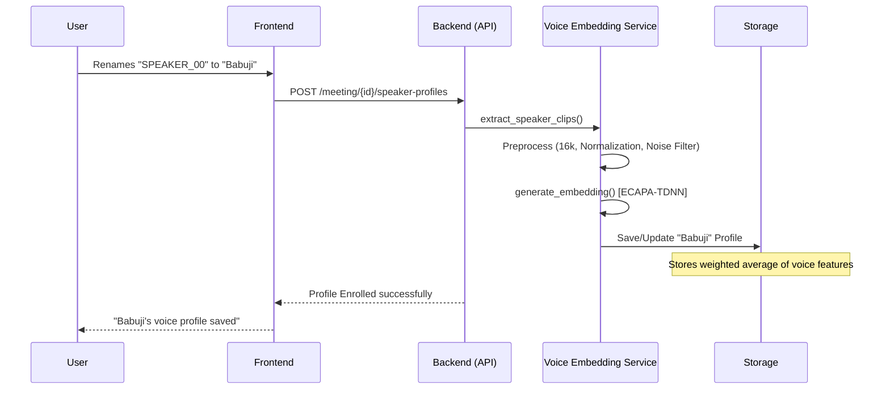

# Voice Identification & Speaker Profiling Architecture

## 🎙️ Overview

ContextIQ implements a neural voice identification system that enables **cross-meeting speaker recognition**. Instead of generic labels like `SPEAKER_00`, the system can automatically identify recurring participants (e.g., "Babuji Abraham", "Varun Kumar") by comparing their voice embeddings against stored profiles.

## 🏗️ System Components

The feature is built on three core pillars:
1. **`VoiceEmbeddingService`**: The engine responsible for audio processing, embedding generation using SpeechBrain, and profile management.
2. **`voice_profiles.py` (API)**: Provides endpoints for speaker clip management, profile listing, and enrollment.
3. **`storage/speaker_profiles/`**: Persistent storage for binary embeddings and metadata for enrolled voices.

---

## 🛠️ The Processing Pipeline

The voice identification process follows a structured 5-step pipeline:

### 1. Speaker Clip Extraction
For each speaker in a meeting, the system extracts a ~10-second reference clip.
- **Strategy**: It doesn't just take the first 10 seconds. It analyzes all segments for that speaker and selects those with the **highest signal-to-noise (SNR) quality** to ensure the embedding is generated from clear speech, not background noise or silence.

### 2. Audio Preprocessing
Before hitting the neural network, the audio undergoes rigorous cleaning:
- **Resampling**: Standardized to **16kHz** (mono).
- **Peak Normalization**: Adjusts levels to [-1, 1] for consistent signal strength.
- **Bandpass Filtering**: A digital FFT filter removes low-frequency rumble (<80Hz) and high-frequency hiss (>7600Hz), focusing on the human speech band.
- **Silence Removal**: Uses an RMS energy threshold to strip out non-speech silence gaps within the clip.

### 3. Neural Embedding Generation
The system uses the **ECAPA-TDNN** (Emphasized Channel Attention, Propagation and Aggregation - Time Delay Neural Network) architecture via the **SpeechBrain** framework.
- **Model**: `spkrec-ecapa-voxceleb`
- **Output**: A **192-dimensional vector** (embedding) that mathematically represents the unique characteristics of a person's voice (vocal tract shape, pitch, cadence).

### 4. Multi-Session Enrollment (Weighted Average)
When a speaker is enrolled for the first time, their embedding is saved. If they are enrolled from a *subsequent* meeting, the system doesn't just overwrite the old embedding.
- It uses a **weighted running average**:
  $$E_{new} = \frac{E_{old} \times N + E_{current}}{N + 1}$$
  *Where $N$ is the number of meetings the speaker has been sampled from.*
- This allows the "voice profile" to become more accurate over time as it captures different recording environments and vocal variations.

### 5. Speaker Matching
During transcription, the system automatically runs the **match logic**:
- **Similarity Measure**: Cosine Similarity.
- **Threshold**: Defaults to **0.55**.
- **Logic**: It computes the similarity between the current meeting's speaker and all stored profiles. If the best match exceeds the threshold, the system auto-renames the speaker in the transcript.

---

## 🔄 Interaction Flow

## 📊 Performance & Optimization

- **Model Loading**: Lazy-initialized to save memory. The 80MB model is only loaded when first needed.
- **Efficiency**: Pre-computes embeddings during transcription so that the UI-matching is instantaneous.
- **Thresholding**: 0.55 is tuned to prevent "False Positives" (mismatching different people) while allowing for "Intra-speaker variability" (same person, different mic).

---
*Document Version: 1.1*
*Architecture Reference: `app/services/voice_embedding_service.py`*
