# ContextIQ — System Architecture

## 1. High-Level Architecture

```mermaid
graph TB
    subgraph Frontend["🖥️ Frontend — Svelte + Vite :5173"]
        Home["Home.svelte<br/>Landing Page"]
        Dash["Dashboard.svelte<br/>Stats + Upload"]
        MD["MeetingDetail.svelte<br/>Transcript + Analytics"]
        AI["ActionItems.svelte<br/>Tasks + Follow-up Email"]
        Chat["Chat.svelte<br/>RAG Q&A"]
        Search["Search.svelte<br/>Keyword Search"]
    end

    subgraph Backend["⚙️ Backend — FastAPI + Uvicorn :8000"]
        direction TB
        subgraph APIs["API Layer (12 Routers)"]
            upload["POST /upload-video"]
            transcribe["POST /transcribe/{id}"]
            summarize["POST /summarize/{id}"]
            insights["POST /meeting/{id}/action-items<br/>POST /meeting/{id}/requirements<br/>POST /meeting/{id}/documentation<br/>POST /meeting/{id}/sentiment<br/>POST /meeting/{id}/topics<br/>POST /meeting/{id}/followup-email"]
            publish["POST /publish/{id}"]
            chat_api["POST /chat/ask/stream<br/>POST /chat/index/{id}"]
            jira_api["POST /meeting/{id}/jira/push<br/>POST /meeting/{id}/jira/sync"]
            speaker["POST /meeting/{id}/speaker-map"]
            stats_api["GET /stats<br/>GET /meetings"]
            search_api["GET /search"]
            diarize["GET /meeting/{id}"]
        end

        subgraph Services["Service Layer"]
            stt["stt_service.py<br/>WhisperX + AssemblyAI + Groq"]
            v2a["video_to_audio.py<br/>FFmpeg Converter"]
            spk["speaker_service.py<br/>Speaker Grouping"]
            store["storage_service.py<br/>File I/O"]
            summary_svc["summary_service.py<br/>Groq LLM Summaries"]
            insights_svc["insights_service.py<br/>Action Items, Decisions,<br/>Requirements, Docs, Sentiment,<br/>Topics, Title, Follow-up Email"]
            pub["publish_service.py<br/>PDF + Email + Teams"]
            rag["rag_service.py<br/>ChromaDB + LangChain"]
            jira_svc["jira_service.py<br/>REST API v3"]
        end
    end

    subgraph External["☁️ External Services"]
        Groq["Groq API<br/>Llama 3.3 70B"]
        ADB["AssemblyAI API"]
        Jira["Jira Cloud<br/>REST API v3"]
        SMTP["SMTP Server<br/>Gmail"]
        Teams["Teams Webhook"]
    end

    subgraph Storage["💾 Storage Layer"]
        FS["File System<br/>storage/{meeting_id}/*.json"]
        Chroma["ChromaDB<br/>storage/chroma_db/"]
        Audio["data/audio/{id}.wav"]
        Video["data/videos/{id}.*"]
    end

    Frontend -->|HTTP REST| APIs
    APIs --> Services
    Services --> External
    Services --> Storage
```

---

## 2. Data Flow — End-to-End Meeting Pipeline

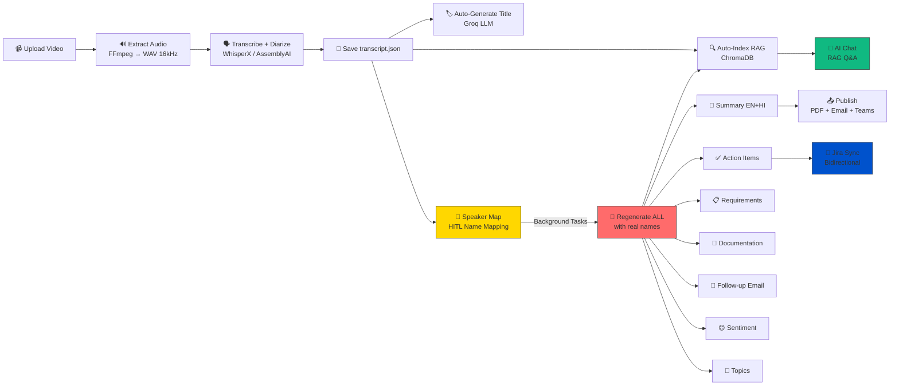

---

## 3. File Storage Structure

```
storage/
├── {meeting_id}/
│   ├── transcript.json        ← segments + speakers
│   ├── metadata.json          ← title, dates, counts
│   ├── speaker_map.json       ← HITL name mapping
│   ├── summary.json           ← EN + HI summaries
│   ├── action_items.json      ← tasks, decisions, takeaways
│   ├── requirements.json      ← functional/non-functional reqs
│   ├── documentation.json     ← MoM, agenda, next steps
│   ├── sentiment.json         ← per-segment sentiment scores
│   ├── topics.json            ← topic segments with time ranges
│   ├── followup_email.json    ← generated email draft
│   ├── speaker_report.json    ← per-speaker scorecards
│   ├── Meeting_Summary.pdf    ← generated PDF
│   └── Full_Report.pdf        ← comprehensive report
├── chroma_db/                 ← ChromaDB vector store
│
data/
├── audio/{meeting_id}.wav     ← extracted audio (16kHz mono)
└── videos/{meeting_id}.*      ← uploaded video files
```

---

## 4. API Endpoint Map

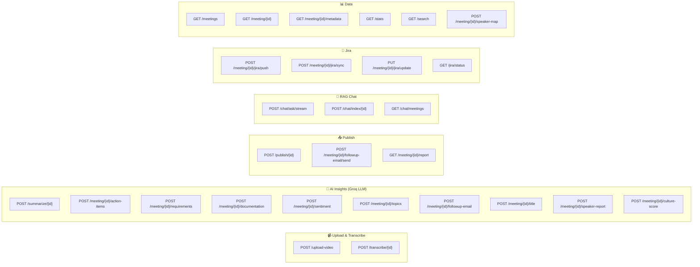

---

## 5. Speaker Map → Background Regeneration Workflow

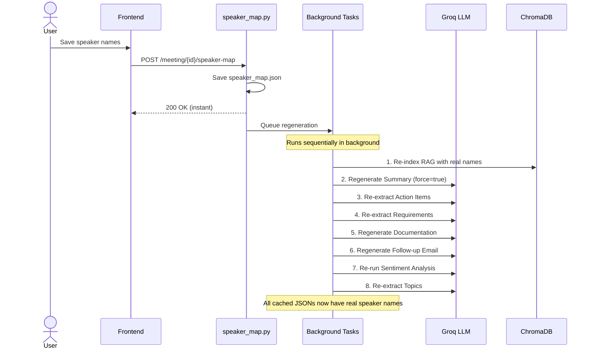

---

## 6. Jira Bidirectional Sync Workflow

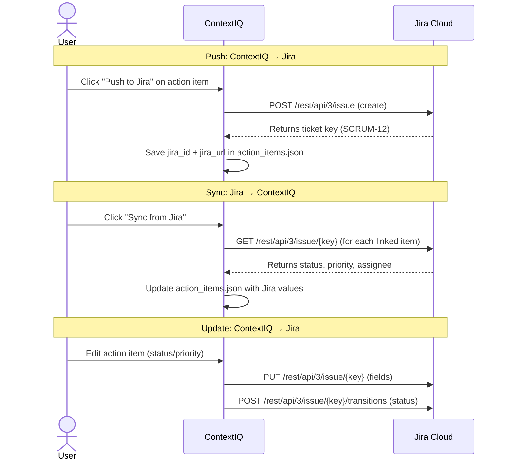

---

## 7. Publish Pipeline

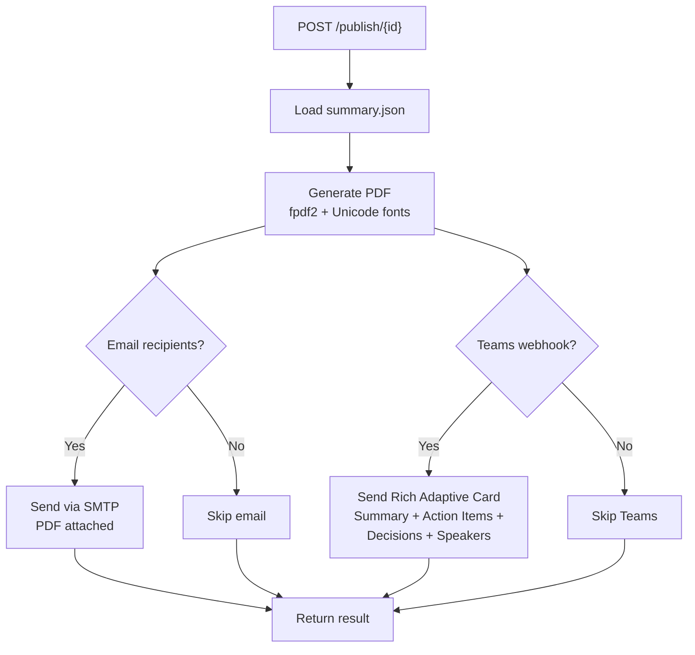

---

## 8. Tech Stack

| Layer | Technology |
|---|---|
| **Frontend** | Svelte 4 + Vite + lucide-svelte |
| **Backend** | FastAPI + Uvicorn (Python 3.10) |
| **STT Engine** | WhisperX (local) + AssemblyAI + Groq Whisper |
| **Diarization** | pyannote.audio 3.x |
| **LLM** | Groq API → Llama 3.3 70B Versatile |
| **RAG** | LangChain + ChromaDB + all-MiniLM-L6-v2 |
| **PDF** | fpdf2 with NotoSans + NotoSansDevanagari |
| **Email** | smtplib (SMTP/TLS) |
| **Teams** | Incoming Webhook (Adaptive Cards v1.4) |
| **Jira** | REST API v3 (Basic Auth) |
| **Audio** | FFmpeg (video → WAV 16kHz mono) |
| **Storage** | File-system JSON + ChromaDB (SQLite) |

---

## 9. Frontend Routing

| Route | Page | Purpose |
|---|---|---|
| `/` | Home.svelte | Landing page |
| `/dashboard` | Dashboard.svelte | Upload + stats + meeting list |
| `/meeting/:id` | MeetingDetail.svelte | Transcript + all analytics |
| `/meeting/:id/actions` | ActionItems.svelte | Tasks + Jira + follow-up email |
| `/chat` | Chat.svelte | RAG chatbot |
| `/search` | Search.svelte | Keyword search |

---

## 10. Entity Relationship — Data Model

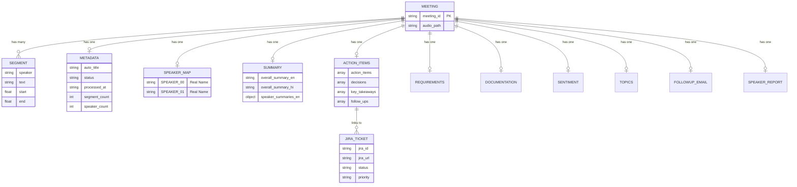

---

## 11. Meeting Lifecycle — State Diagram

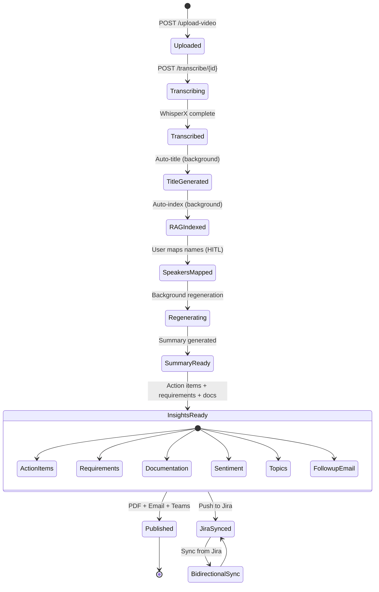

---

## 12. User Journey — Complete Workflow

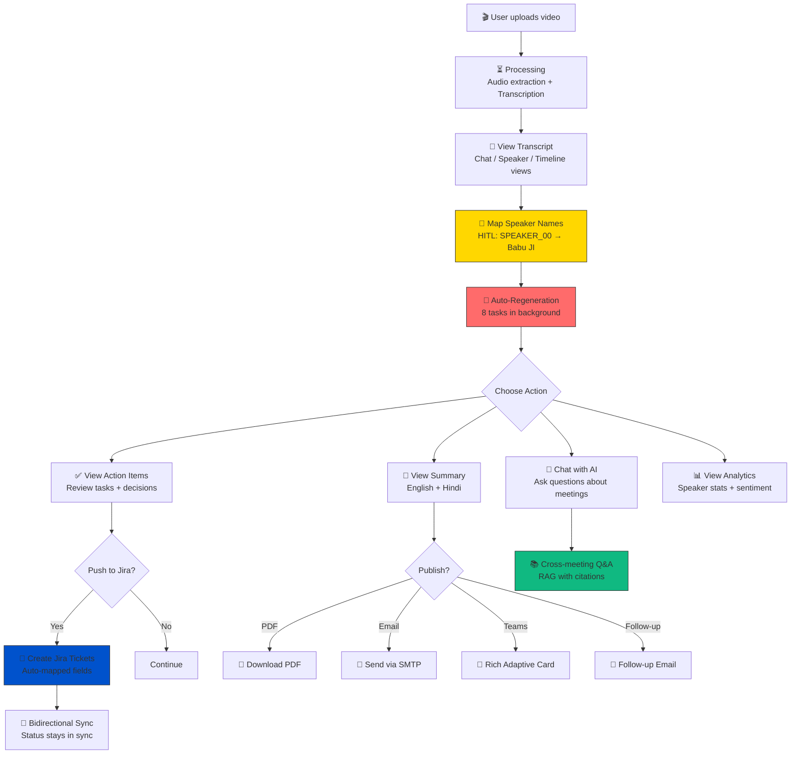

---

## 13. Service Class Diagram

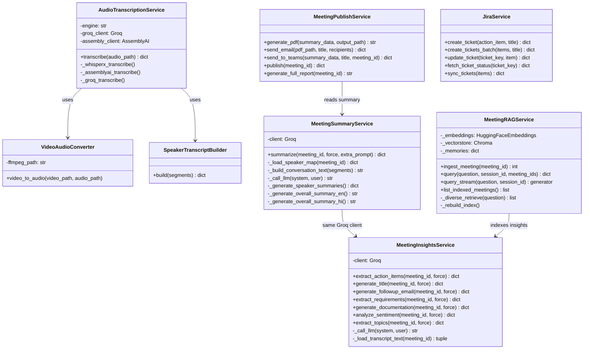

---

## 14. Feature Mind Map

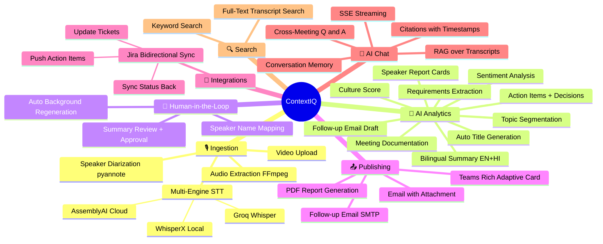

