# ContextIQ — System Architecture

## 1. High-Level Architecture

```mermaid
graph TB
    subgraph Frontend["🖥️ Frontend — Svelte 5 + Vite :5173"]
        Home["Home.svelte<br/>Landing Page"]
        Dash["Dashboard.svelte<br/>Stats + Upload + Culture Score"]
        MD["MeetingDetail.svelte<br/>Transcript + All Analytics"]
        AI["ActionItems.svelte<br/>Tasks + Follow-up Email"]
        Chat["Chat.svelte<br/>RAG Q&A"]
        Search["Search.svelte<br/>Keyword Search"]
    end

    subgraph Backend["⚙️ Backend — FastAPI + Uvicorn :8000"]
        direction TB
        subgraph APIs["API Layer (14 Routers, 35+ Endpoints)"]
            upload["POST /upload-video"]
            transcribe["POST /transcribe/{id}"]
            summarize["POST /summarize/{id}"]
            insights["POST /meeting/{id}/action-items<br/>POST /meeting/{id}/requirements<br/>POST /meeting/{id}/documentation<br/>POST /meeting/{id}/sentiment<br/>POST /meeting/{id}/topics<br/>POST /meeting/{id}/followup-email<br/>POST /meeting/{id}/auto-title"]
            publish["POST /publish/{id}<br/>GET /publish/{id}/pdf<br/>GET /publish/{id}/full-report"]
            chat_api["POST /chat/ask/stream<br/>POST /chat/index/{id}"]
            jira_api["POST /meeting/{id}/jira/push<br/>POST /meeting/{id}/jira/sync"]
            voice_api["GET /meeting/{id}/speaker-clips<br/>POST /meeting/{id}/speaker-profiles<br/>POST /meeting/{id}/voice-match"]
            speaker["POST /meeting/{id}/speaker-map"]
            stats_api["GET /stats<br/>GET /stats/culture-score<br/>GET /meetings"]
            search_api["GET /search"]
            diarize["GET /meeting/{id}<br/>GET /meeting/{id}/video"]
            notion_api["POST /meeting/{id}/notion/push"]
            confluence_api["POST /meeting/{id}/confluence/push"]
        end

        subgraph Services["Service Layer"]
            stt["stt_service.py<br/>WhisperX + AssemblyAI + Groq"]
            v2a["video_to_audio.py<br/>FFmpeg Converter"]
            voice_svc["voice_embedding_service.py<br/>ECAPA-TDNN Speaker ID"]
            summary_svc["summary_service.py<br/>Groq LLM Summaries"]
            insights_svc["insights_service.py<br/>Action Items, Decisions,<br/>Requirements, Docs, Sentiment,<br/>Topics, Title, Follow-up Email"]
            pub["publish_service.py<br/>PDF + Email + Teams"]
            rag["rag_service.py<br/>ChromaDB + LangChain"]
            jira_svc["jira_service.py<br/>REST API v3"]
        end
    end

    subgraph External["☁️ External Services"]
        Groq["Groq API<br/>Llama 3.3 70B + Whisper"]
        ADB["AssemblyAI API"]
        Jira["Jira Cloud<br/>REST API v3"]
        SMTP["SMTP Server<br/>Gmail"]
        Teams["Teams Webhook"]
        Notion["Notion API"]
        Confluence["Confluence API"]
    end

    subgraph Storage["💾 Storage Layer"]
        FS["File System<br/>storage/{meeting_id}/*.json"]
        Chroma["ChromaDB<br/>storage/chroma_db/"]
        Audio["data/audio/{id}.wav"]
        Video["storage/{id}/video.mp4"]
        Profiles["storage/speaker_profiles/<br/>profiles.json"]
        Models["storage/models/<br/>ECAPA-TDNN cache"]
    end

    Frontend -->|HTTP REST| APIs
    APIs --> Services
    Services --> External
    Services --> Storage
```

---

## 2. Data Flow — End-to-End Meeting Pipeline

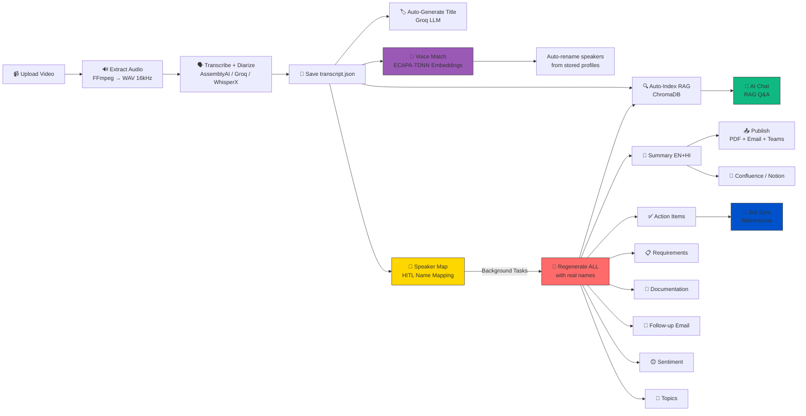

---

## 3. Voice Identification Pipeline

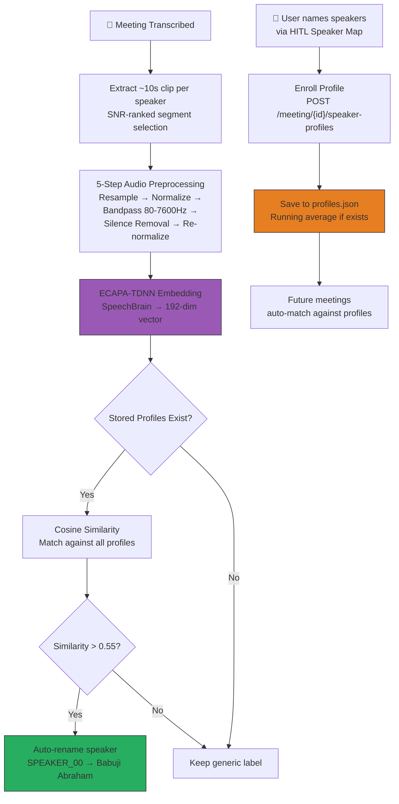

---

## 4. File Storage Structure

```
storage/
├── {meeting_id}/
│   ├── transcript.json        ← segments + speakers
│   ├── metadata.json          ← title, dates, counts
│   ├── video.mp4              ← original video for playback
│   ├── speaker_map.json       ← HITL name mapping
│   ├── speaker_clips/         ← 10s WAV clips per speaker
│   ├── summary.json           ← EN + HI summaries
│   ├── action_items.json      ← tasks, decisions, takeaways
│   ├── requirements.json      ← functional/non-functional reqs
│   ├── documentation.json     ← MoM, agenda, next steps
│   ├── sentiment.json         ← per-segment sentiment scores
│   ├── topics.json            ← topic segments with time ranges
│   ├── followup_email.json    ← generated email draft
│   ├── speaker_report.json    ← per-speaker scorecards
│   ├── Meeting_Summary.pdf    ← generated PDF
│   └── Full_Report.pdf        ← comprehensive report
├── speaker_profiles/
│   └── profiles.json          ← global voice embeddings {name: [192 floats]}
├── models/
│   └── spkrec-ecapa-voxceleb/ ← cached SpeechBrain model
├── chroma_db/                 ← ChromaDB vector store
└── _file_hashes.json          ← SHA-256 upload deduplication registry

data/
├── audio/{meeting_id}.wav     ← extracted audio (16kHz mono)
└── audio/{meeting_id}_clean.wav ← noise-reduced audio
```

---

## 5. API Endpoint Map

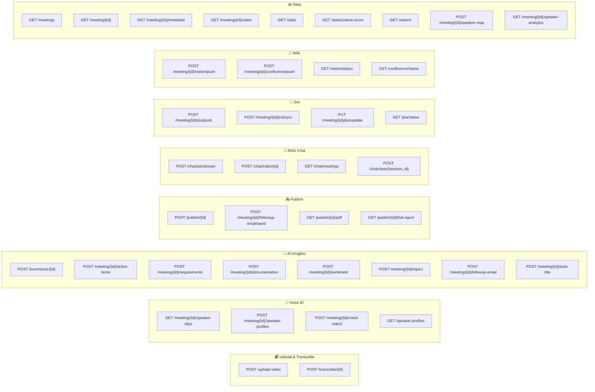

---

## 6. Speaker Map → Background Regeneration Workflow

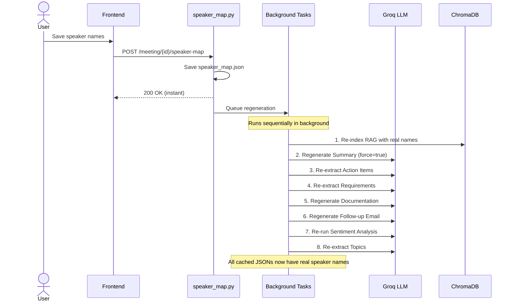

---

## 7. RAG Diverse Retrieval Algorithm

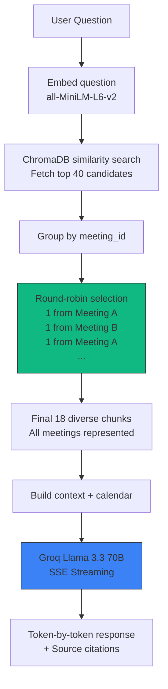

---

## 8. Jira Bidirectional Sync Workflow

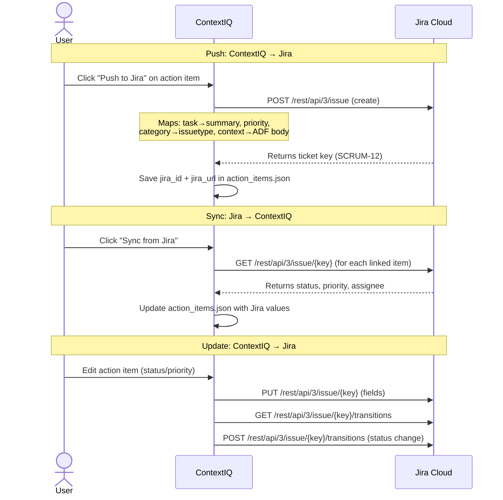

---

## 9. Publish Pipeline

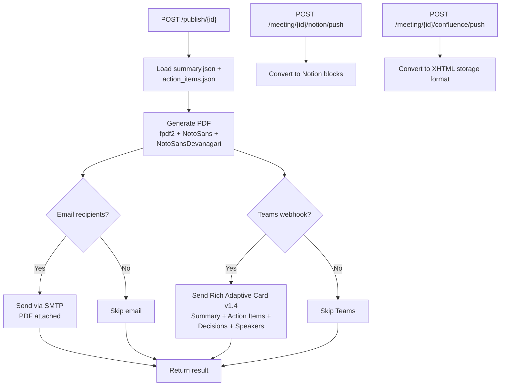

---

## 10. Tech Stack

| Layer | Technology |
|---|---|
| **Frontend** | Svelte 5 + Vite 5 + TailwindCSS 3 + Lucide Svelte |
| **Backend** | FastAPI + Uvicorn (Python 3.10+) |
| **STT Engines** | AssemblyAI (primary) + Groq Whisper + WhisperX (local) |
| **Diarization** | pyannote.audio 3.1 (neural VAD + clustering) |
| **Voice ID** | SpeechBrain ECAPA-TDNN (192-dim embeddings, VoxCeleb) |
| **LLM** | Groq API → Llama 3.3 70B Versatile |
| **RAG** | LangChain + ChromaDB + all-MiniLM-L6-v2 (384-dim) |
| **PDF** | fpdf2 with NotoSans + NotoSansDevanagari |
| **Email** | smtplib (SMTP/TLS) |
| **Teams** | Incoming Webhook (Adaptive Cards v1.4) |
| **Jira** | REST API v3 (Basic Auth, ADF descriptions) |
| **Confluence** | REST API v2 (API Token) |
| **Notion** | Notion API (API Token) |
| **Audio** | FFmpeg (video → WAV 16kHz mono) |
| **Storage** | File-system JSON + ChromaDB (SQLite-backed) |

---

## 11. Frontend Routing

| Route | Page | Purpose |
|---|---|---|
| `/` | Home.svelte | Landing page |
| `/dashboard` | Dashboard.svelte | Upload + stats + meeting list + culture score |
| `/meeting/:id` | MeetingDetail.svelte | Transcript + all analytics tabs |
| `/meeting/:id/actions` | ActionItems.svelte | Tasks + Jira + follow-up email |
| `/chat` | Chat.svelte | RAG chatbot with SSE streaming |
| `/search` | Search.svelte | Keyword search across meetings |

---

## 12. Entity Relationship — Data Model

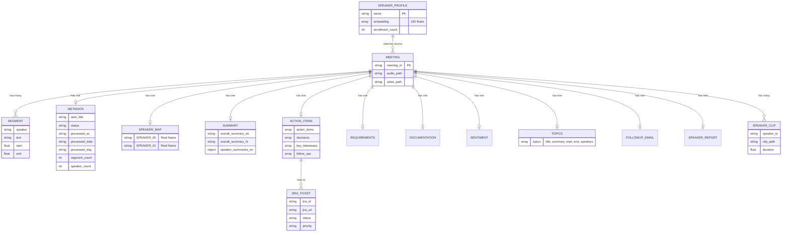

---

## 13. Meeting Lifecycle — State Diagram

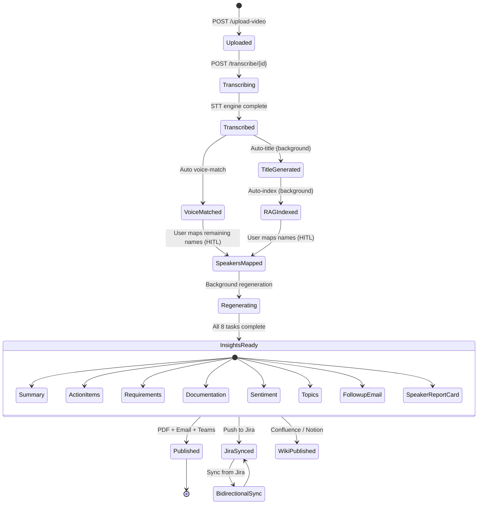

---

## 14. User Journey — Complete Workflow

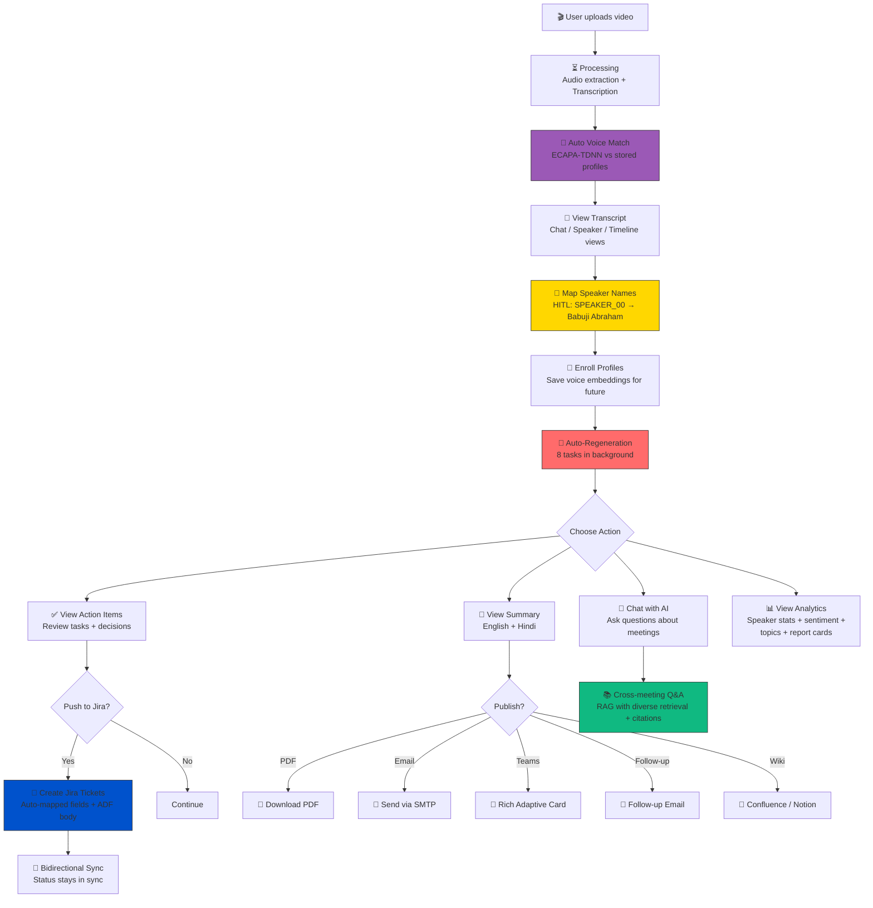

---

## 15. Service Class Diagram

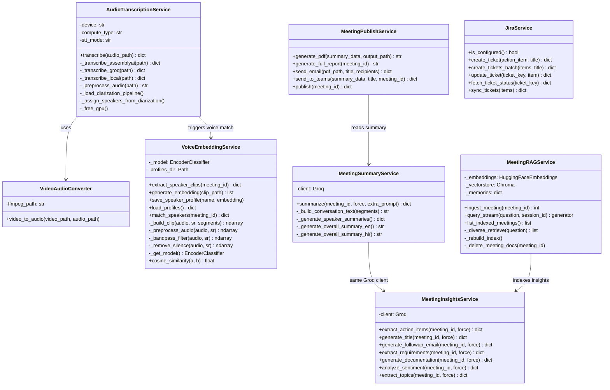

---

## 16. Meeting Culture Score Algorithm

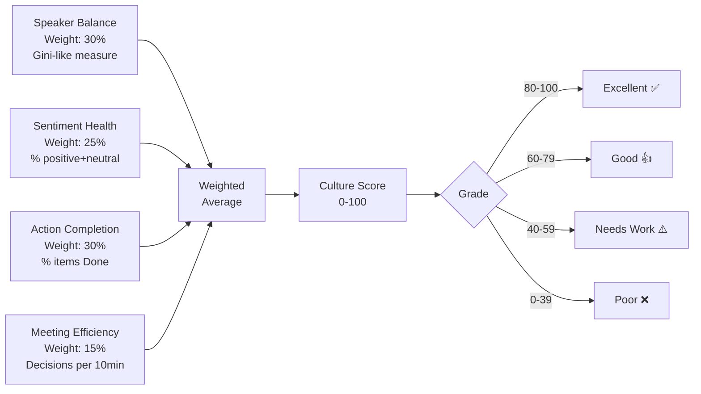

---

## 17. Feature Mind Map

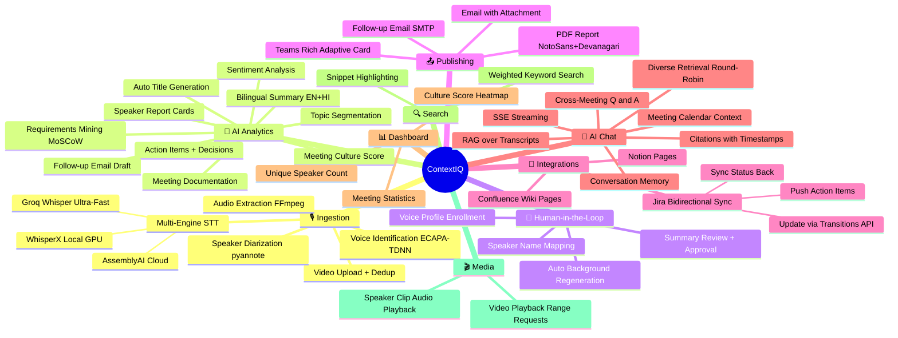

---

*Updated: February 28, 2026 — reflects all 27 features across 14 API modules and 8 services*
