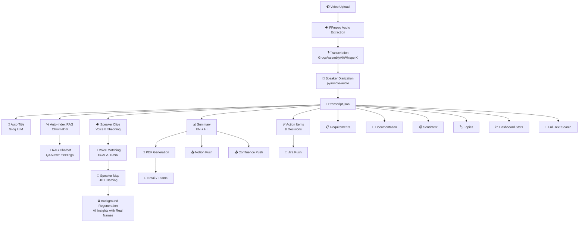

# ContextIQ — Backend Architecture Walkthrough

> **Complete end-to-end code-level explanation of the ContextIQ Meeting Intelligence System backend.**

---

## Table of Contents

1. [System Overview](#1-system-overview)
2. [Project Structure](#2-project-structure)
3. [Entry Point — `main.py`](#3-entry-point--mainpy)
4. [Data Models — `schemas.py`](#4-data-models--schemaspy)
5. [Stage 1: Video Upload](#5-stage-1-video-upload)
6. [Stage 2: Transcription & Diarization](#6-stage-2-transcription--diarization)
7. [Stage 3: Meeting Management](#7-stage-3-meeting-management)
8. [Stage 4: AI-Powered Summaries](#8-stage-4-ai-powered-summaries)
9. [Stage 5: AI Insights & Analytics](#9-stage-5-ai-insights--analytics)
10. [Stage 6: RAG Chatbot](#10-stage-6-rag-chatbot)
11. [Stage 7: Publishing & Delivery](#11-stage-7-publishing--delivery)
12. [Stage 8: Third-Party Integrations](#12-stage-8-third-party-integrations)
13. [Stage 9: Voice Identification](#13-stage-9-voice-identification)
14. [Stage 10: Dashboard & Search](#14-stage-10-dashboard--search)
15. [Storage Layout](#15-storage-layout)
16. [Complete Data Flow Diagram](#16-complete-data-flow-diagram)

---

## 1. System Overview

**ContextIQ** is a FastAPI-based Meeting Intelligence System (v2.0.0) that transforms raw meeting videos into structured, searchable, AI-analyzed knowledge.

### Technology Stack

| Layer | Technology |
|-------|-----------|
| **Framework** | FastAPI + Uvicorn |
| **Transcription** | WhisperX / Groq Whisper / AssemblyAI (multi-engine) |
| **Speaker Diarization** | pyannote-audio |
| **LLM Engine** | Groq API → Llama 3.3 70B |
| **RAG / Embeddings** | LangChain + ChromaDB + HuggingFace Embeddings |
| **Voice ID** | speechbrain ECAPA-TDNN |
| **PDF Generation** | fpdf2 (with Hindi + English Unicode fonts) |
| **Email** | SMTP (Gmail) |
| **Integrations** | Jira, Notion, Confluence, Microsoft Teams |
| **GPU Support** | PyTorch CUDA (float16 / int8 fallback) |

### Configuration ([.env](file:///c:/Users/PawanKumarUikey/.gemini/antigravity/scratch/ContextIQ/.env))

```
FFMPEG_PATH=...          # FFmpeg binary location
HF_TOKEN=...             # HuggingFace token (pyannote models)
GROQ_API_KEY=...         # Groq API for LLM + Whisper
SMTP_HOST/PORT/USER/PASS # Email sending
TEAMS_WEBHOOK_URL=...    # MS Teams webhook
```

---

## 2. Project Structure

```
ContextIQ/
├── app/
│   ├── main.py                    # FastAPI app entry point
│   ├── api/                       # 14 API route modules
│   │   ├── upload.py              # POST /upload-video
│   │   ├── transcribe.py          # POST /transcribe/{id}
│   │   ├── diarization.py         # Meetings CRUD + metadata + video
│   │   ├── summarize.py           # POST /summarize/{id}
│   │   ├── chat.py                # RAG Q&A endpoints
│   │   ├── insights.py            # AI analytics (action items, sentiment, etc.)
│   │   ├── publish.py             # PDF + email + Teams
│   │   ├── speaker_map.py         # HITL speaker naming
│   │   ├── stats.py               # Dashboard statistics
│   │   ├── search.py              # Full-text keyword search
│   │   ├── jira.py                # Jira integration
│   │   ├── notion.py              # Notion integration
│   │   ├── confluence.py          # Confluence integration
│   │   └── voice_profiles.py      # Voice identification
│   ├── schemas/
│   │   └── schemas.py             # Pydantic v2 data models
│   └── services/                  # 12 business logic modules
│       ├── video_to_audio.py      # FFmpeg audio extraction
│       ├── stt_service.py         # Multi-engine transcription
│       ├── speaker_service.py     # Speaker transcript grouping
│       ├── storage_service.py     # Disk persistence
│       ├── summary_service.py     # Groq-powered summaries
│       ├── insights_service.py    # Action items, sentiment, topics, etc.
│       ├── rag_service.py         # LangChain + ChromaDB RAG
│       ├── publish_service.py     # PDF + Email + Teams
│       ├── voice_embedding_service.py  # ECAPA-TDNN voice ID
│       ├── jira_service.py        # Jira REST API client
│       ├── notion_service.py      # Notion API client
│       └── confluence_service.py  # Confluence API client
├── data/audio/                    # Extracted .wav files
├── storage/                       # Per-meeting JSON artifacts
│   ├── {meeting_id}/              # One folder per meeting
│   ├── chroma_db/                 # ChromaDB vector store
│   └── speaker_profiles/          # Global voice embeddings
├── frontend/                      # Svelte + Vite frontend
├── .env                           # Environment configuration
└── requirements.txt               # Python dependencies
```

---

## 3. Entry Point — [main.py](file:///c:/Users/PawanKumarUikey/.gemini/antigravity/scratch/ContextIQ/app/main.py)

📄 [main.py](file:///c:/Users/PawanKumarUikey/.gemini/antigravity/scratch/ContextIQ/app/main.py)

### What it does:

```python
app = FastAPI(title="Meeting Intelligence System", version="2.0.0")
```

1. **Creates FastAPI app** — The central application object
2. **Creates directories** — Ensures `data/audio/` and `storage/` exist at startup
3. **Configures CORS** — Allows the Svelte frontend on `localhost:5173` (and Vite preview on `:4173`) to call the API
4. **Registers 14 routers** — Each router handles a specific feature domain:

```python
app.include_router(upload_router, tags=["Upload"])
app.include_router(transcribe_router, tags=["Transcription"])
app.include_router(diarization_router, tags=["Meeting"])
app.include_router(summarize_router, tags=["Summary"])
# ... and 10 more
```

5. **Root endpoint `GET /`** — Returns a complete API index listing all 50+ endpoints
6. **Health check `GET /health`** — Reports GPU status (VRAM), storage stats (meeting count, disk usage, per-status breakdown), and ChromaDB status

### Key design pattern: **Lazy initialization**

All heavy services (ML models, API clients) are initialized on first use, not at startup, to keep the server boot fast.

---

## 4. Data Models — `schemas.py`

📄 [schemas.py](file:///c:/Users/PawanKumarUikey/.gemini/antigravity/scratch/ContextIQ/app/schemas/schemas.py)

All request/response models use **Pydantic v2 BaseModel**:

| Model | Purpose |
|-------|---------|
| `SegmentOut` | A transcript segment: `{start, end, speaker, text}` |
| `SpeakerSegment` | Speaker-grouped segment (no `speaker` field needed) |
| `UploadResponse` | Returns `meeting_id`, `audio_path`, `message` |
| `TranscriptResponse` | Full transcript with `segments[]` + `speakers{}` dict |
| `MeetingResponse` | Same structure, used for `GET /meeting/{id}` |
| `SummaryResponse` | Speaker summaries (EN) + overall summaries (EN + HI) |
| `SegmentEditRequest` | PATCH a segment's `text` and/or `speaker` |
| `MeetingMetadataRequest` | Update title, date, participants, notes, tags |
| `MeetingMetadataResponse` | Full metadata with processing timestamps |

---

## 5. Stage 1: Video Upload

### API: `POST /upload-video`

📄 [upload.py](file:///c:/Users/PawanKumarUikey/.gemini/antigravity/scratch/ContextIQ/app/api/upload.py)

### Flow:

```
Client uploads .mp4/.mkv/.mov → Validate format → Validate size (≤500MB)
→ SHA-256 hash → Check deduplication → If duplicate: return existing meeting_id
→ If new: Generate UUID → Write temp video → FFmpeg extract audio (16kHz mono WAV)
→ Save video to storage/{id}/video.mp4 → Register hash → Return meeting_id
```

### Code walkthrough:

1. **Format validation** — Only accepts `.mp4`, `.mkv`, `.mov`
2. **Size validation** — Max 500 MB (`MAX_UPLOAD_BYTES`)
3. **SHA-256 deduplication** — Computes hash of the entire video bytes, stores `hash → meeting_id` mapping in `storage/_file_hashes.json`. If the same file is re-uploaded, returns the existing `meeting_id` without re-processing
4. **Audio extraction** — Uses `VideoAudioConverter` service (FFmpeg):

### Service: `VideoAudioConverter`

📄 [video_to_audio.py](file:///c:/Users/PawanKumarUikey/.gemini/antigravity/scratch/ContextIQ/app/services/video_to_audio.py)

```python
cmd = [
    ffmpeg_path,
    "-y",
    "-i", str(video_path),
    "-map", "0:a:0",        # First audio stream only
    "-vn",                   # No video
    "-acodec", "pcm_s16le",  # 16-bit PCM
    "-ar", "16000",          # 16kHz sample rate
    "-ac", "1",              # Mono
    str(audio_path)
]
```

- Output: `data/audio/{meeting_id}.wav`
- The original video is moved to `storage/{meeting_id}/video.mp4` for later in-browser playback

---

## 6. Stage 2: Transcription & Diarization

### API: `POST /transcribe/{meeting_id}`

📄 [transcribe.py](file:///c:/Users/PawanKumarUikey/.gemini/antigravity/scratch/ContextIQ/app/api/transcribe.py)

### This is the most complex endpoint — it orchestrates 5 sub-steps:

```
Audio exists? → Step 1: Transcribe + Diarize (STT service)
→ Step 1b: Add meeting number suffix to speakers (SPEAKER_00 → SPEAKER_00_m1)
→ Step 2: Build speaker-wise grouping (SpeakerTranscriptBuilder)
→ Step 3: Save to storage/{meeting_id}/transcript.json
  → Step 3a: Extract speaker voice clips + auto-match against stored profiles
  → Step 3b: Auto-create metadata.json with processing timestamps
  → Step 4a: Auto-index into RAG (ChromaDB)
  → Step 4b: Auto-generate meeting title via LLM
```

### Service: `AudioTranscriptionService`

📄 [stt_service.py](file:///c:/Users/PawanKumarUikey/.gemini/antigravity/scratch/ContextIQ/app/services/stt_service.py) — **479 lines, multi-engine**

Supports 3 transcription engines (set via `STT_MODE` env var):

| Mode | Transcription | Diarization |
|------|--------------|-------------|
| `assemblyai` | AssemblyAI API | AssemblyAI (built-in) |
| `groq` | Groq Whisper API | Local pyannote |
| `local` | Local WhisperX | WhisperX diarization |

#### Key methods:

- **`__init__`** — Detects GPU, selects `float16` (GPU) or `int8` (CPU) compute type
- **`_preprocess_audio`** — Noise reduction + normalization (saves `_clean` version)
- **`_transcribe_assemblyai`** — Single API call for transcription + diarization
- **`_transcribe_groq`** — Groq Whisper API with chunking for files >25MB
- **`_transcribe_local`** — Local WhisperX model
- **`_load_diarization_pipeline`** — Loads pyannote `speaker-diarization-3.1` (with fallbacks)
- **`_assign_speakers_from_diarization`** — Matches transcribed segments to diarized speaker labels using maximum overlap
- **`transcribe(audio_path)`** — Main orchestrator: picks engine → transcribes → diarizes → merges

### Service: `SpeakerTranscriptBuilder`

📄 [speaker_service.py](file:///c:/Users/PawanKumarUikey/.gemini/antigravity/scratch/ContextIQ/app/services/speaker_service.py)

Simple grouper — converts flat `segments[]` list into `speakers{}` dict:

```python
# Input: [{"speaker": "SPEAKER_00", "start": 0.0, "end": 4.2, "text": "Hello"}]
# Output: {"SPEAKER_00": [{"start": 0.0, "end": 4.2, "text": "Hello"}]}
```

### Service: `MeetingStorageService`

📄 [storage_service.py](file:///c:/Users/PawanKumarUikey/.gemini/antigravity/scratch/ContextIQ/app/services/storage_service.py)

Saves transcript data to `storage/{meeting_id}/transcript.json` with:
- UTC `created_at` timestamp
- `metadata.json` with human-readable date, day, time

---

## 7. Stage 3: Meeting Management

### API: Meetings CRUD

📄 [diarization.py](file:///c:/Users/PawanKumarUikey/.gemini/antigravity/scratch/ContextIQ/app/api/diarization.py) — **447 lines**

| Endpoint | Method | Description |
|----------|--------|-------------|
| `/meetings` | GET | List all meetings with metadata, status, duration, display IDs |
| `/meeting/{id}` | GET | Retrieve full transcript (segments + speakers) |
| `/meeting/{id}/segments/{index}` | PUT | Edit a specific segment's text or speaker |
| `/meeting/{id}/metadata` | GET | Retrieve metadata (title, date, participants, etc.) |
| `/meeting/{id}/metadata` | PATCH | Update metadata (merge-style, only provided fields) |
| `/meeting/{id}/video` | GET/HEAD | Stream video with HTTP Range support (seeking) |
| `/meeting/{id}` | DELETE | Permanently delete meeting (storage + audio + ChromaDB + hash registry) |

### Key features:

#### Sequential display IDs (`m1`, `m2`, `m3`...)
```python
def _get_display_id(meeting_id, counter):
    # Assigns e.g. "m1", "m2" — persisted in _meeting_counter.json
    # Never reuses numbers, even after deletion
```

#### Meeting listing logic
- Skips system directories (`chroma_db`, `speaker_profiles`, `models`)
- Determines status: `uploaded → transcribed → summarized → published`
- Resolves title: `auto_title > manual_title > "Meeting M1"`
- Sorts by `processed_at` (oldest first)

#### Video streaming with Range support
```python
# Supports HTTP Range: bytes=0-1024 for browser seeking
# Returns 206 Partial Content with Content-Range header
```

#### Meeting deletion
Cleans up 4 places:
1. ChromaDB collection (RAG vectors)
2. `storage/{meeting_id}/` directory
3. `data/audio/{meeting_id}.wav`
4. Hash registry entry in `_file_hashes.json`

---

## 8. Stage 4: AI-Powered Summaries

### API: `POST /summarize/{meeting_id}`

📄 [summarize.py](file:///c:/Users/PawanKumarUikey/.gemini/antigravity/scratch/ContextIQ/app/api/summarize.py)

Accepts `force` (regenerate) and `extra_prompt` (custom style instructions) query params.

### Service: `MeetingSummaryService`

📄 [summary_service.py](file:///c:/Users/PawanKumarUikey/.gemini/antigravity/scratch/ContextIQ/app/services/summary_service.py) — **236 lines**

Uses **Groq API with Llama 3.3 70B** model.

#### Flow:

```
Load transcript.json → Load speaker_map.json (if exists)
→ Build conversation text with real names
→ Generate 3 outputs in parallel:
    1. Speaker-wise summaries (English) — one per speaker
    2. Overall meeting summary (English)
    3. Overall meeting summary (Hindi)
→ Cache result in storage/{meeting_id}/summary.json
```

#### Key methods:

- **`_load_speaker_map`** — Loads speaker name mappings for using real names
- **`_apply_speaker_map`** — Replaces `SPEAKER_00` with real names in prompts
- **`_build_conversation_text`** — Formats transcript as `[Speaker]: text` lines
- **`_call_llm`** — Groq API call with 3 retries and exponential backoff
- **`_generate_speaker_summaries`** — Calls LLM once per speaker
- **`_generate_overall_summary_en`** — English summary with LLM
- **`_generate_overall_summary_hi`** — Hindi summary with LLM

---

## 9. Stage 5: AI Insights & Analytics

### API: Multiple endpoints under `/meeting/{meeting_id}/...`

📄 [insights.py](file:///c:/Users/PawanKumarUikey/.gemini/antigravity/scratch/ContextIQ/app/api/insights.py) — **632 lines**

### LLM-powered endpoints (all use Groq Llama 3.3 70B):

| Endpoint | Cached File | Description |
|----------|------------|-------------|
| `POST /meeting/{id}/action-items` | `action_items.json` | Extract action items, decisions, key takeaways, follow-ups |
| `PUT /meeting/{id}/action-items` | `action_items.json` | Save human-edited action items (HITL) |
| `POST /meeting/{id}/auto-title` | `metadata.json` | Auto-generate concise meeting title |
| `POST /meeting/{id}/followup-email` | `followup_email.json` | Draft professional follow-up email |
| `POST /meeting/{id}/followup-email/send` | — | Send email via SMTP |
| `POST /meeting/{id}/requirements` | `requirements.json` | Extract user stories, constraints |
| `POST /meeting/{id}/documentation` | `documentation.json` | Generate structured MoM |
| `POST /meeting/{id}/sentiment` | `sentiment.json` | Analyze sentiment per segment |
| `POST /meeting/{id}/topics` | `topics.json` | Topic segmentation (what was discussed when) |

### Pure computation endpoints (no LLM):

| Endpoint | Description |
|----------|-------------|
| `GET /meeting/{id}/speaker-analytics` | Talk-time, word count, WPM, interruptions per speaker |
| `GET /meeting/{id}/speaker-report` | Full speaker scorecards with role classification |
| `GET /meeting/{id}/keywords` | Top 30 keywords by frequency (stop-word filtered) |

### Service: `MeetingInsightsService`

📄 [insights_service.py](file:///c:/Users/PawanKumarUikey/.gemini/antigravity/scratch/ContextIQ/app/services/insights_service.py) — **870 lines**

All methods follow the same pattern:
1. Check for cached JSON → return if exists (unless `force=True`)
2. Load transcript text with speaker names
3. Send structured prompt to Groq LLM
4. Parse JSON response
5. Save to `storage/{meeting_id}/{feature}.json`

#### Speaker analytics (pure math):

```python
# Interruption detection: speaker change with gap < 0.5 seconds
for i in range(1, len(segments)):
    if prev.speaker != curr.speaker:
        gap = curr.start - prev.end
        if gap < 0.5:
            stats[curr.speaker]["interruptions"] += 1
```

#### Role classification (heuristic):
- **Decision Maker** — most decisions attributed
- **Presenter** — highest talk % and > 40%
- **Challenger** — most questions asked (≥ 2)
- **Doer** — most action items assigned
- **Observer** — talk time < 15%
- **Contributor** — everyone else

---

## 10. Stage 6: RAG Chatbot

### API: Chat endpoints

📄 [chat.py](file:///c:/Users/PawanKumarUikey/.gemini/antigravity/scratch/ContextIQ/app/api/chat.py) — **175 lines**

| Endpoint | Description |
|----------|-------------|
| `POST /chat/ask` | Ask a question, get answer + citations |
| `POST /chat/ask/stream` | SSE streaming answer (token by token) |
| `POST /chat/index/{id}` | Index/re-index a meeting into ChromaDB |
| `GET /chat/meetings` | List all indexed meetings |
| `POST /chat/clear/{session_id}` | Clear conversation history |

### Service: `MeetingRAGService`

📄 [rag_service.py](file:///c:/Users/PawanKumarUikey/.gemini/antigravity/scratch/ContextIQ/app/services/rag_service.py) — **557 lines**

Uses **LangChain + ChromaDB + Groq (Llama 3.3 70B)**.

#### Architecture:

```
User Question → HuggingFace Embeddings → ChromaDB Search
→ Diverse Retrieval (cross-meeting round-robin)
→ Groq LLM with context → Answer + Citations
```

#### Key methods:

- **`__init__`** — Initializes HuggingFace embeddings (`all-MiniLM-L6-v2`), ChromaDB persistent vector store, and Groq LLM client
- **`ingest_meeting`** — Chunks transcript by speaker segments, applies speaker map, upserts into ChromaDB with metadata (meeting_id, speaker, timestamps)
- **`_diverse_retrieve`** — Fetches candidates from ChromaDB, groups by meeting, then **round-robins** so every meeting is represented in the context (not just the most relevant one). Auto-recovers from corrupted ChromaDB by re-indexing
- **`query`** — Full RAG pipeline: retrieve → build prompt → call LLM → extract citations from source documents
- **`query_stream`** — Same but yields SSE events: `{"type": "token", "content": "word"}` → `{"type": "citations", "content": [...]}` → `{"type": "done"}`
- **`_rebuild_index`** — Nukes ChromaDB collection and re-indexes all meetings from disk

#### Citation format:
```json
{
  "meeting_id": "uuid",
  "speaker": "Pawan",
  "start": 12.5,
  "end": 18.3,
  "excerpt": "We should use React for the frontend"
}
```

---

## 11. Stage 7: Publishing & Delivery

### API: Publish endpoints

📄 [publish.py](file:///c:/Users/PawanKumarUikey/.gemini/antigravity/scratch/ContextIQ/app/api/publish.py) — **237 lines**

| Endpoint | Description |
|----------|-------------|
| `POST /publish/{id}` | One-click: generate PDF + optional email + Teams |
| `GET /publish/{id}/pdf` | Download generated PDF |
| `GET /publish/{id}/full-report` | Generate + download comprehensive report |
| `POST /publish/{id}/full-report` | Auto-generate missing sections + build report |
| `POST /publish/{id}/full-report/email` | Email the full report PDF |

### Service: `MeetingPublishService`

📄 [publish_service.py](file:///c:/Users/PawanKumarUikey/.gemini/antigravity/scratch/ContextIQ/app/services/publish_service.py) — **639 lines**

**Zero AI cost** — uses only deterministic templates from cached JSON.

#### PDF generation (`SummaryPDF` class):
- Custom `fpdf2`-based PDF with registered Unicode fonts (NotoSans for English, NotoSansDevanagari for Hindi)
- Professional layout: accent lines in header, page numbers + branding in footer
- Sections: Title, Date, English Summary, Hindi Summary, Speaker Summaries

#### Full Report PDF:
Combines all available analytics into one document:
- Meeting Summary
- Action Items & Decisions
- Requirements & User Stories  
- Meeting Documentation / MoM
- Speaker Analytics

#### Email delivery (SMTP):
```python
# Uses MIMEMultipart with PDF attachment
# SMTP credentials from .env (SMTP_HOST/PORT/USER/PASSWORD)
server.starttls()
server.login(smtp_user, smtp_password)
server.send_message(msg)
```

#### Microsoft Teams delivery:
- Sends rich **Adaptive Cards** via webhook
- Includes: summary, action items, decisions, speaker list
- Zero AI tokens — reads from cached JSON only

---

## 12. Stage 8: Third-Party Integrations

### Jira Integration

📄 [jira.py](file:///c:/Users/PawanKumarUikey/.gemini/antigravity/scratch/ContextIQ/app/api/jira.py) | [jira_service.py](file:///c:/Users/PawanKumarUikey/.gemini/antigravity/scratch/ContextIQ/app/services/jira_service.py)

| Endpoint | Description |
|----------|-------------|
| `GET /jira/status` | Check if Jira is configured |
| `POST /meeting/{id}/jira/push` | Push action items as Jira tickets |
| `POST /meeting/{id}/jira/sync` | Sync ticket statuses back from Jira |
| `PUT /meeting/{id}/jira/update` | Push local edits to Jira tickets |

**Push flow:**
1. Load `action_items.json` → Filter by indices (or push all)
2. Create Jira tickets via REST API (batch)
3. Save `jira_id` and `jira_url` back into `action_items.json`

**Sync flow:** Fetches current status, priority, assignee from Jira → updates local JSON.

### Notion Integration

📄 [notion.py](file:///c:/Users/PawanKumarUikey/.gemini/antigravity/scratch/ContextIQ/app/api/notion.py) | [notion_service.py](file:///c:/Users/PawanKumarUikey/.gemini/antigravity/scratch/ContextIQ/app/services/notion_service.py)

- `GET /notion/status` — Check Notion API connectivity
- `POST /meeting/{id}/notion/push` — Push meeting data to Notion page

### Confluence Integration

📄 [confluence.py](file:///c:/Users/PawanKumarUikey/.gemini/antigravity/scratch/ContextIQ/app/api/confluence.py) | [confluence_service.py](file:///c:/Users/PawanKumarUikey/.gemini/antigravity/scratch/ContextIQ/app/services/confluence_service.py)

- `GET /confluence/status` — Check Confluence API connectivity
- `POST /meeting/{id}/confluence/push` — Push meeting data to Confluence page

---

## 13. Stage 9: Voice Identification

### API: Voice Profile endpoints

📄 [voice_profiles.py](file:///c:/Users/PawanKumarUikey/.gemini/antigravity/scratch/ContextIQ/app/api/voice_profiles.py) — **229 lines**

| Endpoint | Description |
|----------|-------------|
| `GET /meeting/{id}/speaker-clips` | List/auto-extract speaker audio clips |
| `GET /meeting/{id}/speaker-clips/{speaker}` | Serve audio clip for playback |
| `GET /speaker-profiles` | List all stored voice profiles |
| `POST /meeting/{id}/speaker-profiles` | Generate embeddings from clips + save profiles |
| `POST /meeting/{id}/voice-match` | Re-run voice matching against stored profiles |

### Speaker Map (HITL Naming)

📄 [speaker_map.py](file:///c:/Users/PawanKumarUikey/.gemini/antigravity/scratch/ContextIQ/app/api/speaker_map.py) — **236 lines**

When you save a speaker map (`SPEAKER_00 → "Pawan"`), it triggers **background regeneration** of ALL insights:

```python
# Background task: _regenerate_all_insights(meeting_id)
# 1. Re-index RAG (ChromaDB) with real names
# 2. Regenerate Summary         (force=True)
# 3. Regenerate Action Items    (preserves Jira links!)
# 4. Regenerate Requirements
# 5. Regenerate Documentation
# 6. Regenerate Follow-up Email
# 7. Regenerate Sentiment
# 8. Regenerate Topics
```

> [!IMPORTANT]
> Jira link preservation: When action items are regenerated, the code saves existing `jira_id` values, regenerates with real names, then fuzzy-matches (word overlap ≥ 40%) to restore Jira links to the correct items.

### Service: `VoiceEmbeddingService`

📄 [voice_embedding_service.py](file:///c:/Users/PawanKumarUikey/.gemini/antigravity/scratch/ContextIQ/app/services/voice_embedding_service.py) — **477 lines**

Uses **speechbrain ECAPA-TDNN** for speaker verification embeddings.

#### Pipeline:

```
Extract speaker clips (~10s each) → Preprocess (resample 16kHz, normalize,
bandpass filter 80-7600Hz, remove silence) → Generate embedding (ECAPA-TDNN)
→ Compare against stored profiles (cosine similarity, threshold 0.55)
→ Match speakers to known names
```

#### Key methods:

- **`extract_speaker_clips`** — Extracts ~10-second audio clips per speaker, picking segments with highest energy (clearest speech)
- **`_preprocess_audio`** — Full pipeline: resample → normalize → bandpass → silence removal
- **`generate_embedding`** — Runs ECAPA-TDNN to produce a fixed-size vector
- **`save_speaker_profile`** — Saves `name → embedding` mapping. If profile already exists, **averages** the new embedding with the stored one for better cross-meeting accuracy
- **`match_speakers`** — Cosine similarity comparison with 0.55 threshold

---

## 14. Stage 10: Dashboard & Search

### Dashboard Statistics

📄 [stats.py](file:///c:/Users/PawanKumarUikey/.gemini/antigravity/scratch/ContextIQ/app/api/stats.py) — **349 lines**

#### `GET /stats`
Scans all meeting directories and returns:
- Total meetings, unique speakers (resolved via speaker maps), total duration
- Meetings per day breakdown

#### `GET /stats/culture-score`
**Meeting Culture Score** — a 0-100 team health metric:

| Signal | Weight | Calculation |
|--------|--------|-------------|
| Speaker Balance | 30% | Gini-like measure of talk-time distribution |
| Sentiment | 25% | % of positive/neutral segments |
| Action Item Completion | 30% | % of items marked "Done" |
| Meeting Efficiency | 15% | Decisions per 10 minutes |

Grades: Excellent (≥80), Good (≥60), Needs Work (≥40), Poor (<40)

### Full-Text Search

📄 [search.py](file:///c:/Users/PawanKumarUikey/.gemini/antigravity/scratch/ContextIQ/app/api/search.py) — **117 lines**

#### `GET /search?q=keyword`

Keyword search across **title**, **speaker names**, and **transcript text**:

```python
# Scoring:
# - Title match:   +10 points
# - Speaker match:  +5 points  
# - Transcript match: +1 point per segment

# Returns top N results with highlighted snippets (context ±30 chars)
```

---

## 15. Storage Layout

Each meeting creates the following files in `storage/{meeting_id}/`:

| File | Created By | Description |
|------|-----------|-------------|
| `transcript.json` | Transcription | Segments + speakers + timestamps |
| `metadata.json` | Transcription | Title, status, dates, counts |
| `video.mp4` | Upload | Original video for playback |
| `summary.json` | Summarization | EN + HI summaries |
| `action_items.json` | Insights | Action items, decisions, takeaways |
| `requirements.json` | Insights | User stories, constraints |
| `documentation.json` | Insights | Structured MoM |
| `sentiment.json` | Insights | Per-segment sentiment |
| `topics.json` | Insights | Topic segments with time ranges |
| `followup_email.json` | Insights | Draft email content |
| `speaker_map.json` | Speaker Map | `{SPEAKER_ID: "Real Name"}` |
| `speaker_clips/` | Voice ID | Per-speaker `.wav` audio clips |
| `Meeting_Summary.pdf` | Publish | Summary PDF |
| `Full_Report.pdf` | Publish | Comprehensive report PDF |

### Global storage:

| Path | Description |
|------|-------------|
| `storage/_file_hashes.json` | SHA-256 → meeting_id for deduplication |
| `storage/_meeting_counter.json` | meeting_id → sequential number (m1, m2...) |
| `storage/chroma_db/` | ChromaDB persistent vector store |
| `storage/speaker_profiles/` | Global `name → embedding` profiles |
| `data/audio/{id}.wav` | Extracted 16kHz mono WAV files |

---

## 16. Complete Data Flow Diagram



---

> **Total API Endpoints: 50+** | **Total Python Files: 28** | **Total Lines of Backend Code: ~6,000+**
